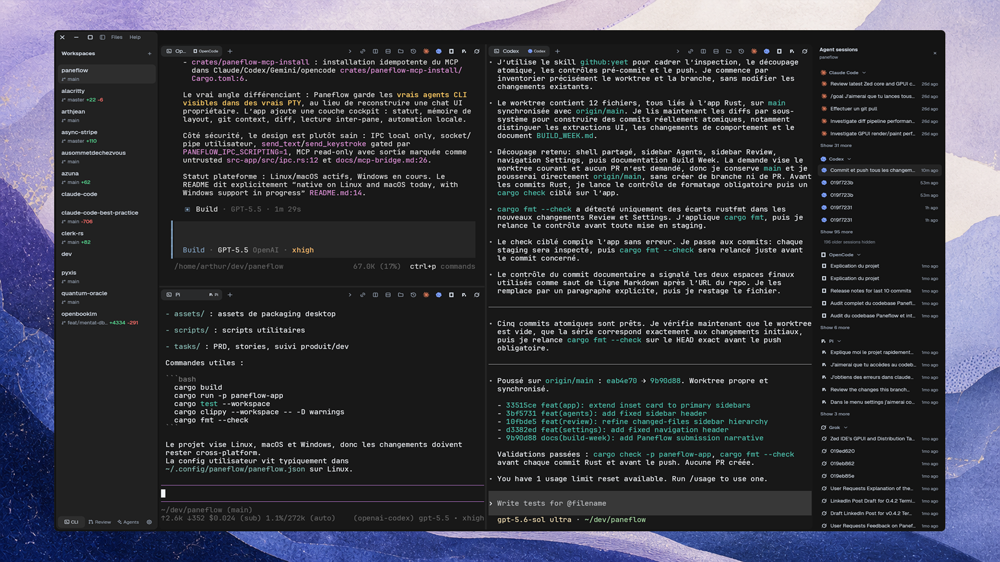

[](https://github.com/arthjean/paneflow/releases/latest)
[](https://github.com/arthjean/paneflow/releases)
[](LICENSE)
[](#install)

Your agents work in parallel, this keeps them in sight.

Paneflow is a native terminal workspace for running coding agents side by side. Each agent lives in a real PTY pane you can read, interrupt, and take over, while the app tracks which one is thinking, waiting, stalled, failed, or done, and keeps every task tied to its workspace and branch.

Works with any CLI agent - Claude Code, Codex, Gemini, opencode, Pi, Hermes, you name it.

Everything runs locally: agents are ordinary CLI processes in ordinary terminals, there is no hosted runtime and no proxy in front of your model. Prompts are pre-filled and you press Enter; auto-submit is explicit and gated.

Written in Rust on [Zed's GPUI](https://github.com/zed-industries/zed/tree/main/crates/gpui), with panes emulated by [Ghostty](https://github.com/ghostty-org/ghostty): the same `libghostty-vt` engine, statically linked, on Linux and Windows x64, with [`alacritty_terminal`](https://crates.io/crates/alacritty_terminal) on macOS and as the rollback everywhere. Native builds for Linux, macOS Apple Silicon, and Windows x64. No Electron, no WSL.

[Website →](https://paneflow.dev)

## Install

### 1. Quick start

On macOS:

```bash
brew install --cask arthjean/paneflow/paneflow
```

Everywhere else, take the build for your machine from the [latest release](https://github.com/arthjean/paneflow/releases/latest): the `.AppImage` runs on any Linux, the `.deb` and `.rpm` also register the package repo so later versions arrive through `apt upgrade` or `dnf upgrade`, and the `.msi` installs on Windows. Every artifact ships a SHA-256 sidecar and a Minisign signature.

[Install docs →](https://paneflow.dev/docs/installation)



### 2. Install for agents

Let one agent read another agent's pane, so you stop copy-pasting scrollback between them.

```bash
paneflow mcp install
```

This registers a local read-only MCP bridge - `list_panes`, `read_pane`, `search_pane` - for every agent it detects. The bridge cannot type into panes or control them, and terminal output comes back wrapped as untrusted data so the reading agent analyzes it instead of obeying it.

[Bridge docs →](docs/mcp-bridge.md)

### 3. Coordinate a fleet

The `paneflow` CLI talks to the same local socket as the app, so a script or an agent can drive the fleet you are watching.

```bash
paneflow ps
paneflow read cargo-run --lines 100
paneflow send codex-review "Review this branch and report risks"
paneflow wait --match claude-impl --pattern "REPORT_DONE"
paneflow watch --type ai.stop
```

`paneflow up` spawns a declarative workspace, and `paneflow flow run` executes a `flow.toml` DAG with spawn, wait, send, capture, and review steps.

[Conductor docs →](docs/user/conductor.md)

### 4. Configure

Themes, shell, keybindings, and shortcuts live in `~/.config/paneflow/paneflow.json` (`%APPDATA%\paneflow` on Windows) and hot-reload while the app runs. Everything is also editable in Settings.

[Learn more →](docs/user/configuration.md)

## Review worktree diffs

When each agent works on its own branch or worktree, the review surface shows the resulting diffs side by side, one column per worktree, with hunk navigation, per-hunk actions, agent attribution, and a local cost estimate where token usage is available.

Reviewing is a supervision step, not an automation step: acting on a hunk pre-fills a prompt in the agent's own pane and waits for you.

[Review docs →](docs/user/review.md)

## Telemetry

Telemetry is opt-in, never includes terminal contents, paths, or prompts, and `PANEFLOW_NO_TELEMETRY=1` disables it regardless of config.

## Build from source

Paneflow pins Rust 1.96.1 through [rust-toolchain.toml](rust-toolchain.toml). Linux builds need Vulkan and the usual Wayland/X11 development libraries.

```bash
git clone https://github.com/arthjean/paneflow.git
cd paneflow
cargo run --release -p paneflow-app
```

[ARCHITECTURE.md](ARCHITECTURE.md) covers the runtime and thread model, [AGENTS.md](AGENTS.md) the repository instructions for coding agents.

## Contributing

[Issues welcome!](https://github.com/arthjean/paneflow/issues)

## License

[GPL-3.0-or-later](LICENSE)
