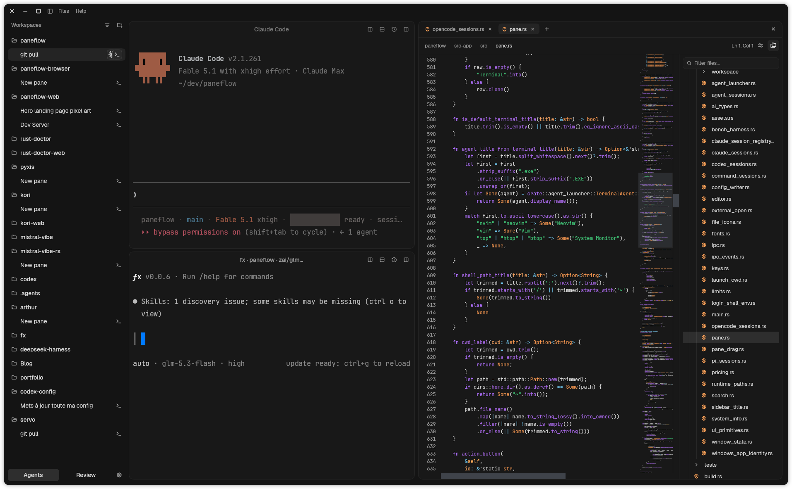

[](https://github.com/arthjean/paneflow/releases/latest)
[](https://github.com/arthjean/paneflow/releases)
[](LICENSE)
[](#install)
[](https://discord.gg/UqGM29Gvat)

The multiplexer for the agent era.

Paneflow is a native terminal multiplexer for coding agents. Run agents in parallel, keep their sessions running when you close the app, and review their changes in a native interface.

Organize projects into tabs and split panes, with several agents in a tab when useful. Work in an existing checkout or create a branch and Git worktree for a separate task. Follow agent activity, see which sessions need attention, and read, interrupt, or take over any terminal. The dock brings together Changes (the checkout's diff against `HEAD`), Files (an integrated editor with Git markers and a file tree), and a terminal.

Works with any CLI agent - Claude Code, Codex, Gemini, opencode, Pi, Hermes, you name it.

Paneflow runs locally: agents are ordinary CLI processes in ordinary terminals and connect to their own model providers. Prompts are pre-filled and you press Enter; auto-submit is explicit and gated. Activity tracking depends on the integrations available for each agent.

Free and open source under [GPL-3.0-or-later](LICENSE). Built with Rust and [Zed's GPUI](https://github.com/zed-industries/zed/tree/main/crates/gpui), using [Ghostty's](https://github.com/ghostty-org/ghostty) `libghostty-vt` terminal engine. Native builds for Linux x86_64 and aarch64, macOS Apple Silicon, and Windows x64.

[Website →](https://paneflow.dev)

## Install

### 1. Quick start

On macOS:

```bash
brew install --cask arthjean/paneflow/paneflow
```

Everywhere else, take the build for your machine from the [latest release](https://github.com/arthjean/paneflow/releases/latest): Linux builds come as `.AppImage`, `.deb`, and `.rpm`, and the `.msi` installs on Windows. The `.deb` and `.rpm` also register the package repo so later versions arrive through `apt upgrade` or `dnf upgrade`. Every artifact ships a SHA-256 sidecar and a Minisign signature.

[Install docs →](https://paneflow.dev/docs/installation)



### 2. Install for agents

Let one agent read another agent's pane, so you stop copy-pasting scrollback between them.

```bash
paneflow mcp install
```

This registers a local MCP bridge for supported agents it detects: Claude Code, Codex, Gemini CLI, and OpenCode. Its read tools are `list_panes`, `read_pane`, and `search_pane`, and terminal output comes back wrapped as untrusted data for the reading agent to analyze. Its one write tool, `write_pane`, sends a message to another agent's pane only after you allow that pair of agent sessions in Paneflow.

[Bridge docs →](docs/user/scripting.md)

### 3. Coordinate a fleet

The `paneflow` CLI lets a script or an agent read, monitor, and control the panes you are watching. For text injection, launch Paneflow with `PANEFLOW_IPC_SCRIPTING=1`; `send` pre-fills text unless you explicitly add `--submit`.

```bash
paneflow ps
paneflow read cargo-run --lines 100
paneflow send codex-review "Review this branch and report risks"
paneflow wait --match claude-impl --pattern "REPORT_DONE"
paneflow watch --type ai.stop
```

`paneflow up` spawns a declarative workspace. `paneflow flow run` executes the steps you define in `flow.toml`: spawn panes or send text, order steps through dependencies, wait for readiness patterns, and capture output. Launching panes with commands or prompts requires `PANEFLOW_IPC_ORCHESTRATION=1` or `PANEFLOW_IPC_SCRIPTING=1`. Prompt submission remains explicit and permission-gated.

[Conductor docs →](docs/user/conductor.md)

### 4. Configure

Themes, shell, keybindings, and shortcuts live in `~/.paneflow/paneflow.json` (`%USERPROFILE%\.paneflow` on Windows) and hot-reload while the app runs. Everything is also editable in Settings.

[Learn more →](docs/user/configuration.md)

## Keep sessions running

Terminal sessions live in a separate host process. Choose **Keep sessions running** when quitting Paneflow to leave the terminals and their processes alive, then reopen the app to reconnect. Choose **Stop everything and quit** to end them.

This keeps live sessions across app closure while the host and machine remain running. Restarting an ended terminal starts a fresh shell; resuming an agent conversation uses that agent's own session support. Neither operation restores a process after a machine restart or host crash.

## Read what the agents changed

The Changes tab compares the active checkout with `HEAD`, including staged and unstaged changes and untracked files. Read split or unified diffs, highlight changes within lines, and revert individual blocks in modified files. Whitespace can be trimmed or ignored.

Open files in the integrated editor to make changes, save, undo, or redo. Git markers in the gutter open a popup to read, copy, or revert the previous text. Paneflow also detects changes made on disk while you edit and lets you resolve save conflicts.

## Telemetry

Telemetry is opt-in, never includes terminal contents, paths, or prompts, and `PANEFLOW_NO_TELEMETRY=1` disables it regardless of config.

## Build from source

Paneflow pins Rust 1.98.0 through [rust-toolchain.toml](rust-toolchain.toml). Linux builds need Vulkan and the usual Wayland/X11 development libraries.

```bash
git clone https://github.com/arthjean/paneflow.git
cd paneflow
scripts/fetch-libghostty.sh   # terminal engine archives, verified against native/libghostty/manifest.toml
cargo run --release -p paneflow-app
```

On Windows, also run `scripts/fetch-conpty.ps1` in PowerShell 7 before building,
or use `scripts/dev.ps1 -Release`, which fetches the pinned ConPTY runtime and
builds both the app and its session host.

[ARCHITECTURE.md](ARCHITECTURE.md) covers the runtime and thread model, [AGENTS.md](AGENTS.md) the repository instructions for coding agents.

## Contributing

[Issues welcome!](https://github.com/arthjean/paneflow/issues)

## License

[GPL-3.0-or-later](LICENSE)
