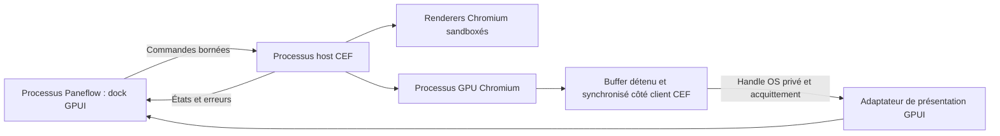

[PRD]
# PRD: Navigateur Agents sur Linux : socle commun, distributions, Wayland et X11

## Changelog

| Version | Date | Author | Summary |
|---|---|---|---|
| 1.9 | 2026-09-09 | Arthur Jean | Périmètre EP-007 autorisé : readiness interne par GitHub Actions ARM64 et contrats code/tests stricts ; la qualification matérielle native et la release publique restent explicitement différées. |
| 1.8 | 2026-09-08 | Arthur Jean | Correction de périmètre autorisée : EP-005 certifie la référence Linux x86_64 réelle, les packages locaux, le fonctionnement Browser, le socle sécurité/sandbox et Q-LNX-04 accepté ; Q-LNX-02/03, les matrices exhaustives et ARM sont transférés à EP-007, sans qualification de release. |
| 1.7 | 2026-09-08 | Arthur Jean | Q-LNX-04 accepté explicitement par le propriétaire sur les preuves Xorg fonctionnelles, IME et isolation PTY archivées ; la mesure M1 X11 non exécutée est dérogée sans devenir une mesure réussie, Q-LNX-03 et la release restent bloquées. |
| 1.0 | 2026-09-05 | Arthur Jean | Scission du plan global par OS ; produit commun conservé, extension GPUI planifiée et qualification native indépendante. |
| 1.1 | 2026-09-06 | Arthur Jean | Diagnostic TSYNC : preuve noyau séparée de l’intégration CEF, invariant du broker et qualification de sandbox par OS explicités ; aucun gate abaissé. |
| 1.6 | 2026-09-07 | Arthur Jean | Transfert autorisé du host multi-pages et du contexte CEF partagé par profil vers EP-004, comme dépendance de US-021 et US-022. |
| 1.5 | 2026-09-07 | Arthur Jean | EP-003 : validation fonctionnelle locale Wayland acceptée ; qualification native X11 de US-015 transférée explicitement à US-026/EP-005, sans autorisation de release. |
| 1.4 | 2026-09-07 | Arthur Jean | Révision C1 : en R1, chaque page Browser possède sa propre racine CEF sous le répertoire du profil de son workspace ; l'isolation entre workspaces est garantie, le partage cookies/stockage entre pages d'un même workspace est hors périmètre et devient une story EP-005 (host multi-pages par profil). |
| 1.3 | 2026-09-07 | Arthur Jean | EP-002 devient un jalon de développement interne permettant EP-003 ; qualifications natives exhaustives et gates de release transférées explicitement à EP-005, sans modifier les seuils NFR. |
| 1.2 | 2026-09-06 | Arthur Jean | CEF source compilé : cycle complet et shaders avec sandbox sur AMD Wayland et NVIDIA XWayland ; échelle OSR et GBM corrigés, gates Xorg/M1/release conservés. |

## Problem Statement

1. La navigation web quitte aujourd’hui Paneflow alors que serveur, terminal et session Agents y résident. Les racines d’ouverture externe sont vérifiables dans `src-app/src/terminal/input.rs` et `src-app/src/app/sidebar/context_menu.rs` ; aucune mesure d’adoption n’est inventée.
2. Le premier plan liait cinq stories de qualification aux quatre cibles avant toute intégration. Arthur demande désormais un travail OS par OS, avec un Mac à venir et Windows accessible séparément ; cette dépendance globale empêchait des préparations indépendantes.
3. Les handles, sandbox, bootstrap, input et packages ont des contrats natifs distincts. Un résultat Linux, une documentation CEF ou l’existence d’IOSurface ne prouve pas le port d’un autre OS.

**Why now:** La demande explicite est de remplacer le plan global par trois PRD exécutables séparément, en conservant le produit prévu et le travail partiel déjà réalisé.

## Overview

Le navigateur est une surface du dock Agents : GPUI rend les onglets et la toolbar, CEF rend les documents web dans un host séparé lancé à la demande. Le PRD Linux possède l’implémentation des contrats partagés, du dock, de la persistance, des politiques web et des outils agent. Il possède également l’adaptateur GPU/IPC, le bootstrap et les packages Linux. Windows et macOS réutilisent ce socle et possèdent leurs adaptateurs et qualifications.

Le travail se déroule en R0 (références, contrat et prototype Linux), R1 (aperçu interne), R2-reference (référence Linux x86_64 et runtime Browser local), R2-extended (qualification avant publication) puis R3 (outils agent). Les 35 stories sont réparties en ces livraisons pour éviter un lot indivisible. Les distributions supplémentaires, la mesure M1 complète, les classes de compositeurs/GPU et Linux ARM sont un travail ultérieur explicite ; aucun Mac ni Windows n’est requis pour avancer ou certifier la référence Linux. Un défaut du pin GPUI déclenche la tâche d’extension prévue, pas un arrêt automatique de tous les travaux indépendants.

Ce PRD remplace la partie Linux et commune du plan global de 32 stories. Le résultat partiel de l’ancien EP-001 est repris comme entrée à revalider, jamais comme preuve native acquise. READY indique que ce plan peut démarrer ; tout résultat de fonctionnement, performance ou distribution exige ensuite ses propres preuves. EP-005 constitue une certification locale de référence ; EP-007 porte la qualification étendue nécessaire à une annonce Linux plus large.

## Goals

Les dates sont des objectifs relatifs au démarrage de ce PRD, pas une promesse d’effort. Les observations matérielles débutent à l’accès à l’environnement correspondant ; le code indépendant avance pendant cette attente.

| Goal | Month-1 Target | Month-6 Target |
|---|---|---|
| Avancer par OS | 1 contrat de port ou socle utilisable sans qualification des deux autres OS | 0 gate de release dépendant de la matrice matérielle d’un autre OS |
| Vérifier une page locale | 1 parcours Browser fonctionnel sur une référence Linux x86_64 réelle | Référence publiée puis matrice étendue qualifiée par EP-007 |
| Préserver le terminal | 1 jeu A/B local archivé avant comparaison C | 100 % des budgets NFR applicables respectés |
| Distribuer un runtime cohérent | 1 manifeste de candidat avec provenance | 100 % des artefacts Linux annoncés vérifiés, sandbox active |
| Contrôler les agents | 0 accès Browser par défaut | 100 % des cas SEC R3 passent avant activation de la capacité agent |

## Target Users

### Développeur qui vérifie son application web

- **Role:** Utilisateur Paneflow sur Linux, avec agents et serveur local.
- **Behaviors:** Lance le service dans un terminal, ouvre sa page, corrige et recharge, consulte DevTools.
- **Pain points:** Changement de fenêtre, mauvais localhost et page dissociée de sa session.
- **Current workaround:** Navigateur externe avec fenêtres ou profils séparés.
- **Success looks like:** Parcours C0 terminé dans le dock, sans frappe Browser envoyée à un PTY ni cookie partagé entre workspaces.

### Mainteneur qui développe OS par OS

- **Role:** Arthur, qui travaille d’abord sous Linux, dispose d’un Windows 11 sur un autre SSD et attend son Mac.
- **Behaviors:** Implémente le socle, transfère sa branche et exécute les validations natives quand la machine est disponible.
- **Pain points:** Un gate global confond disponibilité de matériel et possibilité d’écrire du code ; les copies de code par OS risquent de diverger.
- **Current workaround:** Maintenir le navigateur externe et des notes de qualification manuelles.
- **Success looks like:** Stories de préparation revues sur leur périmètre, référence Linux x86_64 native explicitement qualifiée, puis familles Linux, Wayland/X11, budgets M1 et architecture ARM vérifiés avant leurs annonces correspondantes.

## Research Findings

Recherche renouvelée au 2026-09-05 : six recherches web ciblées, puis inspection bornée du dépôt et deux appels Context7 CLI pour cef-rs. Les sources upstream mouvantes donnent les contrats à vérifier ; elles ne fixent pas les futurs binaires.

### Competitive Context

| Référence | Fait utilisé | Conséquence |
|---|---|---|
| [Cursor](https://prod.cursor.com/docs/agent/tools/browser) | Navigation et outils de contexte navigateur avec isolation de workspace | Conserver navigation humaine et accès agent séparément autorisé |
| [cmux](https://cmux.com/docs/browser-automation) | Navigation, DOM, captures, sessions et diagnostics | Couvrir le parcours développeur ; sa solution ne prouve pas le moteur de Paneflow |
| [Electron OSR](https://www.electronjs.org/docs/latest/tutorial/offscreen-rendering) | Distinction entre bitmap et texture GPU partagée | Qualifier explicitement le transfert ; conserver le shell GPUI |

Le besoin différenciant retenu est la proximité entre une page et sa session Agents dans Paneflow. Aucun avantage inédit, gain de performance ou retour utilisateur concurrent non documenté n’est affirmé. Les captures initiales restent des références de hiérarchie, pas une preuve de moteur.

### Best Practices Applied

CEF décrit des handles accélérés par plateforme et leur validité limitée au callback ; la ressource doit être copiée vers une texture détenue par le client. La synchronisation et la durée de vie sont des exigences par OS. [CefRenderHandler](https://raw.githubusercontent.com/chromiumembedded/cef/master/include/cef_render_handler.h).

Le problème upstream de fenêtres natives Ozone/Wayland ne constitue pas une preuve d’impossibilité de l’OSR : qualifier les deux chemins séparément, sans compter XWayland comme Wayland natif. [CEF Wayland](https://github.com/chromiumembedded/cef/issues/2804). Au pin GPUI local, la construction de surface est réservée à macOS et le dispatch wgpu des surfaces est vide. L’extension Linux doit donc atteindre la scène et son renderer, pas seulement produire une texture wgpu. [Surface GPUI](https://github.com/zed-industries/zed/blob/fecc3273ed32643c2ea1b04a74c8780e2c9ffaf8/crates/gpui/src/elements/surface.rs), [dispatch wgpu](https://github.com/zed-industries/zed/blob/fecc3273ed32643c2ea1b04a74c8780e2c9ffaf8/crates/gpui_wgpu/src/wgpu_renderer.rs#L1529).

Les exemples Context7 présentent des imports DMA-BUF, D3D et IOSurface vers wgpu, mais ne prouvent ni copie avant retour, ni fences, ni consommation par GPUI. Leurs extraits _autodocs sont secondaires : les headers et le code du pin priment. [Imports cef-rs](https://github.com/tauri-apps/cef-rs/blob/dev/_autodocs/07-osr-texture-import.md). Aucun couple exact CEF/cef-rs n’est déclaré testé par ce PRD.

Le dépôt est au commit `fbfefd250a3f3c8d9968a23f8c358712859bc904`, avec Rust 1.98.0, GPUI `fecc3273ed32643c2ea1b04a74c8780e2c9ffaf8` et wgpu 29.0.4 dans le lockfile inspecté. L’outillage `bench/browser/` et `scripts/browser-qualification.mjs` existe ; ses 27 tests précédents concernent le CLI et les fixtures, pas la viabilité du navigateur natif. Le préflight `docs/browser/qualification.md` reste un historique d’obstacles au pin de départ.

## Assumptions & Constraints

### Assumptions (to validate)

| ID | Hypothèse | Risque | Story et preuve attendue |
|---|---|---|---|
| A1 | Le host CEF séparé peut présenter sa frame dans GPUI sur Linux | Élevé | US-006/007, puis US-008/009 puis US-026/027 : prototype branché et traces natives |
| A2 | Le pin distribué respecte la sandbox et les minima de l’OS | Élevé | US-002/004, puis qualification native d’installation |
| A3 | Les copies, fences et mémoire pourront satisfaire M1 et les NFR sur la matrice étendue | Élevé | EP-007/US-033, mesures réelles sans assouplir les seuils ; EP-005 ne les déclare pas exécutés |
| A4 | L’arbre CEF peut rejoindre le lecteur d’écran de la plateforme | Élevé | US-017 puis US-023/028 : preuve avec lecteur natif |
| A5 | Les références matérielles de la matrice étendue seront accessibles | Moyen | EP-007/US-027/033/034 : disponibilité distincte de l’état d’implémentation |
| A6 | Les interfaces communes peuvent rester compatibles entre ports | Moyen | Contrats versionnés, dépendances CORE et tests de régression du socle |

### Hard Constraints

- La présente exécution rédige des PRD et trackers uniquement. Le code, l’outillage existant, les configurations personnelles et les preuves historiques ne sont pas remplacés pendant la rédaction.
- Un seul produit, un seul moteur CEF et un seul domaine Browser partagé. Le PRD Linux possède les contrats communs ; un port peut les corriger avec un test partagé, jamais les copier en contrôleurs divergents.
- L’extension ciblée et versionnée de GPUI est incluse dans le plan. Ses quatre pins et Cargo.lock restent synchronisés, font-kit reste actif, les features Linux Wayland/X11 sont préservées. Le cache Cargo demeure en lecture seule. Un changement de shell ou un fork Chromium complet serait une extension de scope distincte.
- libghostty reste le moteur terminal unique. CEF n’entre ni dans ses types, ni dans les helpers shim/ai-hook/MCP. Les caps de 512 KiB shim, environ 375 KB ai-hook, 512 KiB MCP et le plafond combiné existant sont conservés.
- Les types, chemins et code OS sont isolés derrière les adaptateurs. Une plateforme Browser non prête garde un chemin unavailable et un terminal fonctionnel ; elle ne nécessite pas les archives CEF d’un autre OS pour compiler son terminal.
- Aucune attente de fence, I/O, opération réseau ou création de processus ne bloque le thread GPUI. Les messages et ressources suivent C2/C3 et les handles ne prolongent pas implicitement la vie des callbacks CEF.
- La sandbox requise reste active dès les essais moteur. Aucun no-sandbox, disable-web-security, bypass TLS global, bridge natif de page ou port CDP TCP n’est un moyen de validation.
- Le runtime est vérifié et embarqué avant distribution, disponible hors ligne après installation et mis à jour avec l’app. Aucun exécutable téléchargé au premier usage, Chrome externe imposé ou updater CEF parallèle.
- GPL-3.0-or-later et les obligations natives sont préservées ; les notices/codecs des binaires réels sont vérifiés avant redistribution.
- Les capacités de distribution sont propres à chaque cible : absent, développement sur fixtures, humain qualifié, agent qualifié. Le mécanisme est réellement consommé par le registre, le launcher et le packaging ; il ne consiste pas en un flag non lu. Les builds de développement sur fixtures ne sont pas une release Browser générale.
- Les contrats U1/U2 réutilisent DESIGN.md, les huit thèmes, les primitives et le registre de raccourcis. Aucun redesign du terminal, des splits ou du mode Review.
- `tasks/` reste local et non suivi. Les nouveaux documents suivis décrivent leurs contrats de façon autonome sans pointer vers tasks/. Pour changer de machine, transférer les PRD/trackers et récupérer le code de la branche de travail ; pousser sur main n’est pas nécessaire.

### Résultat de l’expérience CEF TSYNC du 2026-09-06

Le CEF source-pinné a été compilé avec assertions actives, empaqueté et vérifié, puis exécuté dans une copie isolée de PaneFlow. Trois patches corrigent la création précoce du broker, l’échelle OSR sans fenêtre native et l’initialisation GBM X11 avant sandbox. Le host active explicitement les buffers GPU natifs pour sa capture X11. Les permissions et la politique GPU Chromium restent inchangées.

AMD Raphael/Mesa 26.1.8 sous Wayland natif headless et NVIDIA 4070 Ti SUPER/610.57.04 sous XWayland passent le parcours CEF -> DMA-BUF -> GPUI, la saisie, le resize, l’échelle 1x/2x, la perte/reprise du host et la fermeture. Les deux processus GPU observés par parcours ont chacun tous leurs threads filtrés : 32 sur AMD et 20 sur NVIDIA. Les deux chemins passent également 120 programmes de shaders avec caches natifs neufs et vérification de pixels. Les preuves et sources exactes sont indexées par `bench/browser/evidence/prototype/cef-tsync-integrated-20260906/summary.json`.

NVIDIA Wayland natif passe maintenant le même parcours complet et les 120 shaders à caches neufs. Le correctif alloue des buffers de capture GPU natifs compatibles avec les modificateurs NVIDIA et valide la taille réelle du DMA-BUF avant import Vulkan. Les preuves supplémentaires sont indexées par `bench/browser/evidence/prototype/cef-tsync-nvidia-wayland-20260906/summary.json`. Un diagnostic M1 C physique en release rejoue 255 entrées et archive la trace Chromium ; il ne constitue pas la comparaison complète requise. Aucun Xorg natif n’est encore exécuté. Le build expérimental désactive CFI/LTO ; un candidat officiel CFI/ThinLTO/PGO est en compilation et doit encore être qualifié. Le manifeste et le runtime habituels sont inchangés. Les échecs initiaux et la sonde EGL native sensible au cache restent archivés séparément.

Depuis la révision 1.3 autorisée par Arthur le 7 septembre, EP-002 est DONE comme socle de développement interne (5/5 stories dans leur périmètre révisé). Les transferts de propriété Vulkan et PoolReady sont corrigés et disposent de validations ciblées et fonctionnelles archivées. Le runtime durci, le fonctionnement de référence, la sécurité et la sandbox sont vérifiés dans EP-005 ; la vérification des pixels présentés, les mesures M1 exhaustives et la matrice Linux étendue sont transférées à EP-007. Les observations fonctionnelles Wayland restent des preuves locales bornées. La sandbox stricte et les gates par OS restent inchangés ; Windows et macOS conservent leur progression indépendante.

## Quality Gates

Gates applicables au périmètre modifié, exécutés en un lot cohérent à la fin d’implémentation/revue et aux frontières de commit/push prévues par AGENTS.md. Aucun build, suite applicative ou navigateur n’est exécuté pour la seule rédaction de ce PRD.

- `cargo fmt --check` - toolchain Rust 1.98.0 épinglé, obligatoire avant commit/push Rust ; ne pas substituer un autre toolchain.
- `cargo check --workspace --all-targets --locked` - compilation du périmètre disponible sur l’hôte, sans prétendre compiler les branches natives exclues.
- `cargo clippy --workspace --all-targets --locked -- -D warnings` - lint du workspace et des tests ; compléter sur les hôtes natifs aux stories de qualification qui les possèdent.
- `cargo test --workspace --locked` - suite au lot final applicable ; les tests ciblés intermédiaires servent uniquement à résoudre un contrat ou un échec concret.
- `cargo deny check advisories licenses sources` - si les dépendances changent, complété par inventaire licences/SBOM natif et provenance des artefacts CEF.
- `bun test scripts/browser-qualification/qualification.test.mjs` - si l’outillage de qualification Browser est modifié ou repris ; cette suite n’atteste aucun rendu natif.
- `pwsh -NoProfile -File scripts/validate-task-artifacts.ps1` - cohérence des artefacts tasks quand PowerShell est disponible ; sinon exécuter les mêmes invariants avec un runtime disponible et noter explicitement que le script PowerShell n’a pas tourné.

Les commandes terminal/éditeur existantes, M1, traces GPU et observations natives complètent ces gates au moment des stories qui portent leurs budgets. EP-005 exige le runtime durci, le fonctionnement de référence, la sandbox, le socle sécurité et la validation finale ; les budgets M1 complets, les pixels présentés et la matrice étendue appartiennent à EP-007. Ne jamais modifier une baseline pour masquer un delta. Les branches Windows/macOS exclues par cfg ne sont ni compilées ni lintées sur Linux ; leurs résultats natifs appartiennent aux stories désignées, avant qualification publique de la cible.

**Décision de validation R0, révision 1.3 :** Arthur demande explicitement un jalon permettant de développer EP-003. Pour EP-002 uniquement, la revue du contrat et du câblage, le build release r4 lié aux sources Browser, les tests ciblés et les observations fonctionnelles archivées constituent le lot accepté pour le développement interne. Les suites workspace finales (check, fmt, clippy, tests, deny selon dépendances) sont NON EXÉCUTÉES sur l'état final et deviennent une gate obligatoire US-028 avant toute certification de référence Browser. Elles ne sont pas déclarées passées. Les obligations avant tout commit/push restent celles d'AGENTS.md. Aucun défaut connu de corruption, d'ownership ou de sandbox n'est autorisé par ce report ; une régression découverte rouvre la story concernée. La qualification étendue de release est suivie par EP-007.

**Stories de préparation :** vérifier code branché, formats, chemins d’appel et tests de contrat depuis une entrée réelle avec adaptateur déterministe. La preuve est nommée « contrat sur hôte », jamais « GPU/sandbox natif passé ». Ne pas déplacer implicitement dans une telle story une exécution matérielle attribuée à une story de qualification distincte. Toute exécution native faite reste utile comme preuve supplémentaire.

**Stories de qualification :** compiler et exécuter sur l’OS/architecture concernés, passer le corpus UI/IME/lecteur d’écran, vérifier sandbox, processus arrêtés et M1, joindre traces et captures. Une machine, un SDK ou une signature absente laisse la preuve native ouverte. Aucun mock, build croisé, capture d’écran isolée ou score CPU ne remplace ce résultat.

L’utilisation d’un navigateur ou d’une UI native suit l’autorisation applicable à la tâche ; la rédaction des plans ne l’ouvre pas. Si une observation humaine est nécessaire, la consigner comme manuelle avec machine, commit, scénario et résultat. Les autres stories indépendantes continuent.

## Epics & User Stories

Les IDs sont locaux à ce PRD ; une référence à un autre plan utilise son label LINUX/WINDOWS/MACOS. Le compteur stories_done ne compte que les certifications de review-epic.

| Livraison | Périmètre | Condition |
|---|---|---|
| R0 | EP-001 et EP-002, 10 stories | Références et prototype Linux local ; interfaces communes publiables indépendamment de toute qualification globale |
| R1 | EP-003, 6 stories | Aperçu sur fixtures avec au moins un backend local réellement observé ; ne nécessite pas de verdict Windows/macOS |
| R2-reference | EP-004 et EP-005, 11 stories | Référence Linux x86_64 : navigateur humain fonctionnel, runtime local, sécurité et sandbox ; aucune publication automatique |
| R2-extended | EP-007, 4 stories | Qualification des matrices, budgets et architecture ARM avant toute annonce Linux plus large |
| R3 | EP-006, 4 stories | Capacité agent Linux qualifiée ; indépendante de la qualification étendue R2 |

Les livraisons sont des étapes explicites, pas des échéances garanties. Les stories de code indépendantes peuvent avancer avant une qualification non disponible ; les annonces et activations publiques restent soumises à leurs gates.

### EP-001: Préparer les références Linux et les contrats partagés

Rendre le travail engageable depuis la machine Linux disponible : outillage repris, moteur identifié, contrat commun et témoin CEF local. Aucun Mac ni Windows requis.

**Definition of Done:** Les cinq livrables ont leurs preuves propres, dont un témoin Linux local mesuré. Les machines supplémentaires manquantes restent dans la qualification de distribution, sans bloquer les contrats partagés.

#### US-001: Reprendre le protocole M1 et les fixtures existantes

**Description:** En tant que mainteneur, je veux reprendre les outils déjà écrits afin de préparer des expériences reproductibles sans perdre le travail existant.

**Priority:** P0
**Size:** M (3 pts)
**Dependencies:** None

**Acceptance Criteria:**

- [x] Le CLI de qualification sert les neuf fixtures locales et produit leur digest ; les fichiers existants sont repris après inspection, sans générer un second serveur équivalent.
- [x] Le protocole distingue A, B, C et le contrôle pré-feature, les charges, 1920x1080 physiques, 60/120 Hz, cinq répétitions, les horloges et les percentiles de M1.
- [x] Le corpus de replay terminal, les points d’injection/observation et les champs de calibration sont définis avant capture ; les formats CPU et présentation restent distincts.
- [x] Un inventaire indique les références disponibles et manquantes, avec OS, compositor et pilote ; aucun résultat natif n’est inféré des 27 tests historiques du CLI.
- [x] Échec : une capture sans horodatages utilisables, altérée ou de charge non contrôlée est rejetée par inspect/compare sans verdict PASS.

#### US-002: Figer le candidat CEF et le manifeste Linux

**Description:** En tant que mainteneur, je veux des artefacts identifiés afin de développer le host sans dépendance mouvante ni téléchargement caché.

**Priority:** P0
**Size:** L (5 pts)
**Dependencies:** None

**Acceptance Criteria:**

- [x] Le manifeste proposé native/browser/manifest.toml porte versions Chromium/CEF, commit cef-rs, cible, provenance, SHA-256, licences et références des headers effectivement utilisés.
- [x] Les artefacts Linux x86_64 et aarch64 sont identifiés et vérifiés ; le minimum Ubuntu 22.04 est confronté aux symboles ELF et aux dépendances du candidat, sans hausse silencieuse du minimum.
- [x] Un fetch explicite hors build.rs vérifie les archives avant extraction et refuse traversées de chemins ; les entrées Windows/macOS peuvent rester non qualifiées sans bloquer Linux.
- [x] Le manifeste expose une version de contrat commune consommable par les futurs ports ; une version courante de documentation ne devient pas un pin flottant.
- [x] Échec : artefact indisponible, hash faux ou minimum incompatible produit un diagnostic précis et laisse les composants existants intacts ; un autre candidat est étudié avant de conclure à un blocage.

#### US-003: Définir le domaine et le protocole Browser communs

**Description:** En tant que développeur des ports, je veux un contrat indépendant des handles OS afin de réutiliser les mêmes contrôleurs.

**Priority:** P0
**Size:** L (5 pts)
**Dependencies:** None

**Acceptance Criteria:**

- [x] BrowserId, ProfileId, propriétaire de session, document generation, OperationId et erreurs sont définis sans type CEF/GPU dans le domaine commun.
- [x] Commandes et événements versionnés sont consommés par une entrée de harness et un adaptateur déterministe ; les limites C1/C3 sont validées à la frontière.
- [x] BrowserSession et BrowserPresentation séparent durée de vie du document, montage et état de disponibilité ; un contrat de frames versionné décrit ownership, acquittements et générations.
- [x] La matrice de capacités par cible distingue absent, développement, humain qualifié et agent qualifié ; les plateformes sans backend retournent unavailable tout en conservant leurs terminaux.
- [x] Échec : message trop grand, identité inconnue, version incompatible ou generation périmée échoue sans allocation non bornée ni repli vers la page active.

#### US-004: Construire le témoin CEF Linux dans un host séparé

**Description:** En tant que mainteneur Linux, je veux un exécutable de qualification CEF afin de tester son bootstrap avant le dock.

**Priority:** P0
**Size:** L (5 pts)
**Dependencies:** Blocked by US-001, US-002, US-003

**Acceptance Criteria:**

- [x] Une entrée CLI du harness lance un host CEF distinct avec la fixture choisie ; initialisation, pompe et arrêt suivent les headers du pin.
- [x] Les processus concernés démarrent avec la sandbox requise active ; la topologie et les mécanismes Linux utilisés sont archivés, sans no-sandbox.
- [x] Le canal de contrôle est privé, borné et inaccessible à la page ; la racine de données du témoin est isolée des profils personnels.
- [x] Le host peut créer puis fermer une page et quitter depuis cette entrée ; il ne remplace pas le binaire Paneflow ni les helpers terminal.
- [x] Échec : bootstrap, sandbox, runtime ou handshake invalide ferme les seuls processus du témoin et fournit une cause exploitable.

#### US-005: Capturer les références A et B sur Linux local

**Description:** En tant que mainteneur, je veux les mesures locales de référence afin que les futurs deltas reposent sur des données brutes.

**Priority:** P0
**Size:** L (5 pts)
**Dependencies:** Blocked by US-001, US-004

**Acceptance Criteria:**

- [x] A et le contrôle pré-feature exécutent les quatre terminaux déterministes ; B exécute les fixtures au pin retenu, sur la machine Linux réellement disponible.
- [x] Les captures release instrumentées enregistrent les événements d’entrée, les présentations observées et la calibration ; aucun callback CPU seul n’est appelé latence écran.
- [x] Cinq répétitions avec 10 s de chauffe et 60 s de mesure, au moins 1 000 événements input, matériel et versions sont archivées selon M1.
- [x] Les témoins CPU terminal/éditeur et les données de présentation sont conservés séparément ; les autres distributions/GPU/architectures sont explicitement non exécutés à ce stade.
- [x] Échec : incertitude excessive, replay divergent ou point de présentation introuvable invalide la mesure concernée et ne produit aucun GO.

---

### EP-002: Établir la présentation GPU Linux et le cycle du host

Fournir le socle de développement CEF vers GPUI et le cycle du host nécessaires à EP-003. Le parcours fonctionnel Wayland local est observé ; le chemin X11 est préparé et ses limites sont explicites.

**Definition of Done (révision 1.3):** L'extension GPUI, le transport DMA-BUF, le protocole de pools et le superviseur sont branchés au prototype. Les corrections d'ownership ont un build et des tests ciblés liés aux sources ; le parcours fonctionnel local Wayland fonctionne avec sandbox active. Le runtime durci, le fonctionnement de référence et Q-LNX-04 sont portés par EP-005 ; M1, les pixels et la matrice étendue sont portés par EP-007. DONE ne certifie ni M1 complet, ni les pixels, ni une release publique.

**Révision autorisée par Arthur, 2026-09-07 :** le périmètre d'acceptation change explicitement. Les preuves absentes ne deviennent pas positives. Les critères natifs et budgets originaux sont transférés selon le registre ci-dessous, sans baisse de seuil.

| Report | Exigence conservée | Propriétaire / gate |
|---|---|---|
| Q-LNX-01 | Runtime CEF final avec CFI/icall/ThinLTO/PGO, provenance et requalification avec sandbox active | US-024 ; US-026 qualifie le runtime réellement livré |
| Q-LNX-02 | Oracle de contenu réellement présenté après import GPU, incluant resize/scale ; absence de readback normal et bornes copies/buffers/fd C2 | EP-007/US-033, avant qualification graphique étendue |
| Q-LNX-03 | M1 A/B/C complet aux fréquences et répétitions prévues, NFR-02/03/04 et coût CPU ; corriger la provenance du pilote B rejeté | EP-007/US-033, aucun delta ni seuil modifié |
| Q-LNX-04 | Session Xorg native : input, clipping, resize/scale, sandbox et arrêt ; XWayland ne vaut jamais Xorg ; mesure M1 X11 distincte et non exécutée | EP-005/US-026, TTY native et acceptation propriétaire archivées |
| Q-LNX-05 | Lot final check/fmt/clippy/test workspace et deny applicable, après les derniers changements | EP-005/US-028 pour la référence ; EP-007/US-035 avant release |

Ces cinq reports restent des exigences de qualification avec leurs propriétaires respectifs. Pour US-028, EP-005 solde Q-LNX-01, Q-LNX-04 et Q-LNX-05 sur la référence ; Q-LNX-02 et Q-LNX-03 restent des TODO EP-007 avant toute release étendue. EP-003 peut consommer le socle en mode interne sur fixtures, sans activer une capacité de release humaine ou agent.

#### US-006: Versionner l’extension de surfaces externes GPUI

**Description:** En tant que développeur, je veux une entrée de composition GPU explicite afin que les adaptateurs Browser puissent atteindre la scène GPUI.

**Priority:** P0
**Size:** L (5 pts)
**Dependencies:** Blocked by US-003

**Acceptance Criteria:**

- [x] Un ADR borne l’extension au type de surface, à sa propriété, au dispatch de scène et aux points d’import/presentation ; les obstacles du pin actuel sont reliés aux fichiers concernés.
- [x] Un patch ou fork versionné et révisable expose le contrat dans une entrée de harness ; aucun cache Cargo local n’est modifié comme solution permanente.
- [x] Les quatre pins GPUI restent synchronisés avec Cargo.lock ; font-kit, Wayland et X11 sont conservés, et les branches non implémentées rendent une indisponibilité explicite.
- [x] Les tests de contrat vérifient changement de generation, ressource retirée et absence de blocage du thread UI ; le delta upstream et sa maintenance sont chiffrés sur le patch réel.
- [x] Échec : une extension exigeant refonte du terminal, API privée non distribuable ou changement de shell est documentée avant toute expansion du périmètre.

#### US-007: Implémenter le transfert DMA-BUF et son pool

**Description:** En tant que développeur Linux, je veux transférer une frame détenue afin de composer CEF dans GPUI sans utiliser un handle expiré.

**Priority:** P0
**Size:** L (5 pts)
**Dependencies:** Blocked by US-004, US-006

**Acceptance Criteria:**

- [x] Le callback accéléré copie vers une ressource client et termine la copie requise avant retour ; format, modifier, plans, stride, offsets et device sont tracés. La preuve d'implémentation et le parcours fonctionnel suffisent au jalon interne ; l'oracle indépendant des pixels et la qualification des copies sont Q-LNX-02.
- [x] Les descripteurs sont transférés par le canal OS privé avec ownership explicite ; l’import consommateur rejoint le dispatch GPUI de US-006.
- [x] Fences et acquittements protègent écriture/lecture et fermeture des fd ; le pool applique C2 avec 3 buffers stables, 6 au remplacement et 2 images en attente maximum.
- [x] Resize, scale, frames en retard et perte du host invalident les generations sans attendre une fence sur le thread GPUI.
- [x] Échec : modifier non pris en charge, mauvais device, fd invalide ou deadline de retrait dépassée déclenche l’erreur Browser ; aucune conversion vers un rafraîchissement bitmap CPU.

#### US-008: Valider le prototype sous Wayland natif

**Description:** En tant qu’utilisateur Linux Wayland, je veux conserver ma session native afin que le navigateur ne force pas XWayland.

**Priority:** P0
**Size:** L (5 pts)
**Dependencies:** Blocked by US-005, US-007

**Acceptance Criteria:**

- [x] Une fixture est présentée dans la fenêtre GPUI avec son host distinct ; une trace prouve l’absence de connexion X11/XWayland pour la page.
- [x] Sur la configuration locale déclarée, sandbox, clavier, clic, resize, scale et disparition du host sont exécutés et leurs résultats archivés. Si TSYNC est retenu, la preuve porte sur le broker et la politique Chromium réelle de l’artefact CEF testé, pas sur la sonde EGL.
- [x] Les diagnostics locaux et leurs rejets sont archivés avec le pilote nommé ; M1 complet et chaîne de copies/fences sont transférés à Q-LNX-02/03, obligatoires avant release. Aucun budget M1 n'est déclaré satisfait par cette story.
- [x] Un verdict local distingue fonctionnement mesuré, fonctionnement non mesuré, non exécuté et échec ; seul le premier satisfait les budgets concernés.
- [x] Échec : passage forcé par XWayland, sandbox inactive, readback normal ou budget dépassé laisse ce chemin non qualifié et ne bloque pas l’étude X11 indépendante.

#### US-009: Préparer le chemin X11 et son gate natif

**Description:** En tant que développeur Linux, je veux un adaptateur X11 partagé et une qualification native explicitement planifiée afin de poursuivre l'intégration sans annoncer un support non vérifié.

**Priority:** P0
**Size:** L (5 pts)
**Dependencies:** Blocked by US-005, US-007

**Acceptance Criteria (révision 1.3):**

- [x] Le chemin X11 rejoint la même interface BrowserPresentation et le même host via le choix Ozone, sans second moteur ni duplication de logique produit.
- [x] Les observations XWayland existantes restent identifiées comme telles ; aucune observation XWayland n'est renommée Xorg natif.
- [x] Input, clipping, resize/scale, sandbox et arrêt en session Xorg native sont conservés dans Q-LNX-04 sous US-026 ; la mesure M1 X11 reste distincte, non exécutée et transférée au gate global Q-LNX-03 d’EP-007.
- [x] Les différences techniques restent dans l'adaptateur ; la TTY native nécessaire et le chemin de diagnostic sont documentés pour la qualification ultérieure.
- [x] Échec : une qualification native absente ou incorrecte laisse X11 non qualifié pour la release, sans bloquer l'intégration interne sous Wayland.

#### US-010: Brancher la supervision paresseuse au contrôleur commun

**Description:** En tant qu’utilisateur, je veux que le moteur démarre à ma première page et s’arrête avec Paneflow afin de garder le terminal indépendant.

**Priority:** P0
**Size:** L (5 pts)
**Dependencies:** Blocked by US-003, US-004, US-007

**Acceptance Criteria:**

- [x] Le contrôleur réellement appelé par l’application lance le host sur activation Browser et vérifie version, capacité et artefacts avant de lui remettre une page.
- [x] Avant activation, aucun processus CEF ni libcef n’est chargé ; une cible sans backend conserve l’ouverture externe et les fonctions terminal.
- [x] Création, masquage, fermeture et arrêt suivent une machine à états commune ; les I/O et lancements s’exécutent hors thread GPUI.
- [x] Des tests d’intégration depuis l’entrée contrôleur couvrent démarrage concurrent, erreur de handshake et nettoyage des descendants appartenant au host.
- [x] Échec : runtime absent, incohérent ou mort rend Browser indisponible avec reprise explicite ; aucun kill par nom de processus ni relance infinie.

---

### EP-003: Intégrer la navigation et la persistance au dock

Fournir le parcours humain partagé dans le dock Agents, exécuté d’abord sous Linux. Le code commun est réutilisable par les ports sans attendre la matrice Linux finale.

**Definition of Done (révision 1.5, autorisée par Arthur):** Les onglets, propriétaires, navigation, input et restauration atteignent le contrôleur réel. Les observations fonctionnelles Wayland locales, dont input/clipboard et composition IME, valident le jalon interne. La qualification X11 native de US-015 est transférée à US-026/EP-005 (Q-LNX-04), maintenant acceptée par le propriétaire ; elle reste distincte de la mesure M1 et de la release élargie EP-007. Les tests sur des pages réelles ne constituent pas une qualification de navigation générale. Les gates R2-reference, sandbox et release restent distinctes.

**Entrée autorisée :** EP-002 DONE au périmètre interne de la révision 1.3. Commencer US-011 puis les stories selon leurs dépendances ; ne pas reprendre automatiquement la campagne EP-002. Q-LNX-01, Q-LNX-04 et Q-LNX-05 sont portés par EP-005 ; Q-LNX-02 et Q-LNX-03 sont suivis par EP-007. Le runtime de diagnostic n'est pas une autorisation de distribution ou de navigation générale.

#### US-011: Isoler les profils et verrouiller leur racine

**Description:** En tant qu’utilisateur de plusieurs projets, je veux un profil par workspace afin de séparer leurs données web.

**Priority:** P0
**Size:** L (5 pts)
**Dependencies:** Blocked by US-003, US-010

**Acceptance Criteria:**

- [x] Le ProfileId durable est enregistré sur le workspace et ses sessions/worktrees partagent uniquement ce profil ; un workspace distinct reçoit une autre identité.
- [x] RequestContext/cache_path et racine CEF verrouillée suivent C1 (révision 1.4 : racine par page sous le répertoire du profil), sous les chemins privés résolus par runtime_paths et hors dépôt.
- [x] Deux workspaces peuvent poser puis relire des cookies différents de même nom ; une seconde instance Paneflow conserve ses terminaux mais refuse la racine détenue.
- [x] Retrait d’un workspace conserve les données par défaut ; leur effacement demande une action explicite séparée.
- [x] Échec : profil verrouillé, corrompu ou stockage inaccessible n’est ni recréé destructivement ni ouvert par deux hosts.

#### US-012: Découpler le dock Browser du calcul Git

**Description:** En tant qu’utilisateur Agents, je veux ouvrir une page hors dépôt Git afin que la navigation ne dépende pas d’un diff.

**Priority:** P0
**Size:** M (3 pts)
**Dependencies:** Blocked by US-003

**Acceptance Criteria:**

- [x] Le picker et les racines d’ouverture du dock acceptent une surface Browser sans déclencher de snapshot ou de parcours Git.
- [x] Park, restore et prune conservent le propriétaire de session Agents et la sélection des autres surfaces.
- [x] Le dock et ses fichiers/terminaux/Changes existants restent accessibles avec ou sans Browser et sans dépôt.
- [x] Échec : session supprimée ou propriétaire périmé annule l’ouverture au lieu d’attacher la page à la session active par défaut.

#### US-013: Construire les onglets et la navigation commune

**Description:** En tant qu’utilisateur, je veux naviguer dans le dock afin de vérifier mon serveur en gardant mes terminaux visibles.

**Priority:** P0
**Size:** L (5 pts)
**Dependencies:** Blocked by US-010, US-011, US-012

**Acceptance Criteria:**

- [x] Une unique rangée de chips accueille Browser ; barre d’adresse, précédent/suivant, arrêt/rechargement, titre/favicon et fermeture respectent U1.
- [x] Les actions UI atteignent le contrôleur ; le chrome GPUI conserve l’origine visible, le viewport opaque et les règles 360/520 px.
- [x] Agrandir puis réduire restaure la largeur ; fermer le dock masque les présentations, fermer une page détruit sa session après la politique de dialogue.
- [x] L’état vide ne charge aucun site ni recherche imposée ; chargement et erreur locale restent actionnables.
- [x] Échec : callback d’un ancien document, favicon absent ou titre surdimensionné ne modifie ni propriétaire, ni focus, ni disposition hors limites.

#### US-014: Router URL et services vers leur session

**Description:** En tant qu’utilisateur, je veux ouvrir le bon localhost depuis le terminal afin d’éviter une page associée à un autre projet.

**Priority:** P0
**Size:** M (3 pts)
**Dependencies:** Blocked by US-013

**Acceptance Criteria:**

- [x] Les liens HTTP(S), services détectés, menu contextuel et commande d’ouverture passent le propriétaire explicite à la même entrée de navigation.
- [x] Normalisation localhost/IP/IPv6/domaines, refus userinfo et schémas interdits suivent C1/P1, avec URL bornée à 8 KiB.
- [x] L’action Ouvrir à l’extérieur conserve le helper externe existant et ne transforme pas toutes les ouvertures de fichiers en navigation Browser.
- [x] Échec : service arrêté, entrée invalide ou session disparue conserve un diagnostic et ne route jamais silencieusement vers un autre workspace.

#### US-015: Transmettre input, IME et clipboard Linux

**Description:** En tant qu’utilisateur Linux, je veux saisir et naviguer dans la page afin qu’aucune frappe Browser ne rejoigne un PTY.

**Priority:** P0
**Size:** L (5 pts)
**Dependencies:** Blocked by US-013

**Acceptance Criteria:**

- [x] Clavier, souris, wheel, drag et coordonnées scale-aware rejoignent le document actif via l’adaptateur Linux ; le parcours Wayland local est accepté. La qualification fonctionnelle X11 native est couverte par US-026/Q-LNX-04 (révision 1.8) et acceptée par le propriétaire.
- [x] Composition IME, conversion/candidats, validation, annulation, sélections et copier/coller sur geste humain disposent de tests et observations Wayland locales acceptées par Arthur (fixture de performance et champ texte de la page de contact). U2 conserve la priorité aux dialogues et à l’IME. Les preuves natives X11 acceptées sont bornées à Q-LNX-04 ; la campagne exhaustive sur fixtures et le M1 X11 restent explicitement hors EP-005 dans EP-007. Le contexte textuel IME complet hors sélection/composition n’est pas revendiqué.
- [x] Les raccourcis Browser restent contextuels ; un callback tardif ne reprend pas le focus après retour au terminal.
- [x] Échec : changement de session/mode, capture pointeur perdue ou document renouvelé annule la composition et les événements périmés sans fuite vers un PTY.

#### US-016: Sauvegarder les descripteurs et restaurer Dormant

**Description:** En tant qu’utilisateur, je veux retrouver mes onglets sans chargement automatique afin de reprendre mon travail à la demande.

**Priority:** P0
**Size:** L (5 pts)
**Dependencies:** Blocked by US-011, US-012, US-013

**Acceptance Criteria:**

- [x] TabSession stocke les seuls descripteurs C1 versionnés : identité, URL admissible, ordre, titre borné, zoom, mute et sélection.
- [x] Les sessions pré-feature sont relues sans perte de layout ; aucun handle, cookie, DOM, formulaire ou jeton IPC n’est sérialisé.
- [x] Au relancement, tous les Browser sont Dormant, y compris le dernier actif ; la sélection explicite recrée la page sans rejouer POST ou historique moteur.
- [x] Les écritures différées respectent la borne de persistance et gardent le dernier fichier valide.
- [x] Échec : descripteur invalide, plafond dépassé ou disque plein préserve les autres surfaces et signale les données ignorées sans exécuter une URL interdite.

---

### EP-004: Compléter les comportements web et les protections

Terminer les contrôleurs humains communs et leurs chemins Linux, avant qualification de la distribution.

**Definition of Done:** Accessibilité, veille, récupération, permissions, dialogues et DevTools sont branchés au parcours C0 avec leurs cas négatifs ; la certification de référence attend EP-005 et la publication élargie attend EP-007.

#### US-017: Ajouter recherche, zoom et accessibilité Linux

**Description:** En tant qu’utilisateur clavier ou lecteur d’écran, je veux parcourir la page et son chrome afin de vérifier le site sans souris.

**Priority:** P0
**Size:** L (5 pts)
**Dependencies:** Blocked by US-013, US-015

**Acceptance Criteria:**

- [x] Recherche, zoom/reset et parcours F6 sont reliés aux actions Browser ; les contrôles GPUI exposent nom, rôle, état et focus visible.
- [x] Le pont d’accessibilité du document CEF atteint le lecteur Linux retenu, avec une preuve minimale Orca et navigation entre chrome/document/terminal.
- [x] U1/U2 et NFR-10 sont vérifiés à 800x500, aux scales exposés et sur les huit thèmes ; les captures sont attachées aux preuves.
- [x] Échec : arbre OSR indisponible ou contrôle inaccessible est un défaut de qualification explicite, jamais validé par une capture visuelle seule.

#### US-018: Gérer masquage, plafonds et veille explicite

**Description:** En tant qu’utilisateur, je veux borner les pages vivantes sans perdre un formulaire par éviction automatique.

**Priority:** P0
**Size:** M (3 pts)
**Dependencies:** Blocked by US-013, US-016

**Acceptance Criteria:**

- [x] Les limites 8/session, 64 descripteurs/instance et 8 pages vivantes sont appliquées par le contrôleur commun sans affecter fichiers ou terminaux.
- [x] Un viewport caché ne demande plus de begin-frame après stabilisation et informe CEF de sa visibilité ; aucun arrêt universel de JavaScript n’est promis.
- [x] La mise en veille exige un choix humain et le traitement de beforeunload ; la page devient Dormant en gardant son descripteur.
- [x] Échec : neuvième page ou quota global propose choix/annulation et ne détruit pas implicitement un document actif.

#### US-019: Récupérer crashes et arrêts sans toucher aux terminaux

**Description:** En tant qu’utilisateur, je veux relancer une page en panne afin de conserver mes sessions de travail.

**Priority:** P0
**Size:** L (5 pts)
**Dependencies:** Blocked by US-010, US-018

**Acceptance Criteria:**

- [x] Crash renderer et crash host sont distingués ; seules les pages concernées deviennent Crashed et toutes leurs generations/opérations sont invalidées.
- [x] Le nettoyage arrête uniquement les descendants possédés par le host dans le délai NFR-08 et libère les ressources selon les fences.
- [x] La relance est explicite, restaure une URL admissible et ne rejoue ni mutation agent ni POST ; le parent ne fait pas d’I/O bloquante.
- [x] Échec : arrêt incomplet, fence bloquée ou événement tardif produit une erreur bornée sans libération GPU prématurée, kill global ou boucle de reprise infinie.

#### US-020: Appliquer origines, certificats et permissions

**Description:** En tant qu’utilisateur, je veux garder le contrôle des capacités web afin qu’une page ne commande pas mon application.

**Priority:** P0
**Size:** L (5 pts)
**Dependencies:** Blocked by US-011, US-013, US-019

**Acceptance Criteria:**

- [x] La table P1 est appliquée dans les callbacks moteur : TLS invalide et schémas interdits refusés, permission inconnue refusée, localhost/LAN permis.
- [x] Chaque demande est liée à l’origine, au profil et au document ; navigation, révocation ou fermeture invalide toute réponse tardive.
- [x] Caméra/micro, géolocalisation et clipboard asynchrone suivent les autorisations de session et les protections OS Linux qualifiées ; les capacités v1 exclues restent refusées.
- [x] Les pages ne reçoivent ni bridge natif ni accès au canal privé ; les dialogues montrent l’origine et les diagnostics exportés sont réduits.
- [x] Échec : changement d’origine, refus système ou absence de backend n’accorde aucun droit par défaut et ne désactive pas les protections du moteur.

#### US-021: Brancher dialogues, popups et transferts de fichiers

**Description:** En tant qu’utilisateur, je veux les interactions web usuelles afin de vérifier formulaires et téléchargements dans le dock.

**Priority:** P0
**Size:** L (5 pts)
**Dependencies:** Blocked by US-015, US-018, US-020

**Acceptance Criteria:**

- [x] Alert/confirm/prompt/beforeunload sont attachés au document ; les popups sur geste rejoignent sa session et son profil dans les quotas.
- [x] Upload, drag de fichiers et destinations de download passent par une sélection humaine OS ; progression et annulation sont visibles.
- [x] Fullscreen reste dans le dock avec origine et sortie Échap ; menus/IME ne recouvrent pas les protections GPUI.
- [x] Échec : sélection annulée, popup sans geste, transfert interrompu ou document fermé n’expose aucun fichier supplémentaire et n’exécute rien automatiquement.

#### US-022: Intégrer DevTools avec les API publiques

**Description:** En tant que développeur, je veux inspecter DOM, console et réseau afin de diagnostiquer le site sans ouvrir une autre application.

**Priority:** P1
**Size:** L (5 pts)
**Dependencies:** Blocked by US-013, US-015, US-020

**Acceptance Criteria:**

- [x] L’inspecteur CEF utilise ses API publiques, une présentation secondaire liée à la page et aucun port CDP TCP.
- [x] Une seule instance DevTools est ouverte par page ; ratio et focus suivent U1/U2, sans duplication de la rangée Browser.
- [x] Fermeture, navigation et crash nettoient ses références ; DevTools n’est pas restauré automatiquement au démarrage.
- [x] Échec : API du pin indisponible, page morte ou ouverture répétée donne une erreur sans passthrough privé ni instance orpheline.

---

### EP-005: Qualifier la référence Linux x86_64 et préparer le runtime Browser

Certifier l’application Paneflow actuelle sur une référence Linux x86_64 réelle et fonctionnelle, avec ses packages locaux, son fonctionnement Browser, son socle sécurité/sandbox et ses contrôles de non-régression. Les références Windows/macOS ne sont pas des prérequis de cet epic.

**Décision 1.8 :** Arthur autorise la correction du périmètre de certification. EP-005 ne prétend plus couvrir toutes les distributions, tous les compositeurs/GPU, l’architecture ARM, les budgets M1 exhaustifs ou une release publique. Q-LNX-02 et Q-LNX-03, la matrice S1-L étendue et US-027 sont transférés à EP-007. Q-LNX-04 reste accepté par le propriétaire sur les preuves archivées sous `tasks/ep005-validation/native/q-lnx-04-xorg-owner-acceptance.json`. La mesure M1 X11 n’a pas été exécutée et reste une dérogation explicite, pas une mesure réussie. Aucune nouvelle campagne X11 n’est requise pour cette décision.

**Definition of Done:** Les cinq stories conservées ont leurs critères révisés prouvés depuis leurs vraies entrées : runtime x86_64 durci et vérifié, quatre formats locaux, Browser fonctionnel, sécurité automatisée et sandbox native, Q-LNX-04 accepté, contrôle workspace final et dossier de limites. `availability = "development"` et les verdicts de release restent inchangés ; EP-005 ne publie rien.

#### US-023: Exécuter le parcours Browser de référence et le socle de sécurité

**Description:** En tant que mainteneur, je veux prouver le fonctionnement humain et les protections fondamentales du navigateur sur la référence Linux x86_64.

**Priority:** P0
**Size:** L (5 pts)
**Dependencies:** Blocked by US-014, US-016, US-017, US-018, US-019, US-020, US-021, US-022

**Acceptance Criteria:**

- [x] Le Browser CEF de la référence x86_64 ouvre et présente une page, reçoit l’input, supporte resize/scale, perte/reprise du host et fermeture propre ; les preuves natives Wayland et Xorg conservées nomment le runtime et les processus observés.
- [x] Les fixtures de qualification couvrent service worker, WebSocket, WebGL, iframe, authentification locale et refus d’embarqué ; la suite `bun test scripts/browser-qualification/` vérifie leur entrée CLI et leurs invariants.
- [x] Le socle sécurité est exercé depuis ses vraies entrées : les cinq cas automatisables SEC-01, SEC-03, SEC-06, SEC-07 et SEC-08 passent, les origines interdites, messages bornés, générations périmées, racines de profil et checksum runtime sont refusés ; la sandbox renderer/GPU et l’absence de switches de désactivation sont prouvées nativement.
- [x] SEC-02, SEC-04 et SEC-05, qui nécessitent des scénarios natifs spécifiques non exécutés, ne sont pas promus par cette certification ; leur qualification de release reste explicitement suivie par EP-007/US-035.

#### US-024: Embarquer CEF dans les quatre formats Linux x86_64

**Description:** En tant qu’utilisateur Linux x86_64, je veux installer tous les composants requis afin d’utiliser Browser hors ligne après installation.

**Priority:** P0
**Size:** L (5 pts)
**Dependencies:** Blocked by US-002, US-010, US-020

**Acceptance Criteria:**

- [x] Q-LNX-01 : le runtime x86_64 est compilé avec CFI/icall CFI/ThinLTO/PGO, sa provenance est vérifiée et sa requalification native avec sandbox est archivée ; le runtime diagnostic n’est pas utilisé comme preuve.
- [x] Les variantes deb, rpm, AppImage et tar.gz x86_64 embarquent host, runtime, ressources/locales, CREDITS, notices et SBOM ; aucune promesse aarch64 n’est attachée à ces artefacts.
- [x] Dépendances ELF, chargeur, RUNPATH et mécanisme sandbox sont vérifiés dans les packages ; l’AppImage est montée en lecture seule puis exécutée avec `APPIMAGE_EXTRACT_AND_RUN=1`.
- [x] Le package ne dépend ni d’un checkout développeur, ni de Chrome installé, ni d’un téléchargement exécutable au premier usage ; l’absence de sandbox rend Browser indisponible sans toucher au terminal.
- [x] Les voies apt/dnf/zypper et les étapes de signature existantes restent séparées de la variante Browser ; l’artefact terminal de base n’est pas remplacé implicitement.
- [x] NFR-13 passe sur les artefacts x86_64 : surcoût compressé inférieur à 250 MiB et payload Browser installé inférieur à 600 MiB.

#### US-025: Versionner les mises à jour et les notices natives

**Description:** En tant que mainteneur, je veux mettre à jour app et moteur ensemble afin d’éviter les mélanges d’ABI et les profils incompatibles.

**Priority:** P0
**Size:** L (5 pts)
**Dependencies:** Blocked by US-002, US-024

**Acceptance Criteria:**

- [x] L’updater commun et son chemin Linux installent un ensemble app/runtime cohérent vérifié au handshake ; aucun updater CEF indépendant n’est ajouté.
- [x] SBOM, licences, notices et codecs réellement distribués sont inventoriés par artefact x86_64 ; les contraintes de redistribution sont vérifiées avant sortie.
- [x] Le runbook fixe surveillance, triage sous 48 h, cible de correctif sous 7 jours et requalification du pin ; les indisponibilités upstream sont consignées.
- [x] Un profil migré n’est pas rouvert aveuglément par un moteur ancien ; restauration compatible ou profil neuf exigent un choix explicite.
- [x] Échec : hash incorrect, extraction partielle, disque plein ou runtime encore ouvert préserve la version opérationnelle et les données.

#### US-026: Qualifier la référence Linux x86_64 et sa session

**Description:** En tant que mainteneur Linux, je veux qualifier une référence x86_64 réelle afin de connaître exactement la configuration fonctionnelle sans extrapoler à toute la matrice Linux.

**Priority:** P0
**Size:** L (5 pts)
**Dependencies:** Blocked by US-008, US-009, US-023, US-024, US-025

**Acceptance Criteria:**

- [x] Le runtime final x86_64 possède une preuve native fonctionnelle sur les chemins disponibles, avec page présentée, input, resize/scale, perte/reprise du host, sandbox renderer/GPU et arrêt des processus ; les compteurs de surface acceptée ne sont pas présentés comme une mesure photonique.
- [x] Q-LNX-04 est `PASS_OWNER_ACCEPTED` sur Xorg natif/Openbox avec les reçus fonctionnels r14, interactif r7 et isolation PTY bornée r6 ; XWayland n’est pas substitué à Xorg.
- [x] La mesure M1 X11 manquante est conservée comme `measured = false` dans le reçu propriétaire ; aucune valeur M1 ou NFR-02/03/04 n’est inventée pour solder Q-LNX-03.
- [x] Q-LNX-02, Q-LNX-03 et la matrice Ubuntu/Debian/Fedora/Arch/openSUSE, compositeurs/GPU et LSM sont explicitement hors de ce périmètre et suivis par EP-007 sans statut exécuté.

#### US-028: Établir le verdict de référence et la documentation de non-release Linux

**Description:** En tant que mainteneur, je veux un dossier de certification locale afin d’annoncer uniquement la référence réellement exécutée et de conserver les limites de release.

**Priority:** P0
**Size:** L (5 pts)
**Dependencies:** Blocked by US-023, US-024, US-025, US-026

**Acceptance Criteria:**

- [x] Q-LNX-01, Q-LNX-04 et Q-LNX-05 sont soldés pour la référence x86_64 ; Q-LNX-02 et Q-LNX-03 restent des gates de release transférés à EP-007 et ne sont pas déclarés passés.
- [x] Le reçu final rassemble l’entrée d’exécution, les preuves Browser fonctionnelles, le socle sécurité, la sandbox, les quatre formats, NFR-13, les compteurs, les limites et les tentatives rejetées.
- [x] Le manifeste conserve `availability = "development"` et `native_qualification = "hardened_candidate_not_qualified"` ; `human_release` et `agent_release` restent `NOT_QUALIFIED`.
- [x] Les docs utilisateur et de maintenance décrivent le layout, les mécanismes sandbox, la résolution sans checkout et la limite de référence x86_64 ; elles ne présentent ni ARM ni la matrice étendue comme exécutés.
- [x] Aucun commit, push, tag, upload ou lancement de release n’est exécuté par la certification ; une future annonce exige EP-007 et une décision explicite.

---

### EP-007: Préparer et verrouiller la qualification Linux étendue

Conserver hors d’EP-005 les preuves nécessaires à une annonce Linux plus large et livrer ici la readiness interne vérifiable sur Fedora et GitHub Actions. Le périmètre autorisé le 9 septembre 2026 utilise GitHub Actions `ubuntu-22.04-arm` pour ARM64 et les contrats code/tests pour la matrice, M1 et les restrictions. Il ne transforme aucune de ces preuves en qualification native de release.

**Definition of Done:** Le chemin ARM64 CI, la provenance de son runtime, les analyseurs M1 stricts, la matrice Linux explicite, le corpus de sécurité et le verdict de non-release sont branchés depuis leurs vraies entrées et validés. Les campagnes natives manquantes restent `NATIVE_DEFERRED` dans le contrat versionné ; elles sont transférées comme gates de release, pas inventées comme résultats.

#### US-027: Qualifier Linux aarch64 sur GPU réel

**Description:** En tant qu’utilisateur ARM Linux, je veux un package exécuté sur mon architecture afin que le support ne repose pas sur une compilation seule.

**Priority:** P0
**Size:** L (5 pts)
**Dependencies:** Blocked by US-007, US-024, US-025

**Acceptance Criteria:**

- [x] Le workflow GitHub Actions `linux_aarch64_check` est branché sur `ubuntu-22.04-arm`, vérifie le runtime CEF ARM64 épinglé, puis invoque les tests, Clippy et le build release aarch64 du host.
- [x] Le vérificateur local et l'étape CI archivent la provenance, les hashes, les bornes d’extraction, l’architecture ELF, le hash du binaire et les commandes passées ; le reçu porte le statut `CI_CODE_TEST_BUILD`.
- [x] Le code et le tracker distinguent explicitement CI ARM64 de qualification native GPU ARM ; le runtime reste `development` et `upstream_standard_not_qualified`.
- [x] L’absence de GPU ARM ou de session native conserve la qualification release en attente sans bloquer le code x86_64.

#### US-033: Mesurer les pixels, les ressources et M1 Linux

**Description:** En tant que mainteneur, je veux fermer les gates de contenu présenté, de ressources et de performance avant toute publication Linux.

**Priority:** P0
**Size:** L (5 pts)
**Dependencies:** Blocked by US-024, US-026

**Acceptance Criteria:**

- [x] Les analyseurs M1, ressources et pixels rejettent les captures synthétiques, les fréquences hors protocole, les événements discarded et les provenances incomplètes depuis leurs CLI/tests réels.
- [x] Une absence d’oracle de pixels ou de campagne physique conserve `NOT_EXECUTED` et ne produit ni valeur zéro, ni mesure M1 inférée, ni verdict release.
- [x] Les captures rejetées, warmups, événements discarded et incohérences de provenance restent archivés dans le corpus local et sont couverts par les tests de régression.

#### US-034: Couvrir distributions, compositeurs, GPU et restrictions Linux

**Description:** En tant que mainteneur Linux, je veux qualifier les familles et piles annoncées avant d’élargir le support au-delà de la référence locale.

**Priority:** P0
**Size:** L (5 pts)
**Dependencies:** Blocked by US-024, US-026

**Acceptance Criteria:**

- [x] Le contrat versionné énumère Ubuntu, Debian, Fedora, Arch, openSUSE, GNOME/Mutter, KDE/KWin, wlroots, NVIDIA, Mesa et les restrictions LSM/userns/FUSE sans propager un résultat vers une ligne absente.
- [x] Le vérificateur de contrat refuse une matrice incomplète, un statut implicite ou une promotion native sans preuve ; les tests restent exécutables localement et en CI.
- [x] SEC-01, SEC-03, SEC-06, SEC-07 et SEC-08 restent reliés à leurs tests automatisés ; SEC-02, SEC-04 et SEC-05 restent `NATIVE_DEFERRED`.
- [x] La documentation décrit ce mode code/tests et conserve la limite : aucune extrapolation de distribution, compositeur, GPU ou LSM n’est annoncée comme native.

#### US-035: Décider la release Linux après la qualification étendue

**Description:** En tant que mainteneur, je veux un verdict de publication fondé sur toutes les preuves Linux annoncées, distinct du jalon local EP-005.

**Priority:** P0
**Size:** L (5 pts)
**Dependencies:** Blocked by US-027, US-033, US-034

**Acceptance Criteria:**

- [x] Le contrat de qualification et le reçu CI réévaluent les artefacts, la matrice, les analyseurs M1 et SEC-01 à SEC-08 sans confondre readiness interne et qualification native.
- [x] Le dossier interne rassemble provenance ARM64, statuts M1, matrice, corpus sécurité, budgets applicables, notices et limites par cible ; les gates natifs sont listés comme différés.
- [x] La décision conserve explicitement `availability = "development"`, `native_qualification = "hardened_candidate_not_qualified"` et `NOT_QUALIFIED` pour la release publique ; aucun upload, tag ou publication n’est déclenché.

---

### EP-006: Ajouter les outils agent communs et les qualifier Linux

Implémenter une seule API browser.* partagée puis qualifier ses usages sous Linux. Cette livraison optionnelle ne retarde pas le navigateur humain R2.

**Definition of Done:** Lecture, interaction et sélection utilisent les mêmes contrôleurs, respectent C3 et passent SEC-09 à SEC-12 sur Linux. Les ports qualifient séparément leur capacité agent.

#### US-029: Exposer découverte et diagnostics en lecture

**Description:** En tant qu’utilisateur d’un agent, je veux lui donner un contexte Browser limité afin de diagnostiquer la bonne page.

**Priority:** P1
**Size:** L (5 pts)
**Dependencies:** Blocked by US-003, US-020, US-022

**Acceptance Criteria:**

- [ ] browser.list/state/snapshot/screenshot/console/network suivent C3, via un seul service rejoint par les registres CLI et MCP puis le contrôleur app.
- [ ] Chaque résultat porte propriétaire, BrowserId, origine, generation et horodatage ; les pages garées sont identifiables sans activation implicite.
- [ ] Les plafonds de capture, snapshot, logs et réseau sont appliqués ; les secrets d’en-têtes et query/fragment sont réduits selon C3.
- [ ] Les helpers n’embarquent aucune dépendance CEF et restent sous leurs caps ; disabled interdit déjà toutes les lectures.
- [ ] Échec : scope absent, autre workspace, frame inaccessible ou résultat trop grand renvoie une erreur bornée sans contenu inventé ni repli vers la page active.

#### US-030: Autoriser les interactions et la reprise humaine

**Description:** En tant qu’utilisateur, je veux autoriser les actions de mon agent par workspace afin de garder la maîtrise des documents.

**Priority:** P1
**Size:** L (5 pts)
**Dependencies:** Blocked by US-029

**Acceptance Criteria:**

- [ ] Le réglage disabled/read/interact est lu par le service, démarre disabled et incrémente sa generation lors de chaque changement.
- [ ] Navigate/back/forward/reload/click/type/scroll atteignent les contrôleurs humains sans voler le focus, sans evaluate arbitraire ni passthrough CDP.
- [ ] Lease, concurrence, délais, annulation et réussite navigate suivent C3 ; l’input humain annule la lease et les actions en attente.
- [ ] Fichiers, protocoles externes, dialogues OS et permissions exigent toujours une décision humaine.
- [ ] Échec : révocation, ancienne cible, navigation concurrente ou timeout donne un seul résultat terminal et aucun replay automatique, même si un effet a pu avoir lieu.

#### US-031: Préparer un contexte d’élément dans le composer

**Description:** En tant que développeur, je veux sélectionner une partie de page afin de préparer une instruction contextualisée avant envoi.

**Priority:** P2
**Size:** M (3 pts)
**Dependencies:** Blocked by US-029

**Acceptance Criteria:**

- [ ] Une action humaine affiche un overlay borné au viewport et produit référence de document, URL, rectangle et résumé sémantique.
- [ ] Texte et capture facultative sont prévisualisés dans le composer de la session propriétaire ; rien n’est envoyé automatiquement à un PTY ou agent.
- [ ] Les champs password et zones masquées sont exclus du texte ; la capture exacte reste visible avant partage.
- [ ] Échec : élément retiré, iframe inaccessible ou document renouvelé invalide la sélection sans transmettre de contexte périmé.

#### US-032: Qualifier les outils agent Linux sous concurrence

**Description:** En tant que mainteneur, je veux vérifier l’isolation des outils afin qu’un agent ne commande pas les pages d’un autre projet.

**Priority:** P1
**Size:** L (5 pts)
**Dependencies:** Blocked by US-028, US-030, US-031

**Acceptance Criteria:**

- [ ] SEC-09 à SEC-12 sont exécutés avec deux workspaces, deux clients, pages garées, host relancé et identités périmées.
- [ ] Les quotas C3 sont testés à leur limite et à limite+1 depuis CLI/MCP ; chaque OperationId termine une seule fois.
- [ ] Désactivation et reprise humaine arrêtent la livraison des résultats interdits ; le texte de page reste une donnée non fiable.
- [ ] Le verdict agent Linux et ses docs sont distincts du verdict humain ; Windows/macOS peuvent réutiliser le code sans attendre ce résultat matériel Linux.
- [ ] Échec : IDOR, fuite de métadonnées, action rejouée ou prise de focus maintient R3 Linux non qualifiée sans désactiver la navigation humaine déjà qualifiée.

---

## Functional Requirements

Le contrat suivant décrit le même produit sur les trois OS. Son implémentation commune est propriétaire du plan Linux ; les ports branchent leurs adaptateurs et en prouvent le résultat natif.

- FR-01 : Browser est un type de surface du dock Agents, disponible dans son picker, son menu + et une commande d’ouverture d’URL. Aucun contenu Browser n’est ajouté à la grille des terminaux ou au mode Review..
- FR-02 : Chaque onglet Browser a un propriétaire de session Agents explicite, y compris lorsqu’il est garé ; changer de session ne recrée pas sa page..
- FR-03 : Le navigateur propose adresse, historique précédent/suivant, arrêt/rechargement, titre/favicon, fermeture, recherche, zoom et agrandissement du dock..
- FR-04 : La page est rendue par CEF ; GPUI rend son chrome et compose la présentation qualifiée. Le chemin normal de présentation ne transfère pas de frame complète via CPU..
- FR-05 : Le host est séparé et lancé à la demande, avec les sous-processus CEF requis, une racine de données verrouillée et un arrêt borné..
- FR-06 : Profils par workspace, onglets par session, limites et restauration suivent C1 ; aucune connexion à un profil Chrome ou Helium externe n’est importée automatiquement..
- FR-07 : Les entrées URL et liens de services respectent leur propriétaire ; le choix d’ouverture externe reste disponible..
- FR-08 : Le focus, IME, clipboard et les raccourcis sont routés selon U2 ; une touche destinée à la page n’atteint pas un PTY..
- FR-09 : Les erreurs de navigateur, de GPU et de profil restent visibles dans le dock et n’arrêtent pas les terminaux..
- FR-10 : Les permissions, certificats, popups et interactions OS suivent P1 ; toute requête devenue périmée est annulée..
- FR-11 : Les transferts de fichiers passent par une décision humaine et les sélecteurs OS ; aucun fichier téléchargé n’est exécuté automatiquement..
- FR-12 : DevTools utilise des API CEF publiques et une surface liée à la page ; aucun port CDP public n’est nécessaire..
- FR-13 : Les packages embarquent un runtime cohérent et vérifiable, mis à jour avec l’application, avec diagnostics en cas d’incompatibilité..
- FR-14 : Les outils agent sont distincts de `surface.*`, soumis au workspace et désactivés par défaut. Les opérations longues sont asynchrones, bornées et annulables..
- FR-15 : La sélection d’un élément prépare un contexte visible avant envoi ; elle ne transmet pas automatiquement une instruction à un agent..

### Priorités MoSCoW

| Niveau | Capacités | Livraison |
|---|---|---|
| Must Have | Host, GPU, dock, navigation, propriétaires, profils, restauration, input/IME/accessibilité, permissions, reprise et package | R0 à R2, P0 |
| Should Have | DevTools humain ; lecture et interaction agent bornées | DevTools R2 P1 ; outils R3 P1 |
| Could Have | Sélection d’un élément et aperçu de contexte dans le composer | R3 P2 dans le socle, vérifiée par chaque port |
| Won’t Have | Extensions, sync, moteur de recherche, navigateur généraliste, contrôle CDP libre ou moteurs différents par OS | Hors v1 |

R3 est explicitement séparée de R2. Aucune capacité du plan initial n’est supprimée par ce classement ; la sélection d’élément reste à implémenter, même si sa priorité est P2.

### C0 : parcours de référence

Un utilisateur ouvre une session Agents, lance un serveur local, clique son URL, utilise la page dans le dock, corrige avec son agent, recharge, consulte DevTools, bascule sur un deuxième workspace, puis revient. La première page garde son état en mémoire, les cookies du second workspace restent séparés et le terminal n’a reçu aucune frappe destinée au navigateur. Il ferme Paneflow, le relance et retrouve les onglets Browser sous leurs sessions respectives, à l’état Dormant jusqu’à sélection. Un serveur arrêté donne une page d’erreur avec Réessayer ; il ne supprime pas l’onglet.

### U1 : contrat d’interface

Références fournies par Arthur, conservées sans modification : [capture 1](prd-agents-browser-assets/reference-1.png), [capture 2](prd-agents-browser-assets/reference-2.png). Elles définissent la hiérarchie : onglets compacts, navigation, page. Le site montré dans la page n’est pas une UI à reconstruire.

```text
Dock Agents
  [ Changes ] [ fichier ] [ favicon titre × ]       +   agrandir   fermer dock
  précédent  suivant  recharger/arrêter  [ URL                   ]  inspecter  ...
  +--------------------------------------------------------------------------+
  |                                                                          |
  |                          viewport web CEF                                |
  |                                                                          |
  +--------------------------------------------------------------------------+
```

Une seule rangée d’onglets est affichée : Browser rejoint les chips existantes. Pas de barre de tabs Chromium dans la page et pas de sidebar de navigateur additionnelle. Le `+` ouvre le sélecteur de surface existant, avec Browser ajouté ; le raccourci contextuel Nouvel onglet Browser permet la création directe.

| Élément | Règle vérifiable |
|---------|------------------|
| Dock | Largeur actuelle réutilisée : 880 px par défaut, 360 px minimum, 1400 px maximum, bornée à la place disponible. Agrandir occupe la zone principale disponible ; réduire restaure la largeur précédente. |
| Rangée de tabs | Géométrie des chips du dock existant, titre tronqué avec tooltip complet, favicon ou icône générique, fermeture de chaque onglet. Aucun séparateur vertical ajouté entre chips. |
| Toolbar web | Hauteur cible 36 px logiques, contrôles de 24 px, espace de 4 px entre contrôles, champ d’adresse flexible avec hauteur 28 px. Constantes centralisées, rayons/couleurs/textes hérités des primitives existantes. |
| Largeur inférieure à 520 px | Inspecter et actions secondaires migrent dans le menu ; précédent, suivant, recharger/arrêter, adresse et menu restent accessibles. À 360 px, le champ d’adresse conserve au moins 160 px. |
| État vide | Adresse focalisée, invitation Saisir une URL, aucune page distante préchargée ni moteur de recherche imposé. |
| Adresse | L’URL complète est disponible à l’édition et à la copie. L’affichage ne masque pas l’origine ; titres et favicons ne remplacent jamais le nom d’hôte dans les prompts de sécurité. |
| Chargement | Bouton arrêter remplace recharger ; état de navigation visible sans animation décorative continue. Une page peut rester affichée pendant sa navigation selon CEF. |
| Page | Viewport opaque, indépendant des matériaux translucides du shell. Pas de filtrage CSS pour forcer les pages web à suivre le thème Paneflow. |
| Menus et popups | Le chrome GPUI reste au-dessus ; les menus web et candidats IME sont attachés au viewport et bornés à la fenêtre autorisée. |
| DevTools | Une présentation secondaire par page inspectée ; aucune duplication de la rangée Browser. Le ratio page/inspecteur est mémorisé dans la session courante, sans rouvrir DevTools au démarrage. |
| Fermer dock | Masque toutes ses présentations, préserve les onglets. Fermer Browser détruit sa session web après traitement de beforeunload. Fermer le dernier onglet du dock revient au picker. |

### U2 : focus et raccourcis

`secondary` vaut Cmd sur macOS, Ctrl sur Linux/Windows. Les actions restent remappables dans le registre existant. La priorité est : dialogue/IME actif, contexte DevTools, contexte Browser, puis actions globales. Les raccourcis Browser ne s’appliquent que si son chrome ou son document possède le focus.

| Entrée | Effet dans le contexte Browser | Hors contexte Browser |
|--------|--------------------------------|----------------------|
| secondary-L | Focaliser et sélectionner l’adresse | Binding existant conservé |
| secondary-T | Créer un Browser vide dans cette session | Binding existant conservé |
| secondary-W | Fermer le Browser courant ; si focus DevTools, fermer d’abord l’inspecteur | Comportement existant conservé |
| secondary-R | Recharger la page | Binding existant conservé |
| secondary-shift-R | Recharger sans cache de la requête courante selon l’API publique CEF, sans effacer le profil | Binding existant conservé |
| Alt-Gauche / Alt-Droite | Historique précédent/suivant, événement consommé | Navigation de grille existante conservée |
| secondary-F | Recherche dans la page | Recherche de la surface existante |
| secondary-plus / minus / 0 | Zoom page / reset | Binding existant conservé |
| F6 / Shift-F6 | Parcours adresse, document, inspecteur s’il existe, terminal précédemment actif, puis retour | Pas d’ajout de navigation globale non liée au dock |
| Échap | Annuler IME ou overlay prioritaire, sortir du fullscreen, fermer la recherche ; sinon arrêter le chargement en cours | Pas de fermeture implicite de session Agents |

Un événement tardif de titre, chargement ou popup ne change jamais le focus. Un clic utilisateur explicite sur un onglet peut focaliser sa page ; si l’utilisateur a déplacé le focus avant la fin d’une navigation, le callback ne le reprend pas. Le scroll dans la page n’est pas un scroll de terminal. Les changements de mode et de workspace libèrent capture pointeur, composition active et présentation avant d’activer le nouveau contexte.

### C1 : données, limites et cycle de vie

| Objet/règle | Contrat |
|-------------|---------|
| Workspace | Un identifiant BrowserProfileId persistant optionnel sur le workspace sauvegardé. Les worktrees et sessions appartenant au même workspace sont rattachés à ce profil et à son répertoire ; depuis la révision 1.6, leurs pages partagent le RequestContext CEF et les cookies/stockages autorisés par le moteur, via un host multi-pages par profil. Un workspace ajouté séparément obtient un autre profil même si son URL locale est identique. |
| Session Agents | Le propriétaire produit est l’onglet de workspace Paneflow, pas une conversation Claude/Codex distante. Les descripteurs Browser sont imbriqués dans sa TabSession sauvegardée. Les Tab.id runtime ne sont pas des clés disque durables. |
| Browser | BrowserId durable dans son descripteur ; handle de runtime clonable, mais une seule session moteur propriétaire. Les clones utilisés par le rendu ne créent aucun moteur supplémentaire. |
| Descripteur | Version de schéma Browser, ID, URL HTTP(S) validée ou état vide, titre borné, ordre Browser, zoom, mute, indication d’onglet actif. Pas de DOM, mot de passe, cookie, contenu des formulaires, handle GPU ou jeton IPC. |
| URL persistée | L’URL peut elle-même contenir une query ou un fragment sensible. Elle reste dans les données privées de l’utilisateur, est exclue des diagnostics exportés par défaut et peut être supprimée. Aucun mécanisme ne prétend détecter tous les secrets contenus dans une URL. |
| Profil | Données CEF sous une racine cache/data dédiée résolue par runtime_paths, jamais dans le dépôt du projet. Permissions Unix utilisateur seul et ACL Windows limitées à l’utilisateur ; politique cryptographique réelle du runtime documentée, sans promesse de chiffrement universel. |
| Racine CEF | Une racine utilisateur verrouillée contient `profiles/<ProfileId>`. Depuis la révision 1.6, chaque profil possède un seul processus host multi-pages et un RequestContext/cache_path partagé (intégration EP-004, US-021/US-022). Les anciennes racines `pages/<BrowserId>` de la révision 1.4 sont conservées sans fusion automatique de données. Une seule instance Paneflow peut posséder la racine utilisateur à la fois. Une seconde instance conserve ses terminaux mais refuse Browser avec profile_in_use ; aucun partage du host ou transfert automatique de page. Après arrêt du propriétaire, elle peut réessayer. Pas de racine dérivée d’un Tab.id éphémère. |
| Retrait d’un workspace | Ferme ses pages avec la politique normale de confirmation des formulaires. Garde le profil sur disque par défaut ; Effacer ses données est une action distincte et explicite. |
| Plafonds | Maximum 8 descripteurs Browser par session Agents, 64 au total et 8 Browser vivants au total par instance Paneflow. DevTools et les renderers internes Chromium ne sont pas comptés comme onglets Browser. Ces plafonds ne s’appliquent pas aux fichiers ou terminaux du dock. |
| Arrivée au plafond | Refuser une neuvième description dans la session ; au plafond de pages vivantes, proposer de mettre en veille une page choisie. Ne pas tuer implicitement un formulaire pour libérer une place. |
| États | Dormant, Starting, Visible, Hidden, Closing, Crashed. La navigation possède ses propres états Idle/Loading/Failed et ne recrée pas l’identité de la page. |
| Masquage | Cesser la présentation et informer CEF de la visibilité. Le runtime conserve la session et applique ses politiques de background. WasHidden n’est pas présenté comme un arrêt de tout JavaScript, réseau ou audio. |
| Mise en veille | Action humaine qui détruit l’instance web après confirmation utile et garde URL/zoom/mute. Aucun discard automatique par durée en v1 ; pas de détection prétendument exhaustive des formulaires modifiés. |
| Restauration | Tous les Browser sont Dormant au relancement, même le dernier actif. Sélectionner recrée la page ; historique back/forward et état JavaScript en mémoire ne sont pas restaurés après destruction. |
| Historique | Historique de navigation complet fourni par CEF tant que la page vit. Au redémarrage, seule la dernière URL validée est restaurée, pas les POST ou la session history du moteur. |

Entrées admises dans la barre et les commandes : `http://`, `https://`, `localhost:port`, adresse IP avec port, IPv6 entre crochets et nom de domaine valide. HTTP est choisi pour localhost/IP avec port sans schéma, HTTPS pour un nom de domaine sans schéma. Une chaîne non interprétable comme URL produit une erreur, pas une recherche web. `about:blank` est autorisé pour une page vide. Les navigations privilégiées internes de CEF/DevTools restent gérées par l’application et ne sont pas des entrées utilisateur autorisées. Les identifiants username/password dans une URL sont refusés. Les téléchargements Blob créés par une page conservent les contrôles de destination de P1.

### C2 : frontière de rendu et processus



Le dessin montre des responsabilités, pas une garantie sur la topologie interne de tous les processus Chromium. Le pin définit quels processus possèdent chaque ressource. Le prototype doit documenter le chemin réel et le moment où la copie issue du callback CEF est terminée avant son retour.

Un BrowserSession expose état/commandes ; un BrowserPresentation expose montage, bounds, visibilité et textures. Les adaptateurs Linux, macOS et Windows cachent les handles natifs. Pour chaque viewport, le pool actif détient au plus 3 buffers de frame : un consommé et au plus deux disponibles/en attente. Ce plafond concerne les allocations d’interop détenues par le host/Paneflow, pas les surfaces internes de Chromium dont la VRAM totale est mesurée séparément. Le pool est recréé sur changement de dimensions/format/device ; un identifiant de generation interdit de présenter un ancien buffer sur une nouvelle page. Au remplacement, au plus un ancien pool de 3 buffers reste en retrait jusqu’à libération GPU, soit 6 buffers d’interop au total. Les resize supplémentaires sont coalescés tant que ce retrait est en cours. Un retrait qui dépasse 1 seconde déclenche une erreur/reprise du device, sans libérer une ressource encore utilisée ni bloquer GPUI. Si le consommateur prend du retard, abandonner les images obsolètes libérées correctement et garder la plus récente présentable, sans file illimitée.

La propriété et les fences doivent garantir que CEF n’écrit pas dans une texture utilisée par GPUI et que l’hôte ne ferme pas un handle encore consommé. Une lecture CPU peut être utilisée à la demande pour une capture ou un diagnostic ; elle n’est jamais le chemin de rafraîchissement normal. Les captures et DevTools ne bloquent pas le thread GPUI. Une absence de chemin GPU supporté présente une erreur Browser et Ouvrir à l’extérieur ; elle ne bascule pas silencieusement l’application entière vers XWayland ou un renderer bitmap.

### P1 : permissions et contenu non fiable

| Demande | Politique de la v1 distribuable |
|---------|--------------------------------|
| Navigation HTTP(S), localhost/LAN | Autorisée dans le profil du workspace, avec les protections réseau standard du moteur. Le navigateur sert explicitement au développement local ; aucun blocage général des adresses privées. |
| Certificat TLS invalide | Refus avec motif et Ouvrir à l’extérieur. Aucun bypass intégré v1, y compris certificat auto-signé ; le développeur peut installer une autorité de développement dans le magasin supporté par le runtime qualifié. |
| `file:`, `javascript:`, `data:` en adresse/commande ou navigation top-level externe | Refus. Le JavaScript normal des documents web et leurs sous-ressources restent gérés par Chromium. Un site n’accède pas au filesystem Paneflow par ce biais. |
| Protocole externe, par exemple mailto | Dialogue montrant origine et schéma, puis ouverture OS seulement après action humaine. Aucun shell interpolant la chaîne. |
| Popup | Autorisé sur geste utilisateur, dans le profil et la session d’origine ; sinon bloqué avec indication. Les limites de tabs s’appliquent. Les protections OAuth du fournisseur restent actives. |
| Micro/caméra | Demande explicite par origine et profil, autorisation pour la session web en cours, indicateur et révocation ; permissions OS requises en plus. |
| Géolocalisation | Demande explicite pour la session ; précision fournie par le backend disponible. En l’absence de backend, retour permission/unavailable normal, aucune position inventée. |
| Capture écran, notifications persistantes, USB, Bluetooth, serial, MIDI privilégié | Refus v1 avec message de capacité non prise en charge. Une extension future doit ajouter son contrat et ses tests. |
| Copier/coller par geste utilisateur | Chemin clipboard natif. Les demandes asynchrones clipboard read demandent l’accord pour la session et l’origine ; refus par défaut. |
| Upload et fichiers par drag | Choix humain de fichiers ou geste OS explicite ; seuls les fichiers sélectionnés sont exposés. Aucun chemin arbitraire fourni par une API agent. |
| Download | Destination via UI OS, progression et annulation ; aucune ouverture/exécution automatique, même après action agent. |
| Alert/confirm/prompt/beforeunload | Dialogue attaché au document ; un changement de document annule la réponse devenue périmée. |
| Fullscreen | Agrandissement dans le dock avec origine visible et sortie Échap. Aucun remplacement des contrôles de fenêtre Paneflow par une page. |
| Permission inconnue | Refus explicite. Aucun comportement implicite de CEF ne doit accorder un droit que cette table n’autorise pas. |

Corpus de sécurité : EP-005 certifie le socle automatisé SEC-01, SEC-03, SEC-06, SEC-07 et SEC-08 ainsi que la sandbox native de la référence ; les scénarios natifs SEC-02, SEC-04 et SEC-05 restent nécessaires à la qualification de release EP-007. US-032 ajoute SEC-09 à SEC-12 en R3. Les contrôles communs de sandbox, protocole et profils sont actifs dès les prototypes R0.

| Cas | Entrée négative | Résultat requis |
|-----|-----------------|-----------------|
| SEC-01 | Page demandant un endpoint privé du host | Aucune commande exécutée, aucune capacité exposée |
| SEC-02 | Cookie identique posé dans deux profils workspace | Valeurs distinctes relues dans chacun |
| SEC-03 | Redirection top-level vers un protocole interdit | Refus selon P1, sans exécution OS |
| SEC-04 | Certificat invalide ou changement d’origine pendant permission | Aucune permission accordée au nouveau document |
| SEC-05 | Popup sans geste essayant de couvrir un overlay GPUI | Popup bloqué, overlay reste prioritaire |
| SEC-06 | Message de contrôle tronqué, surdimensionné ou sans capacité | Erreur bornée, aucun accès moteur |
| SEC-07 | Callback d’un Browser fermé vers une nouvelle generation | Événement rejeté, nouvelle page inchangée |
| SEC-08 | Profil verrouillé ou runtime checksum invalide | Pas d’ouverture concurrente ni d’exécution du runtime invalide |
| SEC-09 | Agent lecture d’un autre workspace | access_denied sans métadonnée de page |
| SEC-10 | Agent mutation avec accès read | Refus avant toute modification |
| SEC-11 | Document demandant de transformer son texte en commande agent | Contenu conservé comme donnée, aucun appel interne implicite |
| SEC-12 | ID d’élément périmé et lease annulée après input humain | Action rejetée sans replay ni prise de focus |

Le texte d’un site, ses réponses réseau, ses logs et son DOM sont des données non fiables. Ils ne peuvent pas modifier les réglages, déclencher une commande Paneflow ou s’authentifier au protocole privé. Les données du profil peuvent contenir des informations sensibles même si elles sont locales ; l’export de diagnostics est volontaire et prévisualisé.

### C3 : API agent et quotas

R3 fournit un namespace `browser.*` séparé des surfaces terminal. L’IPC Paneflow existant conserve ses primitives ; un service navigateur interne applique la portée à chaque requête et à sa complétion. Les clients CLI/MCP ne choisissent pas librement un autre workspace dans un champ JSON : le scope autorisé provient du contexte IPC existant, puis les identités demandées sont vérifiées contre ce scope.

| Contrat | Valeur ou règle |
|---------|------------------|
| Identités | Workspace/session propriétaire, BrowserId et document generation requis pour les opérations ciblées ; pas de valeur implicite « onglet actif » dans les mutations agent |
| Autorisation | Par workspace : disabled, read, interact. Valeur initiale disabled. L’activation read est déjà un partage de contenu potentiellement sensible. Chaque modification incrémente une generation d’autorisation vérifiée à l’exécution et à la restitution. |
| Révocation | interact vers read annule les mutations non terminées et révoque leurs leases ; tout passage vers disabled annule aussi les lectures et interdit la livraison de leurs résultats en attente. Les effets déjà réalisés ou données déjà remises ne sont pas annulables rétroactivement ; le résultat d’annulation indique cet état quand pertinent. |
| Opération longue | Réponse accepted avec OperationId puis résultat/event de complétion ; la façade CLI/MCP peut attendre hors thread UI dans les délais ci-dessous. Les commandes immédiates peuvent répondre directement. |
| Réussite navigate | L’OperationId suit sa propre navigation et ses redirections HTTP jusqu’au commit du document principal attendu. Ce commit constitue completed, avec URL/generation et état loading ; il ne garantit ni DOM prêt, ni absence d’erreur HTTP, ni fin réseau. Les anciennes références DOM expirent. Une autre navigation ou fermeture annule cette opération ; une sous-frame ne la termine pas. |
| Délais | Accusé local p95 inférieur à 100 ms ; navigation plafonnée à 30 s, capture/snapshot/action à 10 s. Une navigation peut continuer côté page après un timeout de l’observateur ; ce cas est signalé, sans rejeu. |
| Concurrence | 1 mutation à la fois par BrowserId, 4 opérations agent en vol par workspace, au plus 16 en vol par instance. Au-delà : busy, sans file d’attente illimitée. |
| Lease | Lease de mutation de 30 s maximum, renouvelable explicitement ; tout input humain sur la page annule la lease et les opérations non exécutées. Pas de verrou implicite sur le terminal. |
| Entrée | Message de contrôle maximal 256 KiB, URL maximale 8 KiB, saisie maximale 64 KiB par opération, titre maximal 512 caractères. Taille validée avant allocation significative. |
| Résultat textuel | Snapshot maximum 256 KiB ou 2 000 nœuds, avec indicateur truncated ; logs/réseau paginés par 100 entrées. |
| Capture | Viewport par défaut, sortie PNG maximale 8 MiB et 16 mégapixels, blob via canal borné ; erreur too_large sans réduire silencieusement la résolution demandée. |
| Buffers diagnostics | Au plus 1 000 entrées console et 1 000 événements réseau par Browser, avec plafond total 4 MiB par catégorie et durée 15 min ; éviction des plus anciens. Activation à la demande, pas de capture des corps par défaut. |
| Confidentialité | Masquer Authorization, Cookie, Set-Cookie et paramètres sensibles connus dans les diagnostics réseau ; l’URL exportée omet query et fragment par défaut. Cette réduction n’est pas présentée comme une anonymisation exhaustive. |
| Fin d’opération | Un seul résultat terminal parmi completed, failed, cancelled, timed_out ; fermeture, navigation concurrente, changement de scope ou de generation d’autorisation invalide les références concernées. La navigation propre d’une opération navigate est traitée par sa règle de réussite, sans auto-annulation. |

Les outils d’interaction couvrent navigation, historique, rechargement, clic, saisie et scroll. Pas d’API publique `evaluate` arbitraire, de passthrough CDP libre, de téléchargement vers un chemin choisi par l’agent ou de contournement de permissions. Un snapshot peut décrire une sous-frame inaccessible de manière partielle ; il ne fabrique jamais son contenu. La page ne peut pas envoyer elle-même des commandes `browser.*`.


### Parité et disponibilité par cible

Une cible sans backend Browser conserve ses fonctions terminal et l’ouverture externe. L’activation développeur sur fixtures, la disponibilité publique de navigation humaine et l’accès agent sont trois états distincts, réellement vérifiés au launcher et au service. L’accès agent est disabled par workspace même lorsqu’une cible est qualifiée R3. Un moteur ou un adaptateur manquant ne crée aucun faux onglet utilisable et ne déclenche aucun téléchargement automatique.

La branche de développement peut contenir du code des trois OS avec des états de qualification différents. Aucune dépendance cyclique entre certifications de plateformes n’est autorisée : seules les interfaces communes requises par une story peuvent la bloquer.

## Non-Functional Requirements

Ces nombres sont des objectifs hérités du plan initial, pas des performances mesurées. Ils s’appliquent au navigateur Linux et à l’ensemble de ses processus. Aucun seuil n’est abaissé par le découpage. Un dépassement demande correction ou révision visible du PRD avant release, pas un changement du test seul.

Les stories de préparation ne sont pas des expériences M1. R0 établit le socle et les diagnostics du prototype local ; EP-005 certifie la référence x86_64, le runtime, le fonctionnement Browser, le socle sécurité et la sandbox. Les verdicts complets NFR-02/03/04, les scénarios natifs SEC restants et les qualifications de matrice sont requis par EP-007 avant une release élargie. La sandbox et les invariants d'ownership restent requis pendant les essais. R1 reste interne, R2-reference est local, R2-extended porte les gates de publication, R3 ajoute les clauses agent et SEC-09 à SEC-12. Un résultat non exécuté reste non vérifié ; il ne bloque pas le code d’une autre plateforme.

- **NFR-01, coût sans usage :** 0 processus CEF et 0 chargement de libcef avant activation ; sur 100 lancements, surcoût p95 du premier affichage terminal inférieur ou égal à 10 ms et mémoire résidente supplémentaire du parent inférieure ou égale à 2 MiB par rapport au build témoin.
- **NFR-02, terminal sous charge web :** avec 4 terminaux actifs et la fixture web de charge M1, delta p95 input-vers-présentation terminal inférieur ou égal à 1 ms et delta p99 inférieur ou égal à 2 ms par rapport aux mêmes terminaux sans Browser ; débit des benchmarks CPU terminal/éditeur dégradé de 5 % maximum.
- **NFR-03, présentation web :** à 1920x1080 pixels physiques, overhead p95 CEF-vers-présentation de l’intégration inférieur ou égal à 2 ms face au témoin CEF minimal ; moins de 1 % de frames manquées sur fixture scroll/animation à 60 Hz et à 120 Hz sur les machines qualifiées pour ces fréquences.
- **NFR-04, rafraîchissement :** 0 readback CPU de frame complète dans le chemin normal, au plus 2 copies GPU pleine frame de transfert avant composition, au plus 3 buffers d’interop détenus par viewport en régime stable, 6 pendant un remplacement selon C2 et au plus 2 images en attente ; aucune file non bornée.
- **NFR-05, ouverture :** p95 première frame d’une fixture locale inférieur ou égal à 1 500 ms au premier lancement du host, puis 250 ms avec host déjà prêt et cache chaud ; 30 essais par condition et réseau externe exclu.
- **NFR-06, arrière-plan :** après 5 s de stabilisation, 0 begin-frame demandé par Paneflow pour un viewport caché ; sur 60 s avec 8 pages vides cachées, consommation totale Browser inférieure ou égale à 1 % d’un cœur logique. Le CPU de JavaScript arbitraire reste mesuré, sans être assimilé à cet objectif de fixture vide.
- **NFR-07, ressources :** sur 200 cycles ouvrir/fermer d’une fixture, croissance résiduelle inférieure ou égale à 10 MiB de mémoire CPU privée et 8 MiB GPU, et 0 handle/fd Browser supplémentaire après stabilisation. Surcoût mémoire CPU d’intégration face au CEF témoin inférieur ou égal à 32 MiB fixes plus 8 MiB par onglet vivant ; allocations GPU d’interop bornées par 3 fois la taille de frame par viewport plus 20 % de marge en régime stable. Pendant remplacement, borne de 3 fois la somme des tailles ancienne et nouvelle frame plus 20 %. La VRAM interne de Chromium est mesurée séparément puis incluse dans le total Browser rapporté, sans être confondue avec cette borne d’interop.
- **NFR-08, réponse et arrêt :** travail de traitement Browser sur le thread GPUI p99 inférieur ou égal à 1 ms par callback, 0 attente de fence/I/O bloquante ; après commande d’arrêt forcé validée, descendants du host arrêtés sous 5 s. Panne host affichée sous 1 s après détection du décès de processus.
- **NFR-09, sécurité :** 0 release avec sandbox requise désactivée, 0 port de contrôle/CDP TCP ouvert, 0 bridge natif accessible aux pages, 0 violation des frontières dans les cinq cas automatisables et la sandbox de référence en R2-reference, puis dans les 8 cas SEC en R2-extended et les 12 cas avec R3 ; aucune lecture inter-workspace autorisée.
- **NFR-10, accessibilité et géométrie :** 100 % des contrôles Browser actionnables au clavier avec nom/rôle/état ; 1 parcours lecteur d’écran complet Orca sur Linux ; contrastes du chrome conformes WCAG 2.2 AA (4,5:1 texte courant, 3:1 grands textes/contrôles) ; passage à 800x500 et scales 100, 125, 150 et 200 % quand exposés par l’OS.
- **NFR-11, fiabilité :** 0 crash du processus Paneflow et 0 corruption de session sur 200 changements de session/mode, 200 resize/scale, 50 crashs renderer et 20 crashs host injectés ; au plus 1 résultat terminal par OperationId et 0 action mutante rejouée après timeout.
- **NFR-12, maintenance moteur :** triage d’une vulnérabilité critique applicable sous 48 h après connaissance, objectif de package corrigé sous 7 jours après disponibilité d’un correctif CEF distribuable ; 100 % des releases portent versions/pins/checksums et notices natives. Une indisponibilité upstream est documentée avec mitigation dans ce délai, jamais masquée par une version déclarée corrigée.
- **NFR-13, taille distribuée :** surcoût du package compressé Browser inférieur ou égal à 250 MiB et surcoût installé inférieur ou égal à 600 MiB par cible, mesurés face au package sans Browser du même commit. Les plafonds des 3 helpers existants restent inchangés.
- **NFR-14, capacité et persistance :** 8 Browser par session, 64 descripteurs par instance et 8 Browser vivants ; persistance déclenchée sous 1 s après stabilisation d’un changement, avec 100 % des fichiers de session pré-feature du corpus restaurés sans perte de layout terminal. Les quotas API de C3 sont testés à leur limite et à limite + 1.

### M1 : protocole de mesure

Trois configurations appariées : A = Paneflow du même code avec Browser inactif ; B = harness CEF minimal au même pin, même host et même backend GPU sans l’intégration dock ; C = Paneflow intégré. Un build pré-feature au commit de référence contrôle aussi les coûts de A. A et C ont les mêmes quatre terminaux, même flux déterministe de sortie et mêmes entrées synthétiques. B et C ont la même fixture servie localement : page vide, scroll texte/images, animation CSS constante, WebGL et activité réseau contrôlée. Tester les charges séparément avant un scénario combiné ; ne pas comparer une page distante variable à un terminal au repos.

Pour chaque OS de référence : build release instrumenté de la même façon, 10 s de warm-up et 60 s par mesure, 5 répétitions, raw samples conservés, médiane des répétitions plus pire répétition rapportées. Pour les percentiles input, au moins 1 000 événements répartis entre ces répétitions. Pour ouverture/démarrage, respecter les nombres d’essais NFR propres. Enregistrer commit, pin moteur, version OS/kernel/compositor, CPU, GPU, pilote, RAM, état secteur, scale et fréquence. Une incertitude instrumentale supérieure à la moitié du budget de delta invalide le verdict correspondant.

Mesurer la présentation observée, pas seulement la sortie d’un callback OnPaint ; documenter le point de présentation/fence observable par plateforme. Ce n’est pas une mesure photonique du scanout. Les suites terminal/éditeur existantes restent des mesures de pipelines complémentaires, pas un substitut à cette latence.

Mémoire : total de l’arbre Browser et delta du parent, PSS/privée sur Linux, private working set sur Windows et footprint équivalent sur macOS ; ne pas comparer directement ces métriques entre OS. Inclure la mémoire GPU et les handles, les double-comptes partagés étant explicités. Toute revendication de gain mémoire requiert un diff heaptrack sur Linux et l’outil équivalent sur la plateforme concernée ; toute revendication CPU requiert un profil flamegraph ou trace équivalente. Aucun score unique ne remplace les mesures par plateforme.

Dans ce PRD, « chaque OS de référence » désigne uniquement Linux. Les configurations physiques requises sont celles de sa matrice S1. Les données et seuils d’une autre plateforme ne sont ni importés comme baseline ni moyennés avec celles-ci. Chaque jeu garde son commit, pin, hash de fixture/replay, calibration et état de qualification.

## Edge Cases & Error States

| # | Scenario | Trigger | Expected Behavior | User Message |
|---|----------|---------|-------------------|--------------|
| 1 | Premier onglet vide | Browser depuis + | Adresse focalisée, aucun fetch distant | Saisir une URL |
| 2 | Navigation lente | Serveur sans réponse | Chargement visible et arrêt possible ; timeout API distinct de la navigation | Chargement en cours |
| 3 | Serveur local absent | Connexion refusée | Conserver URL, donner Réessayer | Impossible de joindre ce serveur |
| 4 | Réseau hors ligne | DNS ou réseau indisponible | Erreur moteur et reprise manuelle ; cache/service worker utilisé seulement si disponible | Connexion indisponible |
| 5 | URL interdite ou trop longue | Schéma refusé, plus de 8 KiB | Refus avant navigation/allocation importante | Cette adresse n’est pas prise en charge |
| 6 | Certificat invalide | Erreur TLS | Refus sans option de désactivation globale | Certificat non valide. Ouvrir à l’extérieur |
| 7 | Plafond d’onglets | Neuvième Browser dans une session | Ne pas créer ni évincer un fichier | Limite de 8 onglets navigateur atteinte |
| 8 | Plafond de pages vivantes | Huit Browser déjà actifs | Choisir une mise en veille ou annuler | Mettre un onglet en veille pour continuer |
| 9 | Formulaire en cours | beforeunload à la fermeture/veille | Attendre la décision humaine | Quitter cette page ? Des modifications peuvent être perdues |
| 10 | Changement de workspace | Callback de l’ancienne page | Mettre à jour son propriétaire sans focus implicite | Aucun toast nécessaire |
| 11 | Ancienne generation | Réponse de navigation/input tardive | Ignorer/annuler sans réutiliser la cible | Le document a changé |
| 12 | Resize transitoire nul | Dock masqué ou layout intermédiaire | Suspendre présentation, attendre bounds valides | Aucun message |
| 13 | Nouveau scale/écran | DPI ou device différent | Nouveau pool et coordonnées cohérentes | Aucun message si reprise réussie |
| 14 | Import GPU indisponible | Format/modifier/device incompatible | Arrêter la présentation, proposer navigateur externe | Accélération indisponible sur cette configuration |
| 15 | Renderer arrêté | Crash du processus de page | État Crashed pour les seules pages touchées | La page s’est arrêtée. Recharger |
| 16 | Host arrêté | Crash ou protocole irrécupérable | Invalider les pages et opérations, préserver terminaux | Le navigateur s’est arrêté. Relancer |
| 17 | Profil utilisé ailleurs | Verrou actif | Refus Browser dans la deuxième instance ; conserver ses terminaux | Ce profil est déjà utilisé par une autre instance |
| 18 | Profil corrompu | Échec d’ouverture stockage | Préserver données ; proposer sauvegarde/réinitialisation explicite | Impossible d’ouvrir les données du navigateur |
| 19 | Stockage plein | Save ou download échoue | Conserver précédent fichier valide ; pas de boucle de retry | Espace disque insuffisant |
| 20 | Permission sans décision | Changement origine/onglet fermé | Annuler callback et ne mémoriser aucun accord | Demande annulée |
| 21 | Popup tardif/sans geste | window.open non autorisé | Bloquer et indiquer le nombre | Fenêtre bloquée |
| 22 | Fichier annulé/interrompu | Annuler sélecteur, perte réseau | Aucun accès hors sélection ; état annulé/retry visible | Transfert annulé ou interrompu |
| 23 | OAuth refusant l’embarqué | Politique du fournisseur | Proposer ouvrir externe ; pas de copie automatique des cookies/tokens | Ce service nécessite un navigateur externe |
| 24 | Runtime absent ou mélangé | Installation/update incomplet | Browser indisponible, app terminal démarre | Réparer l’installation du navigateur |
| 25 | Downgrade de moteur | Profil plus récent | Ne pas l’ouvrir avec version incompatible | Ces données nécessitent une version plus récente |
| 26 | API agent sans scope | Client non autorisé | access_denied sans métadonnée de page | Accès navigateur non autorisé |
| 27 | Agent et humain concurrents | Input humain pendant lease | Reprise humaine, annuler mutations en attente | Contrôle repris manuellement |
| 28 | Timeout après effet possible | Action sans ack terminal | Résultat timed_out, indiquer effet possible, aucun retry automatique | Délai dépassé. Vérifier la page avant de réessayer |
| 29 | Résultat trop volumineux | Snapshot ou capture au plafond | Truncation annoncée pour texte ; erreur pour capture | Résultat limité ou capture trop volumineuse |
| 30 | Accessibilité absente | Arbre OSR inaccessible au lecteur | Défaut de qualification et diagnostic ; pas de certification R2 | Contenu inaccessible sur cette configuration |
| 31 | XWayland à la place de Wayland | Connexion X11 détectée pour la page dans le test Wayland | Rejeter cette qualification Wayland, conserver la trace | Session Wayland native non qualifiée |
| 32 | Restriction distro | userns, LSM, bibliothèque ou FUSE absent | Diagnostiquer sans désactivation générale de sécurité | Configuration navigateur incompatible |
| 33 | GPU ARM ou Mesa indisponible | Matrice incomplète | Garder la case ouverte, continuer les stories indépendantes | Qualification non exécutée |

Les dix catégories sont couvertes : vide, chargement, erreur, réseau, changement de permission, concurrence, limites, annulation/reprise, interruption et dépendance externe. Les messages décrivent le contenu attendu et utilisent la langue et les primitives existantes lors de l’implémentation. Les scénarios agent s’appliquent en R3.

## Risks & Mitigations

| # | Risk | Probability | Impact | Mitigation |
|---|---|---|---|---|
| 1 | Import GPU incompatible au pin GPUI | Élevée | Élevé | Extension planifiée, prototype local, traces de copies/fences, aucune solution readback CPU cachée |
| 2 | Bootstrap ou sandbox incompatible avec le package/minimum | Élevée | Élevé | Contrat du pin archivé, préparation séparée et passage natif d’installation avant qualification |
| 3 | Duplication du socle et régressions entre ports | Moyenne | Élevé | Responsabilités CORE versionnées, correctif partagé et tests communs ; pas de branches produit permanentes par OS |
| 4 | Budget matériel indisponible ou validation tardive | Élevée | Élevé | Stories natives distinctes et premier smoke test dès accès ; READY n’affirme aucun fonctionnement |
| 5 | GPU web contentionne le terminal | Moyenne | Élevé | M1 A/B/C même machine, quatre terminaux, budgets inchangés et ressources bornées |
| 6 | Arbre OSR non accessible | Moyenne | Élevé | Pont et preuve lecteur d’écran explicites ; rendu visuel seul insuffisant |
| 7 | Profils ou outils agent fuient entre workspaces | Moyenne | Élevé | IDs durables, scopes serveur, generations, révocation, SEC et reprise humaine |
| 8 | Runtime met à jour le profil de façon irréversible | Moyenne | Élevé | Version de profil, bundle cohérent, pas de downgrade aveugle ; action explicite pour profil neuf |
| 9 | Projet trop grand pour un lot unique | Élevée | Élevé | R0/R1/R2/R3 explicites ; R3 ne bloque pas R2, stories bornées et qualifiées séparément |
| 10 | Supposer tous les OS, distros ou codecs compatibles | Élevée | Élevé | Minima effectifs tirés des binaires, matrice finie vérifiée et limites publiées ; pas de promesse non mesurée |

L’auto-contradiction principale résolue est de distinguer « code préparé » et « environnement qualifié ». La préparation autonome n’annule aucun budget, aucune exigence de sandbox et aucun besoin de preuve native au gate de release.

## Non-Goals

- Certifier Windows ou macOS, imposer un Mac pour avancer sous Linux, ou considérer un passage local NVIDIA comme preuve de tous les GPU/distributions.
- Écrire un moteur HTML/CSS/JavaScript, remplacer Blink/V8, maintenir un fork Chromium complet, migrer le shell GPUI vers Electron/Tauri/GTK ou introduire un moteur web différent par OS.
- Extensions, compte/sync Google, historique global, favoris, moteur de recherche, gestionnaire de mots de passe ou import automatique d’un profil externe.
- DRM/Widevine, parité de tous les codecs Chrome, WebUSB/WebBluetooth, capture écran et notifications web persistantes.
- Browser en mode Review, pages dans la grille terminal, fenêtres Browser détachées ou splits de pages ; DevTools reste la seule présentation secondaire.
- Discard automatique, restauration de DOM/formulaires/POST/historique moteur après destruction, API evaluate arbitraire ou port CDP public.
- Nouvelle télémétrie de pages, d’URL ou de DOM ; export de diagnostic volontaire et prévisualisé uniquement.
- Élargir ici les artefacts terminal à macOS Intel, Windows ARM64 ou Linux musl. L’objectif Linux reste la couverture des distributions dans l’enveloppe explicitée en S1-L, sans claim impossible de compatibilité universelle.

## Files NOT to Modify

- `native/libghostty/**`, `crates/paneflow-libghostty-sys/**`, `crates/paneflow-terminal-ghostty/**` : moteur, ABI, archives et liste des cibles terminal hors périmètre.
- `src-app/src/terminal/pty_session.rs`, `src-app/src/terminal/types.rs` et renderer terminal : aucune substitution/refonte ; seule une instrumentation ciblée justifiée dans le harness existant est admise pour M1.
- `src-app/src/diff/**`, cœur de `app/diff_dock/code/**`, `app/review/**`, algorithmes `layout/**` : aucune refonte Git, éditeur, Review ou splits.
- `crates/paneflow-shim/**`, `crates/paneflow-ai-hook/**` : aucun composant CEF. `crates/paneflow-mcp/**` ne change que pour la façade commune R3 sous ses caps.
- `src-app/src/external_open.rs` : garder le helper externe générique ; les appelants décident de la navigation intégrée.
- `bench/baseline.json`, `bench/editor-baseline.json` : aucune modification servant à effacer un dépassement Browser.
- Caches sources Cargo/GPUI, checkouts cmux/Helium, configurations personnelles : lecture seule. Le patch GPUI permis est un artefact versionné et visible, pas une modification de cache.

Les manifests, build support, registres d’adaptateurs, schémas session, appelants URL, dock et scripts de package cités dans Technical Considerations sont des surfaces autorisées. Dans un port, une correction de contrat commun reste ciblée, testée et documentée avec son impact sur les autres adaptateurs.

## Technical Considerations

Les questions suivantes définissent les vérifications d’ingénierie, avec une option recommandée et un propriétaire. Les règles produit précédentes sont déjà décidées ; elles ne sont pas laissées à réinventer pendant l’implémentation.

- **Architecture : quelle extension GPUI minimale permet le transfert qualifié ?** Recommandation : host CEF distinct, surface détenue et import/composition dans le renderer natif. Le patch est dans le périmètre, versionné et révisable ; comparer les alternatives natives/in-process si les preuves l’invalident, sans migrer silencieusement le shell.
- **Données : comment rattacher le navigateur au bon propriétaire ?** Recommandation : ProfileId sur workspace, BrowserId et descripteurs dans TabSession, runtime séparé et generations. Le schéma commun ne contient aucun handle OS.
- **API : comment garantir une seule autorité ?** Recommandation : UI, CLI et MCP rejoignent le même contrôleur ; identités, quotas et politiques sont revérifiés aux entrées et aux complétions.
- **Dépendances : quel pin CEF/cef-rs et quels minima effectifs ?** Choisir des artefacts présents et compatibles, copier leurs headers/hashes dans la provenance et confronter les binaires aux minima ; les sources master/dev de recherche ne sont pas des dépendances de production.
- **Migration : comment reprendre le travail initial sans fausse certification ?** Recommandation : conserver fixtures/protocole et historique, reprendre leurs gaps dans les nouvelles stories TODO ; aucun ancien NO-GO global ne bloque automatiquement une nouvelle implémentation locale.

### Responsabilités et entrées réelles

| Surface | Entrée vérifiée / prévue | Responsabilité |
|---|---|---|
| Dock et propriétaire | `app/diff_dock/model.rs:24`, `app/cli_diff_dock.rs:34`, park/restore/prune | Commun, implémentation Linux US-012/013 puis consommée par ports US-004 |
| Session | `app/session.rs:42`, `paneflow-config/src/schema/session.rs:137` | Commun, US-016 Linux ; données sans types OS |
| Services/URL | `terminal/service_detector.rs:253`, `app/sidebar/context_menu.rs:146`, `terminal/input.rs` | Commun, US-014 Linux ; routage avec propriétaire |
| CLI/IPC | `cli/mod.rs:42`, `app/ipc_handler.rs:1065`, canal/tick existants | Commun, extension ciblée et budgets existants préservés |
| MCP | `crates/paneflow-mcp/src/mcp.rs:143`, tools::tool_specs/dispatch_call | Commun R3 Linux US-029/030 ; qualification agent par OS |
| Profils/chemins | `src-app/src/runtime_paths.rs:173` | Contrat commun, implémentations natives sans constantes POSIX dans les ports |
| GPU | Nouveaux adaptateurs BrowserPresentation et patch versionné GPUI | Contrat commun ; DMA-BUF/wgpu Linux, D3D Windows, IOSurface/Metal macOS |
| Packages/update | `.github/workflows/release.yml`, `scripts/bundle-*`, `packaging/*`, `src-app/src/update/{linux,windows,macos}/` | Modifications ciblées par OS, bundle cohérent avec le manifeste commun |

Les chemins abrégés `app/`, `terminal/` et `cli/` commencent sous `src-app/src/`. Ceux prévus décrivent une responsabilité, pas un fichier déjà implémenté. L’implémentation doit les relier aux entrées existantes dans la même story, ou au harness explicite pour un prototype.

### Dépendances de code entre PRD

| Contrat | Stories propriétaires Linux | Condition pour le consommateur |
|---|---|---|
| CORE-RUNTIME | US-002, US-003 | Manifeste versionné, identités et version de protocole. |
| CORE-CONTROL | US-003, US-010, US-011 | Contrôleur/superviseur, racine et profils : interfaces réellement consommées par le port. |
| CORE-DOCK | US-012, US-013, US-014, US-016 | Picker, dock, routage URL, propriétaires et schéma de restauration. |
| CORE-GPU | US-003, US-006 | Contrat des frames et extension de scène GPUI versionnée. |
| CORE-UX | US-017, US-018, US-019, US-022 | Contrôles recherche/zoom, visibilité/reprise et DevTools communs ; aucune preuve Orca n’est requise pour un autre OS. |
| CORE-WEB | US-020, US-021 | Contrôleurs communs de permissions, dialogues, popups et fichiers. |
| CORE-UPDATE | US-002, US-025 | Manifeste de compatibilité, état de migration profil et contrats d’update. |
| CORE-AGENT | US-029, US-030, US-031 | Implémentation browser.*, autorisations/leases et sélection dans le composer ; pas de dépendance à la qualification Linux US-032. |

Les `blocked_by` du JSON ne contiennent que des IDs de ce PRD. Les dépendances externes utilisent `external_dependencies` et le registre ci-dessus. L’agent les résout dans les interfaces réellement présentes au commit consommé, pas en exigeant un tracker Linux DONE ni en lisant une archive tasks indisponible sur une autre machine. L’absence réelle de l’interface nécessaire bloque uniquement sa story consommatrice ; l’absence d’une preuve Linux sans rapport ne la bloque pas. Un contrat peut être disponible alors que sa story propriétaire attend encore une qualification distincte.

Ordre conseillé : socle Linux, puis Windows et macOS dans l’ordre d’accès aux machines. Les ports peuvent préparer pin/bootstrap à partir de CORE-RUNTIME, puis consommer le dock quand CORE-DOCK existe. R3 dépend uniquement du code CORE-AGENT et du verdict humain local ; le verdict agent d’un autre OS n’est jamais une dépendance.

Les registres de capacités et le manifeste documentent la version consommée. Une correction de contrat partagé découverte dans un port doit ajouter une régression commune et préserver les autres chemins ; elle ne réécrit pas leur qualification passée. Un changement de pin ou de contrat invalide seulement les preuves qui en dépendent et exige leur requalification avant annonce.

### Migration des 32 stories du plan initial

Ce tableau est une table de correspondance de périmètre, pas une importation de statuts. Les numéros d’origine désignent le plan global désormais remplacé. Les colonnes natives précisent l’adaptation ou la requalification du comportement commun ; un tiret signifie sans objet sur cet OS.

| Ancienne story | Nouveau LINUX | Nouveau WINDOWS | Nouveau MACOS |
|---|---|---|---|
| US-001 | US-001, US-005 | US-008, US-014 | US-008, US-014 |
| US-002 | US-006, US-007, US-008, US-009, US-026, US-027 | - | - |
| US-003 | - | - | US-002, US-005, US-006, US-007, US-008, US-009, US-013, US-014 |
| US-004 | - | US-002, US-005, US-006, US-007, US-008, US-013, US-014 | - |
| US-005 | US-002, US-006, US-008, US-009, US-028 | US-001, US-008, US-015 | US-001, US-008, US-015 |
| US-006 | US-003 | US-003, US-004 | US-003, US-004 |
| US-007 | US-004, US-010 | US-002, US-003, US-004 | US-002, US-003, US-004 |
| US-008 | US-006, US-007, US-008, US-009 | - | - |
| US-009 | - | - | US-005, US-006 |
| US-010 | - | US-005, US-006 | - |
| US-011 | US-011 | US-003, US-013 | US-003, US-013 |
| US-012 | US-012 | US-004 | US-004 |
| US-013 | US-013 | US-004, US-013 | US-004, US-013 |
| US-014 | US-014 | US-004, US-013 | US-004, US-013 |
| US-015 | US-015 | US-007, US-008, US-013 | US-007, US-008, US-013 |
| US-016 | US-017 | US-009, US-013 | US-009, US-013 |
| US-017 | US-016 | US-004, US-013 | US-004, US-013 |
| US-018 | US-018 | US-009, US-014 | US-009, US-014 |
| US-019 | US-019 | US-003, US-014 | US-003, US-014 |
| US-020 | US-020 | US-010, US-013 | US-010, US-013 |
| US-021 | US-021 | US-010, US-013 | US-010, US-013 |
| US-022 | US-022 | US-009, US-013 | US-009, US-013 |
| US-023 | US-023 | US-013 | US-013 |
| US-024 | US-024, US-026, US-027 | - | - |
| US-025 | - | - | US-011, US-013 |
| US-026 | - | US-011, US-013 | - |
| US-027 | US-025 | US-012, US-013 | US-012, US-013 |
| US-028 | US-028 | US-015 | US-015 |
| US-029 | US-029 | US-016 | US-016 |
| US-030 | US-030 | US-016 | US-016 |
| US-031 | US-031 | US-016 | US-016 |
| US-032 | US-032 | US-016 | US-016 |

L’ancien tracker conserve son historique, notamment US-001 partielle et les preuves de CLI. Il porte `active: false` et `superseded_by` vers ces trois plans ; il ne doit plus être utilisé comme file d’implémentation. Les nouveaux trackers commencent READY/TODO, sans started_at/completed_at/reviewed_at. Le travail existant à reprendre est référencé, sans être recertifié pendant la rédaction.

### États et preuves

`implement-epic` fait progresser TODO vers IN_PROGRESS puis IN_REVIEW après implémentation, câblage et gates applicables. `review-epic` seul certifie DONE, écrit completed_at/reviewed_at et recalcule les compteurs. Le writer ne marque aucune story DONE ou BLOCKED. Les statuts techniques de matrice (NON_EXÉCUTÉ, FONCTIONNE_NON_MESURÉ, FONCTIONNE_MESURÉ, ÉCHEC) sont distincts des statuts de travail.

Une story de préparation est jugée sur ses critères de code/contrat et peut être revue avant l’accès à la machine ; sa qualification native possède une story distincte. Une story exigeant une observation native ne passe pas IN_REVIEW avec cette preuve manquante. Un epic mixte reste IN_PROGRESS si son enfant natif n’est pas prêt. Aucune demande de « finir le PRD » n’autorise à inventer cette preuve.

Les références au code et contrats versionnés doivent rester autonomes dans ARCHITECTURE.md, DESIGN.md et docs/release au moment de leur implémentation. Aucun fichier suivi ne doit dépendre de ces PRD locaux. Le paquet de transfert des trois PRD contient également les références visuelles ; il ne remplace pas la synchronisation du code de la branche.

### S1-L : distributions, sessions et GPU Linux

« Linux et ses distributions » signifie une application compatible avec l’enveloppe Linux documentée et une couverture explicite des familles ci-dessous, pas une promesse sur chaque combinaison historique. EP-005 ne qualifie que la ligne de référence x86_64 réellement exécutée ; les autres lignes sont le backlog EP-007. Les versions/images manquantes sont figées en US-002 ou dans la story native correspondante avant qualification : leur absence ne bloque plus EP-005, mais bloque toujours une annonce plus large.

| Famille / cible | Système à figer et format | Sessions / preuve requise | Owner |
|---|---|---|---|
| Référence Linux x86_64 | Candidat local Fedora 44 ; runtime x86_64, quatre formats vérifiés | Wayland natif AMD RADV et NVIDIA ; Xorg natif/Openbox NVIDIA 4070 Ti SUPER/610.57.04 ; fonctionnement, sandbox, input, resize/scale, perte/reprise et arrêt | EP-005/US-026 |
| Ubuntu x86_64 | 22.04 LTS minimum conservé et LTS courante au gel ; deb + AppImage | Installation propre, runtime hors ligne, input/presentation Wayland et X11 disponibles | EP-007/US-034 |
| Debian x86_64 | Stable au gel, image/build fixé ; deb + tar.gz | Même passage, dépendances et sandbox effectives | EP-007/US-034 |
| Fedora x86_64 étendue | Image stable gelée et rpm/AppImage | GNOME/Mutter, versions kernel et politiques locales à confirmer hors de la référence | EP-007/US-034 |
| Arch x86_64 | Snapshot rolling daté avec versions packages ; tar.gz et AppImage | Dépendances chargeur/Vulkan et runtime, sessions disponibles | EP-007/US-034 |
| openSUSE x86_64 | Tumbleweed snapshot daté ; rpm + AppImage | Dépendances rpm réellement résolues, sessions disponibles | EP-007/US-034 |
| Linux aarch64 | Ubuntu au minimum confirmé et Fedora de référence ; formats de l’architecture | GPU ARM réel, sandbox, input/presentation, Wayland/X11 disponibles et budgets applicables | EP-007/US-027 |
| Dérivées et configurations glibc hors liste | Même ABI minimale, bibliothèques, chargeur, GPU et mécanisme sandbox | Diagnostic et installation portable documentés ; une dérivée n’hérite pas automatiquement d’un verdict natif | EP-007/US-034 |

La matrice graphique étendue d’EP-007 inclut au moins GNOME/Mutter, KDE/KWin et un compositor wlroots ; NVIDIA propriétaire et un GPU Intel ou AMD Mesa. Chaque famille distro reçoit un lancement/input/presentation réel. Chaque classe de compositor et pilote reçoit au moins un M1 complet sur une configuration nommée. Wayland et X11 sont des lignes de preuve distinctes ; XWayland ne satisfait jamais Wayland natif. Tous les croisements ne sont pas revendiqués. La ligne de référence EP-005 ne constitue pas cette matrice.

Les minima glibc et dépendances effectifs viennent des binaires testés, pas de l’étiquette de la distribution. AppArmor/SELinux, user namespaces, FUSE, rendu hybride et versions drivers sont consignés. Aucun guide n’impose de désactiver globalement un LSM, les restrictions de sandbox ou la vérification de signature. Les distributions musl et environnements immuables non qualifiés reçoivent une limite explicite ; les nouveaux formats Flatpak/Snap ne sont pas introduits silencieusement.

Une machine manquante demeure NON_EXÉCUTÉE. Elle ne bloque pas EP-005, mais son exigence doit être satisfaite avant le verdict R2-extended Linux et toute annonce correspondante. Une sortie partielle publique exige une révision explicite de la matrice et des annonces. Les termes « current/stable » cessent d’être mouvants dès le gel : chaque ligne garde ses versions et son image.

## Success Metrics

| Metric | Baseline (current) | Target | Timeframe | How Measured |
|---|---|---|---|---|
| Navigation intégrée qualifiée Linux | 0, aucun prototype CEF/GPUI qualifié dans ce dépôt | 1 référence Linux x86_64 fonctionnelle, puis matrice étendue séparée | R0 puis R2-reference/R2-extended | Fixtures et exécution native depuis le dock |
| Coût terminal sous charge web | Non mesuré | Delta p95 ≤ 1 ms, p99 ≤ 2 ms ; CPU ≤ 5 % de dégradation | R2-extended | M1 A/B/C même machine et corpus CPU distinct |
| GPU normal | Chemin Browser fonctionnel, oracle de pixels non qualifié | 0 readback CPU, ≤ 2 copies, pools C2 bornés | R2-extended | Traces GPU et compteurs de ressources |
| Coût sans Browser | Pas de moteur intégré actuellement | 0 processus/libcef avant activation sur 100 lancements | R1/R2-reference | Arbre processus et chargements de modules |
| Accessibilité | 0 parcours Browser natif | 1 parcours Orca complet et 100 % contrôles nommés | R2 | Observation native archivée |
| Qualification indépendante | Ancien GO global exigé avant intégration | 0 dépendance à un verdict matériel d’un autre OS | Chaque revue | Graphe de dépendances et manifeste de capacités |
| Sécurité humaine / agent | Socle automatisé et sandbox de référence vérifiés ; 3 scénarios SEC natifs restent ouverts | 8/8 cas SEC avant publication, 12/12 en R3 | EP-005 puis EP-007 | Corpus depuis UI/host/CLI/MCP |
| Distribution | Quatre artefacts Browser x86_64 locaux vérifiés, aucune release | 100 % artefacts annoncés vérifiés, ≤ 250 MiB compressés et ≤ 600 MiB installés de surcoût | R2-reference puis R2-extended | Installation et comparaison de packages |

## Open Questions

Aucune réponse produit supplémentaire n’est requise pour commencer les stories indépendantes. Ces inconnues techniques ont un propriétaire ; leur résolution est du travail planifié, pas une preuve déjà obtenue.

| Question | Owner | Échéance | Conséquence |
|---|---|---|---|
| Quel couple CEF/cef-rs exact et quels minima effectifs ? | US-002 | Avant build natif du candidat | Recherche d’un candidat compatible ; pas de versions inventées |
| Quel patch GPUI, transport et synchronisation fonctionnent réellement ? | US-006/007/008/009 | Première preuve locale | Réparation/plan alternatif si échec ; contrats indépendants continuent |
| Quelle instrumentation relie entrée, callback et présentation ? | US-001/005 | Avant comparaison M1 | Mesure rejetée si incertitude ou provenance insuffisante |
| Quel accès aux références manquantes et à la signature ? | EP-007/US-027/033/034 | Avant qualification correspondante | Story native en attente, aucune annonce de support |
| Quel pont expose l’arbre à Orca ? | US-017 | Avant gate humain R2 | Accessibilité non qualifiée tant que le parcours manque |
| Quels formats/codecs et migrations de profil portent les artefacts ? | US-024/025 | Avant distribution | Notices et rollback adaptés aux binaires réels |

Prochaine entrée : `/implement-epic tasks/prd-agents-browser-linux.md EP-007` pour la qualification étendue. Après un epic effectivement IN_REVIEW : `/review-epic tasks/prd-agents-browser-linux.md EP-007`. READY est un statut de planification ; DONE sur EP-005 certifie uniquement la référence locale et n’autorise aucune publication automatique.
[/PRD]
