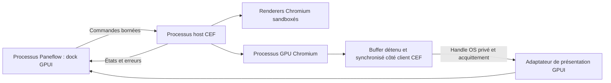

[PRD]
# PRD: Navigateur Agents sur Windows : port natif et qualification indépendante

## Changelog

| Version | Date | Author | Summary |
|---|---|---|---|
| 1.0 | 2026-09-05 | Arthur Jean | Scission du plan global par OS ; produit commun conservé, extension GPUI planifiée et qualification native indépendante. |
| 1.1 | 2026-09-06 | Arthur Jean | Diagnostic TSYNC : preuve noyau séparée de l’intégration CEF, invariant du broker et qualification de sandbox par OS explicités ; aucun gate abaissé. |

## Problem Statement

1. La navigation web quitte aujourd’hui Paneflow alors que serveur, terminal et session Agents y résident. Les racines d’ouverture externe sont vérifiables dans `src-app/src/terminal/input.rs` et `src-app/src/app/sidebar/context_menu.rs` ; aucune mesure d’adoption n’est inventée.
2. Le premier plan liait cinq stories de qualification aux quatre cibles avant toute intégration. Arthur demande désormais un travail OS par OS, avec un Mac à venir et Windows accessible séparément ; cette dépendance globale empêchait des préparations indépendantes.
3. Les handles, sandbox, bootstrap, input et packages ont des contrats natifs distincts. Un résultat Linux, une documentation CEF ou l’existence d’IOSurface ne prouve pas le port d’un autre OS.

**Why now:** La demande explicite est de remplacer le plan global par trois PRD exécutables séparément, en conservant le produit prévu et le travail partiel déjà réalisé.

## Overview

Ce PRD porte le navigateur Agents sur Windows en conservant exactement le produit commun : onglets du dock, navigation, profils, permissions, DevTools et outils agent. Le host CEF séparé, sa sandbox, l’import GPU, les entrées natives et le package sont adaptés à Windows. Le contrat fonctionnel complet est inclus ici pour travailler sur cette machine sans relire la conversation ou l’ancien PRD.

Les contrats communs sont implémentés une fois dans le PRD Linux, puis consommés depuis le code versionné. Le port n’attend ni la validation de toutes les distributions Linux ni celle du troisième OS. Les préparations du host, du renderer et du package peuvent être écrites sous Linux ; leurs critères portent sur ces livrables et leurs tests de contrat. US-008, US-013 et US-014 portent explicitement les exécutions natives. L’absence de machine n’est pas transformée en fonctionnement validé.

R0 prépare et éprouve le port, R1 est un aperçu interne sur fixtures, R2 qualifie le navigateur humain et R3 ses outils agent. Les 16 stories sont réparties en quatre epics ; R2 peut être livrée sans attendre R3. Le statut READY signifie que le plan est engageable, pas que Windows est prouvé viable. Les contrats C0/U1/U2/C1/C2/P1/C3 sont identiques aux autres PRD ; leurs preuves sont propres à cet OS.

## Goals

Les dates sont des objectifs relatifs au démarrage de ce PRD, pas une promesse d’effort. Les observations matérielles débutent à l’accès à l’environnement correspondant ; le code indépendant avance pendant cette attente.

| Goal | Month-1 Target | Month-6 Target |
|---|---|---|
| Avancer par OS | 1 contrat de port ou socle utilisable sans qualification des deux autres OS | 0 gate de release dépendant de la matrice matérielle d’un autre OS |
| Vérifier une page locale | 1 parcours C0 sur une référence native après accès | 100 % des parcours humains de la matrice Windows satisfaits |
| Préserver le terminal | 1 jeu A/B local archivé avant comparaison C | 100 % des budgets NFR applicables respectés |
| Distribuer un runtime cohérent | 1 manifeste de candidat avec provenance | 100 % des artefacts Windows annoncés vérifiés, sandbox active |
| Contrôler les agents | 0 accès Browser par défaut | 100 % des cas SEC R3 passent avant activation de la capacité agent |

## Target Users

### Développeur qui vérifie son application web

- **Role:** Utilisateur Paneflow sur Windows, avec agents et serveur local.
- **Behaviors:** Lance le service dans un terminal, ouvre sa page, corrige et recharge, consulte DevTools.
- **Pain points:** Changement de fenêtre, mauvais localhost et page dissociée de sa session.
- **Current workaround:** Navigateur externe avec fenêtres ou profils séparés.
- **Success looks like:** Parcours C0 terminé dans le dock, sans frappe Browser envoyée à un PTY ni cookie partagé entre workspaces.

### Mainteneur qui développe OS par OS

- **Role:** Arthur, qui travaille d’abord sous Linux, dispose d’un Windows 11 sur un autre SSD et attend son Mac.
- **Behaviors:** Implémente le socle, transfère sa branche et exécute les validations natives quand la machine est disponible.
- **Pain points:** Un gate global confond disponibilité de matériel et possibilité d’écrire du code ; les copies de code par OS risquent de diverger.
- **Current workaround:** Maintenir le navigateur externe et des notes de qualification manuelles.
- **Success looks like:** Stories de préparation revues sur leur périmètre, qualification native explicite, et Windows 10 1809+ et Windows 11 x64 vérifiés avant annonces correspondantes.

## Research Findings

Recherche renouvelée au 2026-09-05 : six recherches web ciblées, puis inspection bornée du dépôt et deux appels Context7 CLI pour cef-rs. Les sources upstream mouvantes donnent les contrats à vérifier ; elles ne fixent pas les futurs binaires.

### Competitive Context

| Référence | Fait utilisé | Conséquence |
|---|---|---|
| [Cursor](https://prod.cursor.com/docs/agent/tools/browser) | Navigation et outils de contexte navigateur avec isolation de workspace | Conserver navigation humaine et accès agent séparément autorisé |
| [cmux](https://cmux.com/docs/browser-automation) | Navigation, DOM, captures, sessions et diagnostics | Couvrir le parcours développeur ; sa solution ne prouve pas le moteur de Paneflow |
| [Electron OSR](https://www.electronjs.org/docs/latest/tutorial/offscreen-rendering) | Distinction entre bitmap et texture GPU partagée | Qualifier explicitement le transfert ; conserver le shell GPUI |

Le besoin différenciant retenu est la proximité entre une page et sa session Agents dans Paneflow. Aucun avantage inédit, gain de performance ou retour utilisateur concurrent non documenté n’est affirmé. Les captures initiales restent des références de hiérarchie, pas une preuve de moteur.

### Best Practices Applied

CEF décrit des handles accélérés par plateforme et leur validité limitée au callback ; la ressource doit être copiée vers une texture détenue par le client. La synchronisation et la durée de vie sont des exigences par OS. [CefRenderHandler](https://raw.githubusercontent.com/chromiumembedded/cef/master/include/cef_render_handler.h).

Le contrat CEF documenté pour M138+ repose sur un bootstrap EXE, une application cliente DLL, un export RunWinMain/RunConsoleMain et sandbox_info ; browser_subprocess_path n’est pas la voie de cette sandbox. Le pin retenu devra confirmer ces exigences. [Sandbox CEF](https://raw.githubusercontent.com/chromiumembedded/cef/master/docs/sandbox_setup.md). cef-rs possède un chemin de copie bootstrap/DLL sous sa feature sandbox. [Distribution cef-rs](https://github.com/tauri-apps/cef-rs/blob/dev/cef/src/build_util/win/mod.rs). Le DirectX draw_surfaces de GPUI est vide au pin de départ, donc une extension versionnée est planifiée. [GPUI DirectX](https://github.com/zed-industries/zed/blob/fecc3273ed32643c2ea1b04a74c8780e2c9ffaf8/crates/gpui_windows/src/directx_renderer.rs#L810).

Les exemples Context7 présentent des imports DMA-BUF, D3D et IOSurface vers wgpu, mais ne prouvent ni copie avant retour, ni fences, ni consommation par GPUI. Leurs extraits _autodocs sont secondaires : les headers et le code du pin priment. [Imports cef-rs](https://github.com/tauri-apps/cef-rs/blob/dev/_autodocs/07-osr-texture-import.md). Aucun couple exact CEF/cef-rs n’est déclaré testé par ce PRD.

Le dépôt est au commit `fbfefd250a3f3c8d9968a23f8c358712859bc904`, avec Rust 1.98.0, GPUI `fecc3273ed32643c2ea1b04a74c8780e2c9ffaf8` et wgpu 29.0.4 dans le lockfile inspecté. L’outillage `bench/browser/` et `scripts/browser-qualification.mjs` existe ; ses 27 tests précédents concernent le CLI et les fixtures, pas la viabilité du navigateur natif. Le préflight `docs/browser/qualification.md` reste un historique d’obstacles au pin de départ.

## Assumptions & Constraints

### Assumptions (to validate)

| ID | Hypothèse | Risque | Story et preuve attendue |
|---|---|---|---|
| A1 | Le host CEF séparé peut présenter sa frame dans GPUI sur Windows | Élevé | US-005/006, puis US-008 puis US-013/014 : prototype branché et traces natives |
| A2 | Le pin distribué respecte la sandbox et les minima de l’OS | Élevé | US-001/002, puis qualification native d’installation |
| A3 | Les copies, fences et mémoire satisfont M1 et les NFR | Élevé | US-008 puis US-013/014, mesures réelles sans assouplir les seuils |
| A4 | L’arbre CEF peut rejoindre le lecteur d’écran de la plateforme | Élevé | US-009 puis US-013 : preuve avec lecteur natif |
| A5 | Les références matérielles de la matrice seront accessibles | Moyen | US-008/013/014 : disponibilité distincte de l’état d’implémentation |
| A6 | Les interfaces communes peuvent rester compatibles entre ports | Moyen | Contrats versionnés, dépendances CORE et tests de régression du socle |

### Hard Constraints

- La présente exécution rédige des PRD et trackers uniquement. Le code, l’outillage existant, les configurations personnelles et les preuves historiques ne sont pas remplacés pendant la rédaction.
- Un seul produit, un seul moteur CEF et un seul domaine Browser partagé. Le PRD Linux possède les contrats communs ; un port peut les corriger avec un test partagé, jamais les copier en contrôleurs divergents.
- L’extension ciblée et versionnée de GPUI est incluse dans le plan. Ses quatre pins et Cargo.lock restent synchronisés, font-kit reste actif, les features Linux Wayland/X11 sont préservées. Le cache Cargo demeure en lecture seule. Un changement de shell ou un fork Chromium complet serait une extension de scope distincte.
- libghostty reste le moteur terminal unique. CEF n’entre ni dans ses types, ni dans les helpers shim/ai-hook/MCP. Les caps de 512 KiB shim, environ 375 KB ai-hook, 512 KiB MCP et le plafond combiné existant sont conservés.
- Les types, chemins et code OS sont isolés derrière les adaptateurs. Une plateforme Browser non prête garde un chemin unavailable et un terminal fonctionnel ; elle ne nécessite pas les archives CEF d’un autre OS pour compiler son terminal.
- Aucune attente de fence, I/O, opération réseau ou création de processus ne bloque le thread GPUI. Les messages et ressources suivent C2/C3 et les handles ne prolongent pas implicitement la vie des callbacks CEF.
- La sandbox requise reste active dès les essais moteur. Aucun no-sandbox, disable-web-security, bypass TLS global, bridge natif de page ou port CDP TCP n’est un moyen de validation.
- Le runtime est vérifié et embarqué avant distribution, disponible hors ligne après installation et mis à jour avec l’app. Aucun exécutable téléchargé au premier usage, Chrome externe imposé ou updater CEF parallèle.
- GPL-3.0-or-later et les obligations natives sont préservées ; les notices/codecs des binaires réels sont vérifiés avant redistribution.
- Les capacités de distribution sont propres à chaque cible : absent, développement sur fixtures, humain qualifié, agent qualifié. Le mécanisme est réellement consommé par le registre, le launcher et le packaging ; il ne consiste pas en un flag non lu. Les builds de développement sur fixtures ne sont pas une release Browser générale.
- Les contrats U1/U2 réutilisent DESIGN.md, les huit thèmes, les primitives et le registre de raccourcis. Aucun redesign du terminal, des splits ou du mode Review.
- `tasks/` reste local et non suivi. Les nouveaux documents suivis décrivent leurs contrats de façon autonome sans pointer vers tasks/. Pour changer de machine, transférer les PRD/trackers et récupérer le code de la branche de travail ; pousser sur main n’est pas nécessaire.

### Preuve de sandbox par plateforme

La qualification décrit les protections réellement actives par type de processus, avec la provenance du pin CEF testé. Une preuve Linux de seccomp/TSYNC n’est ni une preuve native de ce port ni une autorisation d’en assouplir la sandbox. Le diagnostic Linux du 2026-09-06 valide une sonde EGL limitée ; l’intégration du broker et de la politique Chromium complète reste ouverte (`docs/browser/gpu-sandbox-tsync.md`). Ce travail Linux n’ajoute aucune dépendance bloquante aux stories de ce port. Les bootstrap, helpers, protections natives, handles GPU et cycles de vie restent à exécuter sur leur OS selon les critères existants.

## Quality Gates

Gates applicables au périmètre modifié, exécutés en un lot cohérent à la fin d’implémentation/revue et aux frontières de commit/push prévues par AGENTS.md. Aucun build, suite applicative ou navigateur n’est exécuté pour la seule rédaction de ce PRD.

- `cargo fmt --check` - toolchain Rust 1.98.0 épinglé, obligatoire avant commit/push Rust ; ne pas substituer un autre toolchain.
- `cargo check --workspace --all-targets --locked` - compilation du périmètre disponible sur l’hôte, sans prétendre compiler les branches natives exclues.
- `cargo clippy --workspace --all-targets --locked -- -D warnings` - lint du workspace et des tests ; compléter sur les hôtes natifs aux stories de qualification qui les possèdent.
- `cargo test --workspace --locked` - suite au lot final applicable ; les tests ciblés intermédiaires servent uniquement à résoudre un contrat ou un échec concret.
- `cargo deny check advisories licenses sources` - si les dépendances changent, complété par inventaire licences/SBOM natif et provenance des artefacts CEF.
- `bun test scripts/browser-qualification/qualification.test.mjs` - si l’outillage de qualification Browser est modifié ou repris ; cette suite n’atteste aucun rendu natif.
- `pwsh -NoProfile -File scripts/validate-task-artifacts.ps1` - cohérence des artefacts tasks quand PowerShell est disponible ; sinon exécuter les mêmes invariants avec un runtime disponible et noter explicitement que le script PowerShell n’a pas tourné.

Les commandes terminal/éditeur existantes, M1, traces GPU et observations natives complètent ces gates au moment des stories qui portent leurs budgets. Ne jamais modifier une baseline pour masquer un delta. Les branches Windows/macOS exclues par cfg ne sont ni compilées ni lintées sur Linux ; leurs résultats natifs appartiennent aux stories désignées, avant qualification publique de la cible.

**Stories de préparation :** vérifier code branché, formats, chemins d’appel et tests de contrat depuis une entrée réelle avec adaptateur déterministe. La preuve est nommée « contrat sur hôte », jamais « GPU/sandbox natif passé ». Ne pas déplacer implicitement dans une telle story une exécution matérielle attribuée à une story de qualification distincte. Toute exécution native faite reste utile comme preuve supplémentaire.

**Stories de qualification :** compiler et exécuter sur l’OS/architecture concernés, passer le corpus UI/IME/lecteur d’écran, vérifier sandbox, processus arrêtés et M1, joindre traces et captures. Une machine, un SDK ou une signature absente laisse la preuve native ouverte. Aucun mock, build croisé, capture d’écran isolée ou score CPU ne remplace ce résultat.

L’utilisation d’un navigateur ou d’une UI native suit l’autorisation applicable à la tâche ; la rédaction des plans ne l’ouvre pas. Si une observation humaine est nécessaire, la consigner comme manuelle avec machine, commit, scénario et résultat. Les autres stories indépendantes continuent.

## Epics & User Stories

Les IDs sont locaux à ce PRD ; une référence à un autre plan utilise son label LINUX/WINDOWS/MACOS. Le compteur stories_done ne compte que les certifications de review-epic.

| Livraison | Périmètre | Condition |
|---|---|---|
| R0 | EP-001 et EP-002, 8 stories | Préparation puis première exécution native US-008 |
| R1 | Aperçu des contrats communs sur fixtures | Disponible uniquement après fonctionnement local observé, sans annonce de support public |
| R2 | EP-003 et US-013 à US-015, 7 stories | Package et navigateur humain qualifiés sur la matrice propre à cet OS |
| R3 | US-016, 1 story | Qualification locale des outils agent réutilisés |

Les livraisons sont des étapes explicites, pas des échéances garanties. Les stories de code indépendantes peuvent avancer avant une qualification non disponible ; les annonces et activations publiques restent soumises à leurs gates.

### EP-001: Préparer le host Windows et reprendre les contrats communs

Écrire les composants propres à Windows en réutilisant le domaine commun. Ces stories de préparation peuvent avancer depuis Linux ; leurs preuves n’affirment aucune exécution native.

**Definition of Done:** Le plan de runtime, les points d’entrée, la supervision et le branchement au contrôleur sont implémentés et testés au niveau des contrats. La première exécution native appartient à EP-002.

#### US-001: Figer les artefacts et minima Windows

**Description:** En tant que mainteneur Windows, je veux un candidat moteur identifié afin de préparer le port sans supposer sa compatibilité.

**Priority:** P0
**Size:** L (5 pts)
**Dependencies:** None ; interfaces externes : CORE-RUNTIME (résolution dans Technical Considerations).

**Acceptance Criteria:**

- [ ] Le manifeste commun reçoit l’artefact x86_64-pc-windows-msvc, versions Chromium/CEF, cef-rs, hash, provenance et notices ; la version de protocole est compatible avec le socle consommé.
- [ ] Les métadonnées binaires et headers du candidat sont confrontés à Windows 10 1809+ et Windows 11 x64 ; leurs contrats de bootstrap, sandbox et présentation sont archivés au pin.
- [ ] Le fetch explicite et l’extraction sûre sont branchés au tooling de cette cible, sans téléchargement dans build.rs ni au premier usage ; aucune archive Linux ne remplace cet artefact.
- [ ] Le commit des interfaces communes consommées est enregistré depuis le dépôt ; cette préparation n’attend pas la qualification matérielle Linux ni celle du troisième OS.
- [ ] Échec : archive absente, checksum incorrect, ABI ou minimum incompatible conserve la cible non qualifiée et déclenche l’étude d’un candidat compatible, sans réduire le support en silence.

#### US-002: Préparer le bootstrap EXE et la DLL cliente sandboxée

**Description:** En tant que développeur Windows, je veux les points d’entrée exigés par CEF afin de préparer un lancement sandboxé indépendant de Paneflow.

**Priority:** P0
**Size:** L (5 pts)
**Dependencies:** Blocked by US-001

**Acceptance Criteria:**

- [ ] Pour le pin CEF retenu, le bootstrap Windows appelle le point d’entrée exporté de la DLL cliente et transmet sandbox_info ; avec le contrat M138+ documenté, browser_subprocess_path n’est pas utilisé pour contourner ce bootstrap.
- [ ] Le code traite les rôles browser/subprocess avec le bootstrap attendu et les bons modules ; les tests de contrat contrôlent arguments, chemins et refus d’une DLL inconnue.
- [ ] Les tests de contrat de bootstrap, le harness natif et ses scripts de construction, staging et signature locale requise par le pin sont livrés pour US-008 ; la vérification sous Linux porte sur le code, ses données et son chemin d’appel, pas sur une sandbox simulée déclarée active.
- [ ] Aucune initialisation ou dépendance libcef n’est ajoutée au chemin de démarrage terminal lorsque Browser est absent/inactif.
- [ ] Échec : bootstrap absent, export manquant, sandbox_info incompatible ou composant du mauvais pin produit unavailable, sans lancer directement une DLL ni désactiver la sandbox.

#### US-003: Adapter supervision, IPC et profils Windows

**Description:** En tant qu’utilisateur Windows, je veux un host borné et des profils privés afin que le navigateur conserve l’isolation de mes projets.

**Priority:** P0
**Size:** L (5 pts)
**Dependencies:** Blocked by US-002 ; interfaces externes : CORE-CONTROL (résolution dans Technical Considerations).

**Acceptance Criteria:**

- [ ] Le contrôle privé utilise une named pipe et des ACL limitant l’identité utilisateur ; les handles hérités/dupliqués sont limités et le groupe de descendants utilise le mécanisme Job Object compatible avec le bootstrap.
- [ ] Les profils/cache sont résolus par les chemins Windows du runtime avec ACL utilisateur ; aucun chemin POSIX ni shell Linux n’entre dans la configuration du host.
- [ ] Le verrou de racine, la propriété des processus, la fermeture et le handshake sont reliés au superviseur commun ; des tests de contrat couvrent root-in-use, host mort et refus de pair.
- [ ] La libération des ressources appartient au processus propriétaire ; le code d’arrêt n’utilise ni kill par nom ni privilèges élargis par défaut.
- [ ] Échec : ACL/permissions incorrectes, parent perdu ou verrou détenu conserve les terminaux et renvoie une erreur Browser, sans partage implicite du host.

#### US-004: Brancher le backend Windows au dock partagé

**Description:** En tant que développeur, je veux consommer les mêmes contrôleurs afin que le port Windows garde les mêmes règles de produit.

**Priority:** P0
**Size:** L (5 pts)
**Dependencies:** Blocked by US-003 ; interfaces externes : CORE-DOCK (résolution dans Technical Considerations).

**Acceptance Criteria:**

- [ ] Le registre de plateforme et le contrôleur Browser sélectionnent ce backend ; les actions du dock, owners, park/restore, profils et descripteurs réutilisent le socle commun.
- [ ] Une intégration déterministe depuis le picker/contrôleur vérifie commandes, génération, indisponibilité et absence de chargement CEF avant activation, sans réécrire le dock par OS.
- [ ] Le runtime de développement est explicitement accessible au harness ; une capacité non qualifiée ne devient pas une activation publique par défaut.
- [ ] Échec : socle manquant ou version incompatible produit un besoin d’interface précis ; il n’est pas remplacé par une copie divergente ou une dépendance au statut DONE de tout le PRD Linux.

---

### EP-002: Implémenter le GPU et obtenir une première preuve Windows

Préparer composition, transfert et input, puis exécuter un premier parcours natif dès que la machine Windows est accessible.

**Definition of Done:** Le code des adaptateurs a ses preuves de contrat et US-008 a une trace native exploitable. Une machine absente laisse seulement la qualification native ouverte, sans certifier cet epic.

#### US-005: Étendre la composition DirectX de GPUI

**Description:** En tant que développeur Windows, je veux une composition GPU atteignable afin de présenter CEF dans la scène GPUI.

**Priority:** P0
**Size:** L (5 pts)
**Dependencies:** Blocked by US-001 ; interfaces externes : CORE-GPU (résolution dans Technical Considerations).

**Acceptance Criteria:**

- [ ] Le dispatch DirectX draw_surfaces actuellement vide est remplacé par une composition de texture externe avec clipping, format et alpha explicités, atteinte par la scène GPUI commune.
- [ ] L’extension gère dimensions physiques, format couleur, device et génération ; sa surface publique ne divulgue pas de types D3D au domaine Browser.
- [ ] Le patch est versionné avec celui du socle, les quatre pins sont synchronisés et font-kit est conservé ; les chemins Linux et de l’autre OS ne sont pas écrasés.
- [ ] Les tests de données et de dispatch atteignent le contrat de scène depuis une entrée de harness ; l’exécution sur le GPU réel reste explicitement attribuée à US-008.
- [ ] Échec : format non pris en charge, ressource d’une ancienne génération ou backend absent renvoie une erreur, sans chemin CPU de rafraîchissement de secours.

#### US-006: Transférer les textures partagées D3D avec ownership

**Description:** En tant que développeur Windows, je veux une ressource détenue afin que CEF et GPUI ne lisent ni écrivent une texture expirée.

**Priority:** P0
**Size:** L (5 pts)
**Dependencies:** Blocked by US-002, US-005

**Acceptance Criteria:**

- [ ] Le handle partagé D3D adapté au pin est ouvert avec droits bornés, copié dans une texture détenue avant expiration du callback CEF puis transmis au consommateur authentifié.
- [ ] Les mécanismes de synchronisation D3D du pin, la duplication/fermeture des handles et l’alignement du GPU producteur/consommateur sont explicités ; aucun handle brut de callback n’est réutilisé après son retour.
- [ ] Le pool suit C2 : 3 buffers stables, 6 au remplacement et 2 images en attente maximum ; les resize supplémentaires sont coalescés et les générations invalidées.
- [ ] Le chemin callback vers publication puis consommation GPUI est câblé ; des tests de contrat couvrent ownership et ordre de libération, tandis que les fences réelles sont prouvées en US-008/014.
- [ ] Échec : perte device, handle/droit invalide, format incompatible ou retrait dépassant 1 s signale une erreur sans attente sur le thread UI ni libération encore en usage.

#### US-007: Adapter le clavier, l’IME et les changements DPI

**Description:** En tant qu’utilisateur Windows, je veux saisir dans la page afin que le port respecte les coordonnées et les raccourcis de mon OS.

**Priority:** P0
**Size:** L (5 pts)
**Dependencies:** Blocked by US-004, US-006

**Acceptance Criteria:**

- [ ] Les événements Windows de clavier, souris, wheel et composition IME sont traduits vers CEF ; les rectangles candidats et coordonnées couvrent les scales 100/150/200 % et les changements de moniteur.
- [ ] Ctrl est le modificateur secondaire ; les raccourcis U2, le clipboard sur geste humain et la fermeture de DevTools restent contextuels, sans intercepter les touches du terminal.
- [ ] Des tests depuis le contrôleur input vérifient les conversions, les consommateurs d’événements et l’annulation de composition ; le corpus natif IME est préparé pour US-008/013.
- [ ] Les menus et l’inspecteur restent dans la hiérarchie du dock ; navigation et callbacks tardifs ne déplacent pas le focus.
- [ ] Échec : changement d’écran/session, perte de capture ou document périmé annule l’entrée sans frappe dans un PTY ni coordonnées de l’ancien viewport.

#### US-008: Exécuter le prototype sur la première machine Windows

**Description:** En tant que mainteneur, je veux une preuve native précoce afin de détecter un défaut structurel avant la finition du port.

**Priority:** P0
**Size:** L (5 pts)
**Dependencies:** Blocked by US-004, US-006, US-007

**Acceptance Criteria:**

- [ ] Le premier passage s’effectue sur le Windows 11 du SSD d’Arthur, avec version/build, GPU et pilote réellement relevés ; l’absence de cette machine est enregistrée et n’est jamais remplacée par une inspection Linux.
- [ ] Les scripts livrés en US-002 construisent sur cette machine le harness et son staging de qualification avec le SDK et les signatures exigés par le pin ; ce premier test ne dépend ni du MSI/DMG de distribution US-011 ni de sa publication.
- [ ] Le bootstrap du staging local de qualification crée une page dans le dock depuis le processus Paneflow distinct, puis ferme la page et les descendants avec sandbox active.
- [ ] Une fixture apparaît réellement dans GPUI ; handle, copie détenue, synchronisation, input/IME, resize et fermeture du host sont observés et archivés.
- [ ] A et B du même pin sont capturés sur cette machine selon M1 avec première comparaison C ; les preuves distinguent exécution, budgets mesurés et éléments encore non exécutés.
- [ ] Échec : sandbox absente, import non fonctionnel, readback normal ou défaut main-thread donne un verdict local négatif et une réparation ciblée ; aucun support public n’est déclaré.

---

### EP-003: Compléter les intégrations OS et préparer le package Windows

Implémenter les ponts accessibles, les interactions système et la chaîne d’installation. Leur préparation peut avancer pendant l’attente de matériel ; la distribution reste fermée jusqu’à EP-004.

**Definition of Done:** Les chemins natifs et le plan de package sont câblés, les tests de contrats passent et les scénarios d’installation sont prêts. Aucune signature ni lecture d’écran réelle n’est inférée de ces seuls tests.

#### US-009: Brancher l’accessibilité Windows et les contrôles du dock

**Description:** En tant qu’utilisateur de Narrator, je veux atteindre le document et le chrome afin de naviguer avec les technologies d’assistance.

**Priority:** P0
**Size:** L (5 pts)
**Dependencies:** Blocked by US-004, US-007 ; interfaces externes : CORE-UX (résolution dans Technical Considerations).

**Acceptance Criteria:**

- [ ] Le pont choisi vers l’accessibilité Windows reçoit les mises à jour de l’arbre CEF et les identités de document ; les noms/rôles/états des contrôles GPUI restent exposés.
- [ ] Recherche, zoom/reset, navigation F6, focus visible et couleurs réutilisent U1/U2 ; les états d’accessibilité sont reliés aux générations de document.
- [ ] Un test du contrôleur de pont utilise des mises à jour de l’arbre et vérifie leurs événements de sortie ; un parcours Narrator est préparé pour exécution réelle en US-013.
- [ ] Échec : nœud périmé, sous-frame indisponible ou arbre absent est signalé ; le pont ne fabrique pas le contenu inaccessible.

#### US-010: Adapter permissions, dialogues et fichiers Windows

**Description:** En tant qu’utilisateur Windows, je veux les dialogues et autorisations de mon système afin de garder le contrôle des fichiers et capacités web.

**Priority:** P0
**Size:** L (5 pts)
**Dependencies:** Blocked by US-004, US-007 ; interfaces externes : CORE-WEB (résolution dans Technical Considerations).

**Acceptance Criteria:**

- [ ] Sélecteurs de fichiers, destinations de download, clipboard, demandes caméra/micro et protocoles externes utilisent les chemins Windows ; un fichier du cwd ne devient jamais une DLL ou une destination implicite.
- [ ] P1 reste l’unique politique : origine/profil/document, révocation et génération sont revérifiés lors du retour asynchrone de la décision OS.
- [ ] Les tests depuis le contrôleur de permissions/fichiers injectent accord, refus, annulation et navigation concurrente ; aucun chemin arbitraire agent n’est accepté.
- [ ] Échec : refus OS, capability absente, dialogue fermé ou callback tardif n’accorde aucun droit et n’exécute aucun téléchargement automatiquement.

#### US-011: Préparer le MSI et la signature des composants

**Description:** En tant que mainteneur Windows, je veux un plan de package reproductible afin de préparer une installation sans outils de développement.

**Priority:** P0
**Size:** L (5 pts)
**Dependencies:** Blocked by US-001, US-002, US-003

**Acceptance Criteria:**

- [ ] Le staging et le WiX MSI décrivent bootstrap, DLL cliente, libcef, ressources et locales dans un dossier installé non modifiable par un utilisateur standard.
- [ ] La chaîne de build prépare la signature des composants Windows modifiés selon le runbook existant ; la vérification des DLL chargées exclut le cwd et les répertoires non autorisés.
- [ ] Les tests du plan de bundle vérifient sur fixture la présence et la cohérence des composants ; création réelle du MSI signé, installation standard-user et vérification des DLL appartiennent à US-013.
- [ ] La préparation conserve le format publié existant et les plafonds des petits helpers ; les secrets de signature proviennent de la configuration mainteneur et ne sont pas ajoutés au dépôt.
- [ ] Échec : ressource manquante, architecture incorrecte, chemin hors bundle ou configuration de signature absente bloque la construction distribuable, sans télécharger le runtime au premier usage.

#### US-012: Adapter les mises à jour et le rollback Windows

**Description:** En tant qu’utilisateur Windows, je veux une mise à jour cohérente afin de préserver mes profils quand le moteur change.

**Priority:** P0
**Size:** L (5 pts)
**Dependencies:** Blocked by US-011 ; interfaces externes : CORE-UPDATE (résolution dans Technical Considerations).

**Acceptance Criteria:**

- [ ] L’updater Windows coordonne l’arrêt du host et les fichiers verrouillés avant remplacement MSI ; le protocole app/runtime refuse un mélange de versions après reboot ou installation interrompue.
- [ ] Les chemins de mise à jour utilisent le manifeste, les hashes et la version de profil communs ; une migration interdit tout downgrade aveugle des données.
- [ ] Des fixtures de plan d’installation couvrent interruption, fichiers retenus, espace insuffisant et reprise ; la mise à jour native réelle est attribuée à US-013.
- [ ] SBOM, licences, codecs et runbook de maintenance du pin sont complétés pour cet artefact sans supposer que l’audit Cargo couvre le runtime.
- [ ] Échec : signature/hash invalide ou ensemble partiel conserve la version précédente et les données ; aucun moteur incompatible n’ouvre le profil.

---

### EP-004: Qualifier et préparer les livraisons Windows

Exécuter la matrice native S1-W, certifier le navigateur humain, puis les outils agent dans une livraison distincte.

**Definition of Done:** Les quatre stories ont leurs preuves sur Windows. US-015 constitue le gate humain R2 ; US-016 est le gate agent R3 et ne retarde pas R2.

#### US-013: Qualifier installation, parcours web et accessibilité Windows

**Description:** En tant que mainteneur, je veux des passages sur les systèmes revendiqués afin de qualifier le port à partir des packages réels.

**Priority:** P0
**Size:** L (5 pts)
**Dependencies:** Blocked by US-008, US-009, US-010, US-011, US-012

**Acceptance Criteria:**

- [ ] Windows 10 au minimum 1809 revendiqué et Windows 11 sont exécutés avec builds exacts ; NVIDIA et au moins un GPU Intel ou AMD sont couverts, avec multi-écran DPI.
- [ ] Le MSI réellement signé s’installe sous utilisateur standard, démarre depuis un dossier protégé et charge uniquement les DLL attendues ; une DLL hostile déposée dans le cwd n’est pas chargée.
- [ ] C0, U1/U2, SEC-01 à SEC-08, IME, clipboard, fichiers, permissions, DevTools et lecture du contenu par Narrator sont exécutés ; la restauration reste Dormant.
- [ ] Le parcours couvre clair/sombre, les huit thèmes, 800x500 et les scales exposés ; une mise à jour depuis la version précédente et ses erreurs préservent les profils.
- [ ] Échec : configuration obligatoire, signature ou preuve native absente reste NON_EXÉCUTÉE ; une compilation ou le premier smoke test ne certifie pas toute la matrice.

#### US-014: Mesurer performances, ressources et récupération Windows

**Description:** En tant que mainteneur, je veux les mesures propres à Windows afin de vérifier les budgets sans importer un résultat Linux.

**Priority:** P0
**Size:** L (5 pts)
**Dependencies:** Blocked by US-008, US-012

**Acceptance Criteria:**

- [ ] M1 A/B/C est exécuté sur les références natives avec traces de présentation D3D/OS, profileur CPU et mémoire natifs Windows, 1920x1080, 60/120 Hz qualifiés, cinq répétitions et données brutes conservées.
- [ ] Les ressources mesurées incluent private working set de l’arbre Browser, delta du parent, mémoire GPU et handles Windows ; interop et VRAM interne Chromium sont séparées avant total, sans comparaison directe entre métriques OS.
- [ ] NFR-01 à NFR-08 et NFR-11/13 couvrent coût sans usage, terminal actif, copies/buffers, ouverture, background, 200 cycles, resize, crashs et tailles de package.
- [ ] Les baselines CPU et présentation restent distinctes et aucun seuil n’est modifié pour transformer une régression en PASS.
- [ ] Échec : incertitude excessive, croissance résiduelle, ressource orpheline ou budget dépassé laisse le verdict concerné négatif et déclenche une correction mesurée.

#### US-015: Préparer le verdict humain et les docs Windows

**Description:** En tant qu’utilisateur Windows, je veux connaître les capacités réellement disponibles afin de choisir le navigateur intégré en connaissance de ses limites.

**Priority:** P0
**Size:** L (5 pts)
**Dependencies:** Blocked by US-013, US-014

**Acceptance Criteria:**

- [ ] Le rapport versionné rassemble la matrice S1-W, minima effectifs, preuves GPU/sandbox/input/accessibilité, M1, SEC et provenance des packages.
- [ ] La capacité Browser humain x86_64-pc-windows-msvc est autorisée dans le manifeste de distribution seulement après ce verdict ; aucun résultat Linux ou du troisième OS n’est une condition de certification locale.
- [ ] Les docs décrivent parcours, erreurs, données locales, permissions, DevTools et installation ; la certification du dossier ne publie, commit ou push rien automatiquement.
- [ ] Échec : case obligatoire manquante ou budget non satisfait donne NO-GO R2 pour cette cible ; les terminaux et les autres plateformes conservent leur état de support.

#### US-016: Qualifier les outils agent communs sur Windows

**Description:** En tant qu’utilisateur d’agents sur Windows, je veux les mêmes outils contrôlés afin de vérifier la page du bon workspace.

**Priority:** P1
**Size:** L (5 pts)
**Dependencies:** Blocked by US-015 ; interfaces externes : CORE-AGENT (résolution dans Technical Considerations).

**Acceptance Criteria:**

- [ ] Les implémentations communes browser.list/state/snapshot/screenshot/console/network et navigate/back/forward/reload/click/type/scroll sont réutilisées, avec sélection et aperçu composer ; aucun namespace ou contrôleur parallèle par OS.
- [ ] SEC-09 à SEC-12 et les limites C3 sont exécutés sur Windows avec deux workspaces, deux clients, anciennes generations, relance du host et reprise humaine.
- [ ] Les résultats incluent identités, origine, generation et horodatage ; les captures/sous-frames inaccessibles sont signalées et les secrets réduits selon C3.
- [ ] Le réglage démarre disabled, read n’autorise aucune mutation et toute révocation bloque les résultats en attente ; le verdict agent est distinct du verdict humain R2.
- [ ] Échec : socle agent pas encore intégré, scope invalide, lease perdue ou fuite de métadonnée conserve R3 en attente sans rouvrir le chantier R2 déjà qualifié.

---

## Functional Requirements

Le contrat suivant décrit le même produit sur les trois OS. Son implémentation commune est propriétaire du plan Linux ; les ports branchent leurs adaptateurs et en prouvent le résultat natif.

- FR-01 : Browser est un type de surface du dock Agents, disponible dans son picker, son menu + et une commande d’ouverture d’URL. Aucun contenu Browser n’est ajouté à la grille des terminaux ou au mode Review..
- FR-02 : Chaque onglet Browser a un propriétaire de session Agents explicite, y compris lorsqu’il est garé ; changer de session ne recrée pas sa page..
- FR-03 : Le navigateur propose adresse, historique précédent/suivant, arrêt/rechargement, titre/favicon, fermeture, recherche, zoom et agrandissement du dock..
- FR-04 : La page est rendue par CEF ; GPUI rend son chrome et compose la présentation qualifiée. Le chemin normal de présentation ne transfère pas de frame complète via CPU..
- FR-05 : Le host est séparé et lancé à la demande, avec les sous-processus CEF requis, une racine de données verrouillée et un arrêt borné..
- FR-06 : Profils par workspace, onglets par session, limites et restauration suivent C1 ; aucune connexion à un profil Chrome ou Helium externe n’est importée automatiquement..
- FR-07 : Les entrées URL et liens de services respectent leur propriétaire ; le choix d’ouverture externe reste disponible..
- FR-08 : Le focus, IME, clipboard et les raccourcis sont routés selon U2 ; une touche destinée à la page n’atteint pas un PTY..
- FR-09 : Les erreurs de navigateur, de GPU et de profil restent visibles dans le dock et n’arrêtent pas les terminaux..
- FR-10 : Les permissions, certificats, popups et interactions OS suivent P1 ; toute requête devenue périmée est annulée..
- FR-11 : Les transferts de fichiers passent par une décision humaine et les sélecteurs OS ; aucun fichier téléchargé n’est exécuté automatiquement..
- FR-12 : DevTools utilise des API CEF publiques et une surface liée à la page ; aucun port CDP public n’est nécessaire..
- FR-13 : Les packages embarquent un runtime cohérent et vérifiable, mis à jour avec l’application, avec diagnostics en cas d’incompatibilité..
- FR-14 : Les outils agent sont distincts de `surface.*`, soumis au workspace et désactivés par défaut. Les opérations longues sont asynchrones, bornées et annulables..
- FR-15 : La sélection d’un élément prépare un contexte visible avant envoi ; elle ne transmet pas automatiquement une instruction à un agent..

### Priorités MoSCoW

| Niveau | Capacités | Livraison |
|---|---|---|
| Must Have | Host, GPU, dock, navigation, propriétaires, profils, restauration, input/IME/accessibilité, permissions, reprise et package | R0 à R2, P0 |
| Should Have | DevTools humain ; lecture et interaction agent bornées | DevTools R2 P1 ; outils R3 P1 |
| Could Have | Sélection d’un élément et aperçu de contexte dans le composer | R3 P2 dans le socle, vérifiée par chaque port |
| Won’t Have | Extensions, sync, moteur de recherche, navigateur généraliste, contrôle CDP libre ou moteurs différents par OS | Hors v1 |

R3 est explicitement séparée de R2. Aucune capacité du plan initial n’est supprimée par ce classement ; la sélection d’élément reste à implémenter, même si sa priorité est P2.

### C0 : parcours de référence

Un utilisateur ouvre une session Agents, lance un serveur local, clique son URL, utilise la page dans le dock, corrige avec son agent, recharge, consulte DevTools, bascule sur un deuxième workspace, puis revient. La première page garde son état en mémoire, les cookies du second workspace restent séparés et le terminal n’a reçu aucune frappe destinée au navigateur. Il ferme Paneflow, le relance et retrouve les onglets Browser sous leurs sessions respectives, à l’état Dormant jusqu’à sélection. Un serveur arrêté donne une page d’erreur avec Réessayer ; il ne supprime pas l’onglet.

### U1 : contrat d’interface

Références fournies par Arthur, conservées sans modification : [capture 1](prd-agents-browser-assets/reference-1.png), [capture 2](prd-agents-browser-assets/reference-2.png). Elles définissent la hiérarchie : onglets compacts, navigation, page. Le site montré dans la page n’est pas une UI à reconstruire.

```text
Dock Agents
  [ Changes ] [ fichier ] [ favicon titre × ]       +   agrandir   fermer dock
  précédent  suivant  recharger/arrêter  [ URL                   ]  inspecter  ...
  +--------------------------------------------------------------------------+
  |                                                                          |
  |                          viewport web CEF                                |
  |                                                                          |
  +--------------------------------------------------------------------------+
```

Une seule rangée d’onglets est affichée : Browser rejoint les chips existantes. Pas de barre de tabs Chromium dans la page et pas de sidebar de navigateur additionnelle. Le `+` ouvre le sélecteur de surface existant, avec Browser ajouté ; le raccourci contextuel Nouvel onglet Browser permet la création directe.

| Élément | Règle vérifiable |
|---------|------------------|
| Dock | Largeur actuelle réutilisée : 880 px par défaut, 360 px minimum, 1400 px maximum, bornée à la place disponible. Agrandir occupe la zone principale disponible ; réduire restaure la largeur précédente. |
| Rangée de tabs | Géométrie des chips du dock existant, titre tronqué avec tooltip complet, favicon ou icône générique, fermeture de chaque onglet. Aucun séparateur vertical ajouté entre chips. |
| Toolbar web | Hauteur cible 36 px logiques, contrôles de 24 px, espace de 4 px entre contrôles, champ d’adresse flexible avec hauteur 28 px. Constantes centralisées, rayons/couleurs/textes hérités des primitives existantes. |
| Largeur inférieure à 520 px | Inspecter et actions secondaires migrent dans le menu ; précédent, suivant, recharger/arrêter, adresse et menu restent accessibles. À 360 px, le champ d’adresse conserve au moins 160 px. |
| État vide | Adresse focalisée, invitation Saisir une URL, aucune page distante préchargée ni moteur de recherche imposé. |
| Adresse | L’URL complète est disponible à l’édition et à la copie. L’affichage ne masque pas l’origine ; titres et favicons ne remplacent jamais le nom d’hôte dans les prompts de sécurité. |
| Chargement | Bouton arrêter remplace recharger ; état de navigation visible sans animation décorative continue. Une page peut rester affichée pendant sa navigation selon CEF. |
| Page | Viewport opaque, indépendant des matériaux translucides du shell. Pas de filtrage CSS pour forcer les pages web à suivre le thème Paneflow. |
| Menus et popups | Le chrome GPUI reste au-dessus ; les menus web et candidats IME sont attachés au viewport et bornés à la fenêtre autorisée. |
| DevTools | Une présentation secondaire par page inspectée ; aucune duplication de la rangée Browser. Le ratio page/inspecteur est mémorisé dans la session courante, sans rouvrir DevTools au démarrage. |
| Fermer dock | Masque toutes ses présentations, préserve les onglets. Fermer Browser détruit sa session web après traitement de beforeunload. Fermer le dernier onglet du dock revient au picker. |

### U2 : focus et raccourcis

`secondary` vaut Cmd sur macOS, Ctrl sur Linux/Windows. Les actions restent remappables dans le registre existant. La priorité est : dialogue/IME actif, contexte DevTools, contexte Browser, puis actions globales. Les raccourcis Browser ne s’appliquent que si son chrome ou son document possède le focus.

| Entrée | Effet dans le contexte Browser | Hors contexte Browser |
|--------|--------------------------------|----------------------|
| secondary-L | Focaliser et sélectionner l’adresse | Binding existant conservé |
| secondary-T | Créer un Browser vide dans cette session | Binding existant conservé |
| secondary-W | Fermer le Browser courant ; si focus DevTools, fermer d’abord l’inspecteur | Comportement existant conservé |
| secondary-R | Recharger la page | Binding existant conservé |
| secondary-shift-R | Recharger sans cache de la requête courante selon l’API publique CEF, sans effacer le profil | Binding existant conservé |
| Alt-Gauche / Alt-Droite | Historique précédent/suivant, événement consommé | Navigation de grille existante conservée |
| secondary-F | Recherche dans la page | Recherche de la surface existante |
| secondary-plus / minus / 0 | Zoom page / reset | Binding existant conservé |
| F6 / Shift-F6 | Parcours adresse, document, inspecteur s’il existe, terminal précédemment actif, puis retour | Pas d’ajout de navigation globale non liée au dock |
| Échap | Annuler IME ou overlay prioritaire, sortir du fullscreen, fermer la recherche ; sinon arrêter le chargement en cours | Pas de fermeture implicite de session Agents |

Un événement tardif de titre, chargement ou popup ne change jamais le focus. Un clic utilisateur explicite sur un onglet peut focaliser sa page ; si l’utilisateur a déplacé le focus avant la fin d’une navigation, le callback ne le reprend pas. Le scroll dans la page n’est pas un scroll de terminal. Les changements de mode et de workspace libèrent capture pointeur, composition active et présentation avant d’activer le nouveau contexte.

### C1 : données, limites et cycle de vie

| Objet/règle | Contrat |
|-------------|---------|
| Workspace | Un identifiant BrowserProfileId persistant optionnel sur le workspace sauvegardé. Les worktrees et sessions appartenant au même workspace partagent son profil. Un workspace ajouté séparément obtient un autre profil même si son URL locale est identique. |
| Session Agents | Le propriétaire produit est l’onglet de workspace Paneflow, pas une conversation Claude/Codex distante. Les descripteurs Browser sont imbriqués dans sa TabSession sauvegardée. Les Tab.id runtime ne sont pas des clés disque durables. |
| Browser | BrowserId durable dans son descripteur ; handle de runtime clonable, mais une seule session moteur propriétaire. Les clones utilisés par le rendu ne créent aucun moteur supplémentaire. |
| Descripteur | Version de schéma Browser, ID, URL HTTP(S) validée ou état vide, titre borné, ordre Browser, zoom, mute, indication d’onglet actif. Pas de DOM, mot de passe, cookie, contenu des formulaires, handle GPU ou jeton IPC. |
| URL persistée | L’URL peut elle-même contenir une query ou un fragment sensible. Elle reste dans les données privées de l’utilisateur, est exclue des diagnostics exportés par défaut et peut être supprimée. Aucun mécanisme ne prétend détecter tous les secrets contenus dans une URL. |
| Profil | Données CEF sous une racine cache/data dédiée résolue par runtime_paths, jamais dans le dépôt du projet. Permissions Unix utilisateur seul et ACL Windows limitées à l’utilisateur ; politique cryptographique réelle du runtime documentée, sans promesse de chiffrement universel. |
| Racine CEF | Une racine verrouillée pour le host propriétaire de l’installation utilisateur, avec RequestContext/cache_path par ProfileId. Une seule instance Paneflow peut posséder cette racine à la fois. Une seconde instance conserve ses terminaux mais refuse Browser avec profile_in_use ; aucun partage du host ou transfert automatique de page. Après arrêt du propriétaire, elle peut réessayer. Pas de racine dérivée d’un Tab.id éphémère. |
| Retrait d’un workspace | Ferme ses pages avec la politique normale de confirmation des formulaires. Garde le profil sur disque par défaut ; Effacer ses données est une action distincte et explicite. |
| Plafonds | Maximum 8 descripteurs Browser par session Agents, 64 au total et 8 Browser vivants au total par instance Paneflow. DevTools et les renderers internes Chromium ne sont pas comptés comme onglets Browser. Ces plafonds ne s’appliquent pas aux fichiers ou terminaux du dock. |
| Arrivée au plafond | Refuser une neuvième description dans la session ; au plafond de pages vivantes, proposer de mettre en veille une page choisie. Ne pas tuer implicitement un formulaire pour libérer une place. |
| États | Dormant, Starting, Visible, Hidden, Closing, Crashed. La navigation possède ses propres états Idle/Loading/Failed et ne recrée pas l’identité de la page. |
| Masquage | Cesser la présentation et informer CEF de la visibilité. Le runtime conserve la session et applique ses politiques de background. WasHidden n’est pas présenté comme un arrêt de tout JavaScript, réseau ou audio. |
| Mise en veille | Action humaine qui détruit l’instance web après confirmation utile et garde URL/zoom/mute. Aucun discard automatique par durée en v1 ; pas de détection prétendument exhaustive des formulaires modifiés. |
| Restauration | Tous les Browser sont Dormant au relancement, même le dernier actif. Sélectionner recrée la page ; historique back/forward et état JavaScript en mémoire ne sont pas restaurés après destruction. |
| Historique | Historique de navigation complet fourni par CEF tant que la page vit. Au redémarrage, seule la dernière URL validée est restaurée, pas les POST ou la session history du moteur. |

Entrées admises dans la barre et les commandes : `http://`, `https://`, `localhost:port`, adresse IP avec port, IPv6 entre crochets et nom de domaine valide. HTTP est choisi pour localhost/IP avec port sans schéma, HTTPS pour un nom de domaine sans schéma. Une chaîne non interprétable comme URL produit une erreur, pas une recherche web. `about:blank` est autorisé pour une page vide. Les navigations privilégiées internes de CEF/DevTools restent gérées par l’application et ne sont pas des entrées utilisateur autorisées. Les identifiants username/password dans une URL sont refusés. Les téléchargements Blob créés par une page conservent les contrôles de destination de P1.

### C2 : frontière de rendu et processus



Le dessin montre des responsabilités, pas une garantie sur la topologie interne de tous les processus Chromium. Le pin définit quels processus possèdent chaque ressource. Le prototype doit documenter le chemin réel et le moment où la copie issue du callback CEF est terminée avant son retour.

Un BrowserSession expose état/commandes ; un BrowserPresentation expose montage, bounds, visibilité et textures. Les adaptateurs Linux, macOS et Windows cachent les handles natifs. Pour chaque viewport, le pool actif détient au plus 3 buffers de frame : un consommé et au plus deux disponibles/en attente. Ce plafond concerne les allocations d’interop détenues par le host/Paneflow, pas les surfaces internes de Chromium dont la VRAM totale est mesurée séparément. Le pool est recréé sur changement de dimensions/format/device ; un identifiant de generation interdit de présenter un ancien buffer sur une nouvelle page. Au remplacement, au plus un ancien pool de 3 buffers reste en retrait jusqu’à libération GPU, soit 6 buffers d’interop au total. Les resize supplémentaires sont coalescés tant que ce retrait est en cours. Un retrait qui dépasse 1 seconde déclenche une erreur/reprise du device, sans libérer une ressource encore utilisée ni bloquer GPUI. Si le consommateur prend du retard, abandonner les images obsolètes libérées correctement et garder la plus récente présentable, sans file illimitée.

La propriété et les fences doivent garantir que CEF n’écrit pas dans une texture utilisée par GPUI et que l’hôte ne ferme pas un handle encore consommé. Une lecture CPU peut être utilisée à la demande pour une capture ou un diagnostic ; elle n’est jamais le chemin de rafraîchissement normal. Les captures et DevTools ne bloquent pas le thread GPUI. Une absence de chemin GPU supporté présente une erreur Browser et Ouvrir à l’extérieur ; elle ne bascule pas silencieusement l’application entière vers XWayland ou un renderer bitmap.

### P1 : permissions et contenu non fiable

| Demande | Politique de la v1 distribuable |
|---------|--------------------------------|
| Navigation HTTP(S), localhost/LAN | Autorisée dans le profil du workspace, avec les protections réseau standard du moteur. Le navigateur sert explicitement au développement local ; aucun blocage général des adresses privées. |
| Certificat TLS invalide | Refus avec motif et Ouvrir à l’extérieur. Aucun bypass intégré v1, y compris certificat auto-signé ; le développeur peut installer une autorité de développement dans le magasin supporté par le runtime qualifié. |
| `file:`, `javascript:`, `data:` en adresse/commande ou navigation top-level externe | Refus. Le JavaScript normal des documents web et leurs sous-ressources restent gérés par Chromium. Un site n’accède pas au filesystem Paneflow par ce biais. |
| Protocole externe, par exemple mailto | Dialogue montrant origine et schéma, puis ouverture OS seulement après action humaine. Aucun shell interpolant la chaîne. |
| Popup | Autorisé sur geste utilisateur, dans le profil et la session d’origine ; sinon bloqué avec indication. Les limites de tabs s’appliquent. Les protections OAuth du fournisseur restent actives. |
| Micro/caméra | Demande explicite par origine et profil, autorisation pour la session web en cours, indicateur et révocation ; permissions OS requises en plus. |
| Géolocalisation | Demande explicite pour la session ; précision fournie par le backend disponible. En l’absence de backend, retour permission/unavailable normal, aucune position inventée. |
| Capture écran, notifications persistantes, USB, Bluetooth, serial, MIDI privilégié | Refus v1 avec message de capacité non prise en charge. Une extension future doit ajouter son contrat et ses tests. |
| Copier/coller par geste utilisateur | Chemin clipboard natif. Les demandes asynchrones clipboard read demandent l’accord pour la session et l’origine ; refus par défaut. |
| Upload et fichiers par drag | Choix humain de fichiers ou geste OS explicite ; seuls les fichiers sélectionnés sont exposés. Aucun chemin arbitraire fourni par une API agent. |
| Download | Destination via UI OS, progression et annulation ; aucune ouverture/exécution automatique, même après action agent. |
| Alert/confirm/prompt/beforeunload | Dialogue attaché au document ; un changement de document annule la réponse devenue périmée. |
| Fullscreen | Agrandissement dans le dock avec origine visible et sortie Échap. Aucun remplacement des contrôles de fenêtre Paneflow par une page. |
| Permission inconnue | Refus explicite. Aucun comportement implicite de CEF ne doit accorder un droit que cette table n’autorise pas. |

Corpus de sécurité : US-013 certifie SEC-01 à SEC-08 en R2 ; US-016 ajoute SEC-09 à SEC-12 en R3. Les contrôles communs de sandbox, protocole et profils sont actifs dès les prototypes R0.

| Cas | Entrée négative | Résultat requis |
|-----|-----------------|-----------------|
| SEC-01 | Page demandant un endpoint privé du host | Aucune commande exécutée, aucune capacité exposée |
| SEC-02 | Cookie identique posé dans deux profils workspace | Valeurs distinctes relues dans chacun |
| SEC-03 | Redirection top-level vers un protocole interdit | Refus selon P1, sans exécution OS |
| SEC-04 | Certificat invalide ou changement d’origine pendant permission | Aucune permission accordée au nouveau document |
| SEC-05 | Popup sans geste essayant de couvrir un overlay GPUI | Popup bloqué, overlay reste prioritaire |
| SEC-06 | Message de contrôle tronqué, surdimensionné ou sans capacité | Erreur bornée, aucun accès moteur |
| SEC-07 | Callback d’un Browser fermé vers une nouvelle generation | Événement rejeté, nouvelle page inchangée |
| SEC-08 | Profil verrouillé ou runtime checksum invalide | Pas d’ouverture concurrente ni d’exécution du runtime invalide |
| SEC-09 | Agent lecture d’un autre workspace | access_denied sans métadonnée de page |
| SEC-10 | Agent mutation avec accès read | Refus avant toute modification |
| SEC-11 | Document demandant de transformer son texte en commande agent | Contenu conservé comme donnée, aucun appel interne implicite |
| SEC-12 | ID d’élément périmé et lease annulée après input humain | Action rejetée sans replay ni prise de focus |

Le texte d’un site, ses réponses réseau, ses logs et son DOM sont des données non fiables. Ils ne peuvent pas modifier les réglages, déclencher une commande Paneflow ou s’authentifier au protocole privé. Les données du profil peuvent contenir des informations sensibles même si elles sont locales ; l’export de diagnostics est volontaire et prévisualisé.

### C3 : API agent et quotas

R3 fournit un namespace `browser.*` séparé des surfaces terminal. L’IPC Paneflow existant conserve ses primitives ; un service navigateur interne applique la portée à chaque requête et à sa complétion. Les clients CLI/MCP ne choisissent pas librement un autre workspace dans un champ JSON : le scope autorisé provient du contexte IPC existant, puis les identités demandées sont vérifiées contre ce scope.

| Contrat | Valeur ou règle |
|---------|------------------|
| Identités | Workspace/session propriétaire, BrowserId et document generation requis pour les opérations ciblées ; pas de valeur implicite « onglet actif » dans les mutations agent |
| Autorisation | Par workspace : disabled, read, interact. Valeur initiale disabled. L’activation read est déjà un partage de contenu potentiellement sensible. Chaque modification incrémente une generation d’autorisation vérifiée à l’exécution et à la restitution. |
| Révocation | interact vers read annule les mutations non terminées et révoque leurs leases ; tout passage vers disabled annule aussi les lectures et interdit la livraison de leurs résultats en attente. Les effets déjà réalisés ou données déjà remises ne sont pas annulables rétroactivement ; le résultat d’annulation indique cet état quand pertinent. |
| Opération longue | Réponse accepted avec OperationId puis résultat/event de complétion ; la façade CLI/MCP peut attendre hors thread UI dans les délais ci-dessous. Les commandes immédiates peuvent répondre directement. |
| Réussite navigate | L’OperationId suit sa propre navigation et ses redirections HTTP jusqu’au commit du document principal attendu. Ce commit constitue completed, avec URL/generation et état loading ; il ne garantit ni DOM prêt, ni absence d’erreur HTTP, ni fin réseau. Les anciennes références DOM expirent. Une autre navigation ou fermeture annule cette opération ; une sous-frame ne la termine pas. |
| Délais | Accusé local p95 inférieur à 100 ms ; navigation plafonnée à 30 s, capture/snapshot/action à 10 s. Une navigation peut continuer côté page après un timeout de l’observateur ; ce cas est signalé, sans rejeu. |
| Concurrence | 1 mutation à la fois par BrowserId, 4 opérations agent en vol par workspace, au plus 16 en vol par instance. Au-delà : busy, sans file d’attente illimitée. |
| Lease | Lease de mutation de 30 s maximum, renouvelable explicitement ; tout input humain sur la page annule la lease et les opérations non exécutées. Pas de verrou implicite sur le terminal. |
| Entrée | Message de contrôle maximal 256 KiB, URL maximale 8 KiB, saisie maximale 64 KiB par opération, titre maximal 512 caractères. Taille validée avant allocation significative. |
| Résultat textuel | Snapshot maximum 256 KiB ou 2 000 nœuds, avec indicateur truncated ; logs/réseau paginés par 100 entrées. |
| Capture | Viewport par défaut, sortie PNG maximale 8 MiB et 16 mégapixels, blob via canal borné ; erreur too_large sans réduire silencieusement la résolution demandée. |
| Buffers diagnostics | Au plus 1 000 entrées console et 1 000 événements réseau par Browser, avec plafond total 4 MiB par catégorie et durée 15 min ; éviction des plus anciens. Activation à la demande, pas de capture des corps par défaut. |
| Confidentialité | Masquer Authorization, Cookie, Set-Cookie et paramètres sensibles connus dans les diagnostics réseau ; l’URL exportée omet query et fragment par défaut. Cette réduction n’est pas présentée comme une anonymisation exhaustive. |
| Fin d’opération | Un seul résultat terminal parmi completed, failed, cancelled, timed_out ; fermeture, navigation concurrente, changement de scope ou de generation d’autorisation invalide les références concernées. La navigation propre d’une opération navigate est traitée par sa règle de réussite, sans auto-annulation. |

Les outils d’interaction couvrent navigation, historique, rechargement, clic, saisie et scroll. Pas d’API publique `evaluate` arbitraire, de passthrough CDP libre, de téléchargement vers un chemin choisi par l’agent ou de contournement de permissions. Un snapshot peut décrire une sous-frame inaccessible de manière partielle ; il ne fabrique jamais son contenu. La page ne peut pas envoyer elle-même des commandes `browser.*`.


### Parité et disponibilité par cible

Une cible sans backend Browser conserve ses fonctions terminal et l’ouverture externe. L’activation développeur sur fixtures, la disponibilité publique de navigation humaine et l’accès agent sont trois états distincts, réellement vérifiés au launcher et au service. L’accès agent est disabled par workspace même lorsqu’une cible est qualifiée R3. Un moteur ou un adaptateur manquant ne crée aucun faux onglet utilisable et ne déclenche aucun téléchargement automatique.

La branche de développement peut contenir du code des trois OS avec des états de qualification différents. Aucune dépendance cyclique entre certifications de plateformes n’est autorisée : seules les interfaces communes requises par une story peuvent la bloquer.

## Non-Functional Requirements

Ces nombres sont des objectifs hérités du plan initial, pas des performances mesurées. Ils s’appliquent au navigateur Windows et à l’ensemble de ses processus. Aucun seuil n’est abaissé par le découpage. Un dépassement demande correction ou révision visible du PRD avant release, pas un changement du test seul.

Les stories de préparation ne sont pas des expériences M1. R0 mesure les parties applicables au prototype local (NFR-02/03/04, sandbox, ressources et accessibilité minimale disponible), R1 reste interne, R2 exige tous les NFR humains sur sa matrice native, R3 ajoute les clauses agent et SEC-09 à SEC-12. Un résultat non exécuté reste non vérifié ; il ne bloque pas le code d’une autre plateforme.

- **NFR-01, coût sans usage :** 0 processus CEF et 0 chargement de libcef avant activation ; sur 100 lancements, surcoût p95 du premier affichage terminal inférieur ou égal à 10 ms et mémoire résidente supplémentaire du parent inférieure ou égale à 2 MiB par rapport au build témoin.
- **NFR-02, terminal sous charge web :** avec 4 terminaux actifs et la fixture web de charge M1, delta p95 input-vers-présentation terminal inférieur ou égal à 1 ms et delta p99 inférieur ou égal à 2 ms par rapport aux mêmes terminaux sans Browser ; débit des benchmarks CPU terminal/éditeur dégradé de 5 % maximum.
- **NFR-03, présentation web :** à 1920x1080 pixels physiques, overhead p95 CEF-vers-présentation de l’intégration inférieur ou égal à 2 ms face au témoin CEF minimal ; moins de 1 % de frames manquées sur fixture scroll/animation à 60 Hz et à 120 Hz sur les machines qualifiées pour ces fréquences.
- **NFR-04, rafraîchissement :** 0 readback CPU de frame complète dans le chemin normal, au plus 2 copies GPU pleine frame de transfert avant composition, au plus 3 buffers d’interop détenus par viewport en régime stable, 6 pendant un remplacement selon C2 et au plus 2 images en attente ; aucune file non bornée.
- **NFR-05, ouverture :** p95 première frame d’une fixture locale inférieur ou égal à 1 500 ms au premier lancement du host, puis 250 ms avec host déjà prêt et cache chaud ; 30 essais par condition et réseau externe exclu.
- **NFR-06, arrière-plan :** après 5 s de stabilisation, 0 begin-frame demandé par Paneflow pour un viewport caché ; sur 60 s avec 8 pages vides cachées, consommation totale Browser inférieure ou égale à 1 % d’un cœur logique. Le CPU de JavaScript arbitraire reste mesuré, sans être assimilé à cet objectif de fixture vide.
- **NFR-07, ressources :** sur 200 cycles ouvrir/fermer d’une fixture, croissance résiduelle inférieure ou égale à 10 MiB de mémoire CPU privée et 8 MiB GPU, et 0 handle/fd Browser supplémentaire après stabilisation. Surcoût mémoire CPU d’intégration face au CEF témoin inférieur ou égal à 32 MiB fixes plus 8 MiB par onglet vivant ; allocations GPU d’interop bornées par 3 fois la taille de frame par viewport plus 20 % de marge en régime stable. Pendant remplacement, borne de 3 fois la somme des tailles ancienne et nouvelle frame plus 20 %. La VRAM interne de Chromium est mesurée séparément puis incluse dans le total Browser rapporté, sans être confondue avec cette borne d’interop.
- **NFR-08, réponse et arrêt :** travail de traitement Browser sur le thread GPUI p99 inférieur ou égal à 1 ms par callback, 0 attente de fence/I/O bloquante ; après commande d’arrêt forcé validée, descendants du host arrêtés sous 5 s. Panne host affichée sous 1 s après détection du décès de processus.
- **NFR-09, sécurité :** 0 release avec sandbox requise désactivée, 0 port de contrôle/CDP TCP ouvert, 0 bridge natif accessible aux pages, 0 violation des frontières dans les 8 cas SEC de R2, puis les 12 cas avec R3 ; aucune lecture inter-workspace autorisée.
- **NFR-10, accessibilité et géométrie :** 100 % des contrôles Browser actionnables au clavier avec nom/rôle/état ; 1 parcours lecteur d’écran complet Narrator sur Windows ; contrastes du chrome conformes WCAG 2.2 AA (4,5:1 texte courant, 3:1 grands textes/contrôles) ; passage à 800x500 et scales 100, 125, 150 et 200 % quand exposés par l’OS.
- **NFR-11, fiabilité :** 0 crash du processus Paneflow et 0 corruption de session sur 200 changements de session/mode, 200 resize/scale, 50 crashs renderer et 20 crashs host injectés ; au plus 1 résultat terminal par OperationId et 0 action mutante rejouée après timeout.
- **NFR-12, maintenance moteur :** triage d’une vulnérabilité critique applicable sous 48 h après connaissance, objectif de package corrigé sous 7 jours après disponibilité d’un correctif CEF distribuable ; 100 % des releases portent versions/pins/checksums et notices natives. Une indisponibilité upstream est documentée avec mitigation dans ce délai, jamais masquée par une version déclarée corrigée.
- **NFR-13, taille distribuée :** surcoût du package compressé Browser inférieur ou égal à 250 MiB et surcoût installé inférieur ou égal à 600 MiB par cible, mesurés face au package sans Browser du même commit. Les plafonds des 3 helpers existants restent inchangés.
- **NFR-14, capacité et persistance :** 8 Browser par session, 64 descripteurs par instance et 8 Browser vivants ; persistance déclenchée sous 1 s après stabilisation d’un changement, avec 100 % des fichiers de session pré-feature du corpus restaurés sans perte de layout terminal. Les quotas API de C3 sont testés à leur limite et à limite + 1.

### M1 : protocole de mesure

Trois configurations appariées : A = Paneflow du même code avec Browser inactif ; B = harness CEF minimal au même pin, même host et même backend GPU sans l’intégration dock ; C = Paneflow intégré. Un build pré-feature au commit de référence contrôle aussi les coûts de A. A et C ont les mêmes quatre terminaux, même flux déterministe de sortie et mêmes entrées synthétiques. B et C ont la même fixture servie localement : page vide, scroll texte/images, animation CSS constante, WebGL et activité réseau contrôlée. Tester les charges séparément avant un scénario combiné ; ne pas comparer une page distante variable à un terminal au repos.

Pour chaque OS de référence : build release instrumenté de la même façon, 10 s de warm-up et 60 s par mesure, 5 répétitions, raw samples conservés, médiane des répétitions plus pire répétition rapportées. Pour les percentiles input, au moins 1 000 événements répartis entre ces répétitions. Pour ouverture/démarrage, respecter les nombres d’essais NFR propres. Enregistrer commit, pin moteur, version OS/kernel/compositor, CPU, GPU, pilote, RAM, état secteur, scale et fréquence. Une incertitude instrumentale supérieure à la moitié du budget de delta invalide le verdict correspondant.

Mesurer la présentation observée, pas seulement la sortie d’un callback OnPaint ; documenter le point de présentation/fence observable par plateforme. Ce n’est pas une mesure photonique du scanout. Les suites terminal/éditeur existantes restent des mesures de pipelines complémentaires, pas un substitut à cette latence.

Mémoire : total de l’arbre Browser et delta du parent, PSS/privée sur Linux, private working set sur Windows et footprint équivalent sur macOS ; ne pas comparer directement ces métriques entre OS. Inclure la mémoire GPU et les handles, les double-comptes partagés étant explicités. Toute revendication de gain mémoire requiert un diff heaptrack sur Linux et l’outil équivalent sur la plateforme concernée ; toute revendication CPU requiert un profil flamegraph ou trace équivalente. Aucun score unique ne remplace les mesures par plateforme.

Dans ce PRD, « chaque OS de référence » désigne uniquement Windows. Les configurations physiques requises sont celles de sa matrice S1. Les données et seuils d’une autre plateforme ne sont ni importés comme baseline ni moyennés avec celles-ci. Chaque jeu garde son commit, pin, hash de fixture/replay, calibration et état de qualification.

## Edge Cases & Error States

| # | Scenario | Trigger | Expected Behavior | User Message |
|---|----------|---------|-------------------|--------------|
| 1 | Premier onglet vide | Browser depuis + | Adresse focalisée, aucun fetch distant | Saisir une URL |
| 2 | Navigation lente | Serveur sans réponse | Chargement visible et arrêt possible ; timeout API distinct de la navigation | Chargement en cours |
| 3 | Serveur local absent | Connexion refusée | Conserver URL, donner Réessayer | Impossible de joindre ce serveur |
| 4 | Réseau hors ligne | DNS ou réseau indisponible | Erreur moteur et reprise manuelle ; cache/service worker utilisé seulement si disponible | Connexion indisponible |
| 5 | URL interdite ou trop longue | Schéma refusé, plus de 8 KiB | Refus avant navigation/allocation importante | Cette adresse n’est pas prise en charge |
| 6 | Certificat invalide | Erreur TLS | Refus sans option de désactivation globale | Certificat non valide. Ouvrir à l’extérieur |
| 7 | Plafond d’onglets | Neuvième Browser dans une session | Ne pas créer ni évincer un fichier | Limite de 8 onglets navigateur atteinte |
| 8 | Plafond de pages vivantes | Huit Browser déjà actifs | Choisir une mise en veille ou annuler | Mettre un onglet en veille pour continuer |
| 9 | Formulaire en cours | beforeunload à la fermeture/veille | Attendre la décision humaine | Quitter cette page ? Des modifications peuvent être perdues |
| 10 | Changement de workspace | Callback de l’ancienne page | Mettre à jour son propriétaire sans focus implicite | Aucun toast nécessaire |
| 11 | Ancienne generation | Réponse de navigation/input tardive | Ignorer/annuler sans réutiliser la cible | Le document a changé |
| 12 | Resize transitoire nul | Dock masqué ou layout intermédiaire | Suspendre présentation, attendre bounds valides | Aucun message |
| 13 | Nouveau scale/écran | DPI ou device différent | Nouveau pool et coordonnées cohérentes | Aucun message si reprise réussie |
| 14 | Import GPU indisponible | Format/modifier/device incompatible | Arrêter la présentation, proposer navigateur externe | Accélération indisponible sur cette configuration |
| 15 | Renderer arrêté | Crash du processus de page | État Crashed pour les seules pages touchées | La page s’est arrêtée. Recharger |
| 16 | Host arrêté | Crash ou protocole irrécupérable | Invalider les pages et opérations, préserver terminaux | Le navigateur s’est arrêté. Relancer |
| 17 | Profil utilisé ailleurs | Verrou actif | Refus Browser dans la deuxième instance ; conserver ses terminaux | Ce profil est déjà utilisé par une autre instance |
| 18 | Profil corrompu | Échec d’ouverture stockage | Préserver données ; proposer sauvegarde/réinitialisation explicite | Impossible d’ouvrir les données du navigateur |
| 19 | Stockage plein | Save ou download échoue | Conserver précédent fichier valide ; pas de boucle de retry | Espace disque insuffisant |
| 20 | Permission sans décision | Changement origine/onglet fermé | Annuler callback et ne mémoriser aucun accord | Demande annulée |
| 21 | Popup tardif/sans geste | window.open non autorisé | Bloquer et indiquer le nombre | Fenêtre bloquée |
| 22 | Fichier annulé/interrompu | Annuler sélecteur, perte réseau | Aucun accès hors sélection ; état annulé/retry visible | Transfert annulé ou interrompu |
| 23 | OAuth refusant l’embarqué | Politique du fournisseur | Proposer ouvrir externe ; pas de copie automatique des cookies/tokens | Ce service nécessite un navigateur externe |
| 24 | Runtime absent ou mélangé | Installation/update incomplet | Browser indisponible, app terminal démarre | Réparer l’installation du navigateur |
| 25 | Downgrade de moteur | Profil plus récent | Ne pas l’ouvrir avec version incompatible | Ces données nécessitent une version plus récente |
| 26 | API agent sans scope | Client non autorisé | access_denied sans métadonnée de page | Accès navigateur non autorisé |
| 27 | Agent et humain concurrents | Input humain pendant lease | Reprise humaine, annuler mutations en attente | Contrôle repris manuellement |
| 28 | Timeout après effet possible | Action sans ack terminal | Résultat timed_out, indiquer effet possible, aucun retry automatique | Délai dépassé. Vérifier la page avant de réessayer |
| 29 | Résultat trop volumineux | Snapshot ou capture au plafond | Truncation annoncée pour texte ; erreur pour capture | Résultat limité ou capture trop volumineuse |
| 30 | Accessibilité absente | Arbre OSR inaccessible au lecteur | Défaut de qualification et diagnostic ; pas de certification R2 | Contenu inaccessible sur cette configuration |
| 31 | DLL hostile dans cwd | Nom de DLL identique au runtime | Ne charger que les emplacements autorisés | Réparer l’installation du navigateur |
| 32 | Windows 11 passe, minimum Windows 10 absent | Tentative de généralisation | Conserver la qualification minimum ouverte | Configuration non qualifiée |
| 33 | SDK ou machine Windows absent | Travail de préparation sous Linux | Poursuivre les contrats disponibles, ne pas déclarer compilation native | Qualification Windows en attente |

Les dix catégories sont couvertes : vide, chargement, erreur, réseau, changement de permission, concurrence, limites, annulation/reprise, interruption et dépendance externe. Les messages décrivent le contenu attendu et utilisent la langue et les primitives existantes lors de l’implémentation. Les scénarios agent s’appliquent en R3.

## Risks & Mitigations

| # | Risk | Probability | Impact | Mitigation |
|---|---|---|---|---|
| 1 | Import GPU incompatible au pin GPUI | Élevée | Élevé | Extension planifiée, prototype local, traces de copies/fences, aucune solution readback CPU cachée |
| 2 | Bootstrap ou sandbox incompatible avec le package/minimum | Élevée | Élevé | Contrat du pin archivé, préparation séparée et passage natif d’installation avant qualification |
| 3 | Duplication du socle et régressions entre ports | Moyenne | Élevé | Responsabilités CORE versionnées, correctif partagé et tests communs ; pas de branches produit permanentes par OS |
| 4 | Budget matériel indisponible ou validation tardive | Élevée | Élevé | Stories natives distinctes et premier smoke test dès accès ; READY n’affirme aucun fonctionnement |
| 5 | GPU web contentionne le terminal | Moyenne | Élevé | M1 A/B/C même machine, quatre terminaux, budgets inchangés et ressources bornées |
| 6 | Arbre OSR non accessible | Moyenne | Élevé | Pont et preuve lecteur d’écran explicites ; rendu visuel seul insuffisant |
| 7 | Profils ou outils agent fuient entre workspaces | Moyenne | Élevé | IDs durables, scopes serveur, generations, révocation, SEC et reprise humaine |
| 8 | Runtime met à jour le profil de façon irréversible | Moyenne | Élevé | Version de profil, bundle cohérent, pas de downgrade aveugle ; action explicite pour profil neuf |
| 9 | Projet trop grand pour un lot unique | Élevée | Élevé | R0/R1/R2/R3 explicites ; R3 ne bloque pas R2, stories bornées et qualifiées séparément |
| 10 | Supposer tous les OS, distros ou codecs compatibles | Élevée | Élevé | Minima effectifs tirés des binaires, matrice finie vérifiée et limites publiées ; pas de promesse non mesurée |

L’auto-contradiction principale résolue est de distinguer « code préparé » et « environnement qualifié ». La préparation autonome n’annule aucun budget, aucune exigence de sandbox et aucun besoin de preuve native au gate de release.

## Non-Goals

- Réimplémenter le dock, les profils ou browser.* par OS ; certifier Linux/macOS ; compter WSL/Wine ou une compilation croisée comme preuve Windows native.
- Écrire un moteur HTML/CSS/JavaScript, remplacer Blink/V8, maintenir un fork Chromium complet, migrer le shell GPUI vers Electron/Tauri/GTK ou introduire un moteur web différent par OS.
- Extensions, compte/sync Google, historique global, favoris, moteur de recherche, gestionnaire de mots de passe ou import automatique d’un profil externe.
- DRM/Widevine, parité de tous les codecs Chrome, WebUSB/WebBluetooth, capture écran et notifications web persistantes.
- Browser en mode Review, pages dans la grille terminal, fenêtres Browser détachées ou splits de pages ; DevTools reste la seule présentation secondaire.
- Discard automatique, restauration de DOM/formulaires/POST/historique moteur après destruction, API evaluate arbitraire ou port CDP public.
- Nouvelle télémétrie de pages, d’URL ou de DOM ; export de diagnostic volontaire et prévisualisé uniquement.
- Élargir ici les artefacts terminal à macOS Intel, Windows ARM64 ou Linux musl. L’objectif Linux reste la couverture des distributions dans l’enveloppe explicitée en S1-L, sans claim impossible de compatibilité universelle.

## Files NOT to Modify

- `native/libghostty/**`, `crates/paneflow-libghostty-sys/**`, `crates/paneflow-terminal-ghostty/**` : moteur, ABI, archives et liste des cibles terminal hors périmètre.
- `src-app/src/terminal/pty_session.rs`, `src-app/src/terminal/types.rs` et renderer terminal : aucune substitution/refonte ; seule une instrumentation ciblée justifiée dans le harness existant est admise pour M1.
- `src-app/src/diff/**`, cœur de `app/diff_dock/code/**`, `app/review/**`, algorithmes `layout/**` : aucune refonte Git, éditeur, Review ou splits.
- `crates/paneflow-shim/**`, `crates/paneflow-ai-hook/**` : aucun composant CEF. `crates/paneflow-mcp/**` ne change que pour la façade commune R3 sous ses caps.
- `src-app/src/external_open.rs` : garder le helper externe générique ; les appelants décident de la navigation intégrée.
- `bench/baseline.json`, `bench/editor-baseline.json` : aucune modification servant à effacer un dépassement Browser.
- Caches sources Cargo/GPUI, checkouts cmux/Helium, configurations personnelles : lecture seule. Le patch GPUI permis est un artefact versionné et visible, pas une modification de cache.

Les manifests, build support, registres d’adaptateurs, schémas session, appelants URL, dock et scripts de package cités dans Technical Considerations sont des surfaces autorisées. Dans un port, une correction de contrat commun reste ciblée, testée et documentée avec son impact sur les autres adaptateurs.

## Technical Considerations

Les questions suivantes définissent les vérifications d’ingénierie, avec une option recommandée et un propriétaire. Les règles produit précédentes sont déjà décidées ; elles ne sont pas laissées à réinventer pendant l’implémentation.

- **Architecture : quelle extension GPUI minimale permet le transfert qualifié ?** Recommandation : host CEF distinct, surface détenue et import/composition dans le renderer natif. Le patch est dans le périmètre, versionné et révisable ; comparer les alternatives natives/in-process si les preuves l’invalident, sans migrer silencieusement le shell.
- **Données : comment rattacher le navigateur au bon propriétaire ?** Recommandation : ProfileId sur workspace, BrowserId et descripteurs dans TabSession, runtime séparé et generations. Le schéma commun ne contient aucun handle OS.
- **API : comment garantir une seule autorité ?** Recommandation : UI, CLI et MCP rejoignent le même contrôleur ; identités, quotas et politiques sont revérifiés aux entrées et aux complétions.
- **Dépendances : quel pin CEF/cef-rs et quels minima effectifs ?** Choisir des artefacts présents et compatibles, copier leurs headers/hashes dans la provenance et confronter les binaires aux minima ; les sources master/dev de recherche ne sont pas des dépendances de production.
- **Migration : comment reprendre le travail initial sans fausse certification ?** Recommandation : conserver fixtures/protocole et historique, reprendre leurs gaps dans les nouvelles stories TODO ; aucun ancien NO-GO global ne bloque automatiquement une nouvelle implémentation locale.

### Responsabilités et entrées réelles

| Surface | Entrée vérifiée / prévue | Responsabilité |
|---|---|---|
| Dock et propriétaire | `app/diff_dock/model.rs:24`, `app/cli_diff_dock.rs:34`, park/restore/prune | Commun, implémentation Linux US-012/013 puis consommée par ports US-004 |
| Session | `app/session.rs:42`, `paneflow-config/src/schema/session.rs:137` | Commun, US-016 Linux ; données sans types OS |
| Services/URL | `terminal/service_detector.rs:253`, `app/sidebar/context_menu.rs:146`, `terminal/input.rs` | Commun, US-014 Linux ; routage avec propriétaire |
| CLI/IPC | `cli/mod.rs:42`, `app/ipc_handler.rs:1065`, canal/tick existants | Commun, extension ciblée et budgets existants préservés |
| MCP | `crates/paneflow-mcp/src/mcp.rs:143`, tools::tool_specs/dispatch_call | Commun R3 Linux US-029/030 ; qualification agent par OS |
| Profils/chemins | `src-app/src/runtime_paths.rs:173` | Contrat commun, implémentations natives sans constantes POSIX dans les ports |
| GPU | Nouveaux adaptateurs BrowserPresentation et patch versionné GPUI | Contrat commun ; DMA-BUF/wgpu Linux, D3D Windows, IOSurface/Metal macOS |
| Packages/update | `.github/workflows/release.yml`, `scripts/bundle-*`, `packaging/*`, `src-app/src/update/{linux,windows,macos}/` | Modifications ciblées par OS, bundle cohérent avec le manifeste commun |

Les chemins abrégés `app/`, `terminal/` et `cli/` commencent sous `src-app/src/`. Ceux prévus décrivent une responsabilité, pas un fichier déjà implémenté. L’implémentation doit les relier aux entrées existantes dans la même story, ou au harness explicite pour un prototype.

### Dépendances de code entre PRD

| Contrat | Stories propriétaires Linux | Condition pour le consommateur |
|---|---|---|
| CORE-RUNTIME | US-002, US-003 | Manifeste versionné, identités et version de protocole. |
| CORE-CONTROL | US-003, US-010, US-011 | Contrôleur/superviseur, racine et profils : interfaces réellement consommées par le port. |
| CORE-DOCK | US-012, US-013, US-014, US-016 | Picker, dock, routage URL, propriétaires et schéma de restauration. |
| CORE-GPU | US-003, US-006 | Contrat des frames et extension de scène GPUI versionnée. |
| CORE-UX | US-017, US-018, US-019, US-022 | Contrôles recherche/zoom, visibilité/reprise et DevTools communs ; aucune preuve Orca n’est requise pour un autre OS. |
| CORE-WEB | US-020, US-021 | Contrôleurs communs de permissions, dialogues, popups et fichiers. |
| CORE-UPDATE | US-002, US-025 | Manifeste de compatibilité, état de migration profil et contrats d’update. |
| CORE-AGENT | US-029, US-030, US-031 | Implémentation browser.*, autorisations/leases et sélection dans le composer ; pas de dépendance à la qualification Linux US-032. |

Les `blocked_by` du JSON ne contiennent que des IDs de ce PRD. Les dépendances externes utilisent `external_dependencies` et le registre ci-dessus. L’agent les résout dans les interfaces réellement présentes au commit consommé, pas en exigeant un tracker Linux DONE ni en lisant une archive tasks indisponible sur une autre machine. L’absence réelle de l’interface nécessaire bloque uniquement sa story consommatrice ; l’absence d’une preuve Linux sans rapport ne la bloque pas. Un contrat peut être disponible alors que sa story propriétaire attend encore une qualification distincte.

Ordre conseillé : socle Linux, puis Windows et macOS dans l’ordre d’accès aux machines. Les ports peuvent préparer pin/bootstrap à partir de CORE-RUNTIME, puis consommer le dock quand CORE-DOCK existe. R3 dépend uniquement du code CORE-AGENT et du verdict humain local ; le verdict agent d’un autre OS n’est jamais une dépendance.

Les registres de capacités et le manifeste documentent la version consommée. Une correction de contrat partagé découverte dans un port doit ajouter une régression commune et préserver les autres chemins ; elle ne réécrit pas leur qualification passée. Un changement de pin ou de contrat invalide seulement les preuves qui en dépendent et exige leur requalification avant annonce.

### Migration des 32 stories du plan initial

Ce tableau est une table de correspondance de périmètre, pas une importation de statuts. Les numéros d’origine désignent le plan global désormais remplacé. Les colonnes natives précisent l’adaptation ou la requalification du comportement commun ; un tiret signifie sans objet sur cet OS.

| Ancienne story | Nouveau LINUX | Nouveau WINDOWS | Nouveau MACOS |
|---|---|---|---|
| US-001 | US-001, US-005 | US-008, US-014 | US-008, US-014 |
| US-002 | US-006, US-007, US-008, US-009, US-026, US-027 | - | - |
| US-003 | - | - | US-002, US-005, US-006, US-007, US-008, US-009, US-013, US-014 |
| US-004 | - | US-002, US-005, US-006, US-007, US-008, US-013, US-014 | - |
| US-005 | US-002, US-006, US-008, US-009, US-028 | US-001, US-008, US-015 | US-001, US-008, US-015 |
| US-006 | US-003 | US-003, US-004 | US-003, US-004 |
| US-007 | US-004, US-010 | US-002, US-003, US-004 | US-002, US-003, US-004 |
| US-008 | US-006, US-007, US-008, US-009 | - | - |
| US-009 | - | - | US-005, US-006 |
| US-010 | - | US-005, US-006 | - |
| US-011 | US-011 | US-003, US-013 | US-003, US-013 |
| US-012 | US-012 | US-004 | US-004 |
| US-013 | US-013 | US-004, US-013 | US-004, US-013 |
| US-014 | US-014 | US-004, US-013 | US-004, US-013 |
| US-015 | US-015 | US-007, US-008, US-013 | US-007, US-008, US-013 |
| US-016 | US-017 | US-009, US-013 | US-009, US-013 |
| US-017 | US-016 | US-004, US-013 | US-004, US-013 |
| US-018 | US-018 | US-009, US-014 | US-009, US-014 |
| US-019 | US-019 | US-003, US-014 | US-003, US-014 |
| US-020 | US-020 | US-010, US-013 | US-010, US-013 |
| US-021 | US-021 | US-010, US-013 | US-010, US-013 |
| US-022 | US-022 | US-009, US-013 | US-009, US-013 |
| US-023 | US-023 | US-013 | US-013 |
| US-024 | US-024, US-026, US-027 | - | - |
| US-025 | - | - | US-011, US-013 |
| US-026 | - | US-011, US-013 | - |
| US-027 | US-025 | US-012, US-013 | US-012, US-013 |
| US-028 | US-028 | US-015 | US-015 |
| US-029 | US-029 | US-016 | US-016 |
| US-030 | US-030 | US-016 | US-016 |
| US-031 | US-031 | US-016 | US-016 |
| US-032 | US-032 | US-016 | US-016 |

L’ancien tracker conserve son historique, notamment US-001 partielle et les preuves de CLI. Il porte `active: false` et `superseded_by` vers ces trois plans ; il ne doit plus être utilisé comme file d’implémentation. Les nouveaux trackers commencent READY/TODO, sans started_at/completed_at/reviewed_at. Le travail existant à reprendre est référencé, sans être recertifié pendant la rédaction.

### États et preuves

`implement-epic` fait progresser TODO vers IN_PROGRESS puis IN_REVIEW après implémentation, câblage et gates applicables. `review-epic` seul certifie DONE, écrit completed_at/reviewed_at et recalcule les compteurs. Le writer ne marque aucune story DONE ou BLOCKED. Les statuts techniques de matrice (NON_EXÉCUTÉ, FONCTIONNE_NON_MESURÉ, FONCTIONNE_MESURÉ, ÉCHEC) sont distincts des statuts de travail.

Une story de préparation est jugée sur ses critères de code/contrat et peut être revue avant l’accès à la machine ; sa qualification native possède une story distincte. Une story exigeant une observation native ne passe pas IN_REVIEW avec cette preuve manquante. Un epic mixte reste IN_PROGRESS si son enfant natif n’est pas prêt. Aucune demande de « finir le PRD » n’autorise à inventer cette preuve.

Les références au code et contrats versionnés doivent rester autonomes dans ARCHITECTURE.md, DESIGN.md et docs/release au moment de leur implémentation. Aucun fichier suivi ne doit dépendre de ces PRD locaux. Le paquet de transfert des trois PRD contient également les références visuelles ; il ne remplace pas la synchronisation du code de la branche.

### S1-W : matrice native Windows

| Condition | Référence | Preuve obligatoire | Owner |
|---|---|---|---|
| Premier smoke | le Windows 11 du SSD d’Arthur, avec version/build, GPU et pilote réellement relevés | Bootstrap sandboxé, page GPU, input, scale/resize et fermeture ; aucune généralisation | US-008 |
| Minimum produit | Windows 10 1809+ et Windows 11 x64 | Compatibilité du pin puis installation et parcours réels ; le minimum existant n’est pas relevé en silence | US-001/013 |
| Référence courante | Version/build natif figé avant tests | C0, U1/U2, SEC-01 à SEC-08, IME, Narrator, dialogues et fichiers | US-013 |
| GPU / écrans | Windows 10 au minimum 1809 revendiqué et Windows 11 sont exécutés avec builds exacts ; NVIDIA et au moins un GPU Intel ou AMD sont couverts, avec multi-écran DPI. | Import réel, copies/fences, clipping, changement d’écran/scale | US-008/013/014 |
| Performances | A/B/C du même pin, même matériel et load, 60/120 Hz qualifiés | NFR, M1 et ressources propres à cet OS | US-014 |
| Distribution | Artefact natif signé de la cible x86_64-pc-windows-msvc | Installation propre, update, offline après téléchargement et vérification de la chaîne | US-013/015 |
| Agent | Après code commun et R2 local | SEC-09 à SEC-12, quotas, scopes et reprise humaine | US-016 |

Les cases commencent NON_EXÉCUTÉES. Le Mac futur ou le SSD Windows annoncé constitue un accès prévu, pas une preuve déjà obtenue. US-008 peut attendre l’accès matériel pendant que les préparations indépendantes continuent. Le minimum OS et la référence courante peuvent nécessiter deux environnements distincts ; une version récente ne valide pas rétroactivement le minimum.

Les formats sont ceux du produit existant (docs/user/installation/windows.md:9). Intel macOS et Windows ARM64 ne sont pas des artefacts de ce plan. Aucune case Linux ni de l’autre OS n’est requise pour le verdict natif de ce PRD ; seules les versions des contrats de code commun doivent être compatibles.

## Success Metrics

| Metric | Baseline (current) | Target | Timeframe | How Measured |
|---|---|---|---|---|
| Navigation intégrée qualifiée Windows | 0, aucun prototype CEF/GPUI qualifié dans ce dépôt | 1 parcours C0 puis 100 % matrice locale | R0 puis R2 | Fixtures et exécution native depuis le dock |
| Coût terminal sous charge web | Non mesuré | Delta p95 ≤ 1 ms, p99 ≤ 2 ms ; CPU ≤ 5 % de dégradation | R0/R2 | M1 A/B/C même machine et corpus CPU distinct |
| GPU normal | Aucun chemin Browser qualifié | 0 readback CPU, ≤ 2 copies, pools C2 bornés | R0/R2 | Traces GPU et compteurs de ressources |
| Coût sans Browser | Pas de moteur intégré actuellement | 0 processus/libcef avant activation sur 100 lancements | R1/R2 | Arbre processus et chargements de modules |
| Accessibilité | 0 parcours Browser natif | 1 parcours Narrator complet et 100 % contrôles nommés | R2 | Observation native archivée |
| Qualification indépendante | Ancien GO global exigé avant intégration | 0 dépendance à un verdict matériel d’un autre OS | Chaque revue | Graphe de dépendances et manifeste de capacités |
| Sécurité humaine / agent | 0 cas natif Browser exécuté | 8/8 cas SEC en R2, 12/12 en R3 | Gates de release | Corpus depuis UI/host/CLI/MCP |
| Distribution | 0 artefact Browser qualifié | 100 % artefacts annoncés vérifiés, ≤ 250 MiB compressés et ≤ 600 MiB installés de surcoût | R2 | Installation et comparaison de packages |

## Open Questions

Aucune réponse produit supplémentaire n’est requise pour commencer les stories indépendantes. Ces inconnues techniques ont un propriétaire ; leur résolution est du travail planifié, pas une preuve déjà obtenue.

| Question | Owner | Échéance | Conséquence |
|---|---|---|---|
| Quel couple CEF/cef-rs exact et quels minima effectifs ? | US-001 | Avant build natif du candidat | Recherche d’un candidat compatible ; pas de versions inventées |
| Quel patch GPUI, transport et synchronisation fonctionnent réellement ? | US-005/006/008 | Première preuve locale | Réparation/plan alternatif si échec ; contrats indépendants continuent |
| Quelle instrumentation relie entrée, callback et présentation ? | US-008/014 | Avant comparaison M1 | Mesure rejetée si incertitude ou provenance insuffisante |
| Quel accès aux références manquantes et à la signature ? | US-008/013 | Avant qualification correspondante | Story native en attente, aucune annonce de support |
| Quel pont expose l’arbre à Narrator ? | US-009/013 | Avant gate humain R2 | Accessibilité non qualifiée tant que le parcours manque |
| Quels formats/codecs et migrations de profil portent les artefacts ? | US-011/012 | Avant distribution | Notices et rollback adaptés aux binaires réels |

Prochaine entrée : `/implement-epic tasks/prd-agents-browser-windows.md EP-001`. Après un epic effectivement IN_REVIEW : `/review-epic tasks/prd-agents-browser-windows.md EP-001`. READY est un statut de planification ; il n’autorise aucune publication automatique.
[/PRD]
