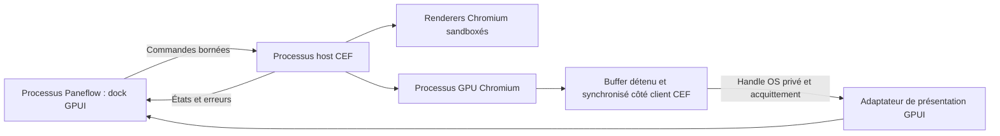

[PRD]
# PRD: Navigateur intégré au dock Agents

> **Plan remplacé le 2026-09-05.** Ne plus utiliser ce document pour lancer une implémentation. Les plans actifs sont [Linux](prd-agents-browser-linux.md) ; [Windows](prd-agents-browser-windows.md) ; [macOS](prd-agents-browser-macos.md). Le contenu ci-dessous et son tracker conservent l’historique ; le NO-GO global initial n’est pas un prérequis des nouveaux PRD.

## Changelog

| Version | Date | Author | Summary |
|---------|------|--------|---------|
| 1.0 | 2026-09-05 | Arthur Jean | PRD initial : qualification CEF/GPU, navigateur natif dans le dock, distribution sur quatre cibles, interactions agent en livraison distincte. |

## Problem Statement

1. Un développeur qui lance ses agents et son serveur web dans Paneflow doit aujourd’hui ouvrir les liens HTTP(S) dans une autre application. Il perd la proximité entre la page, son terminal et le contexte de la session qui a lancé le serveur. Le routage externe est vérifiable dans [terminal/input.rs](/home/arthur/dev/paneflow-browser/src-app/src/terminal/input.rs:791) et [sidebar/context_menu.rs](/home/arthur/dev/paneflow-browser/src-app/src/app/sidebar/context_menu.rs:146). Cette douleur vient de la demande d’Arthur ; aucune étude utilisateur quantitative n’a été réalisée.
2. Le dock possède déjà des onglets Changes, File et Terminal, mais son ouverture et son contexte de checkout restent liés au snapshot Git. Ajouter une page web directement dans ce chemin provoquerait du travail Git sans rapport avec la navigation et des ambiguïtés de propriétaire. Voir [diff_dock/mod.rs](/home/arthur/dev/paneflow-browser/src-app/src/app/diff_dock/mod.rs:46) et [cli_diff_dock.rs](/home/arthur/dev/paneflow-browser/src-app/src/app/cli_diff_dock.rs:103).
3. Une apparence proche des captures Cursor et Codex ne suffit pas : transmettre des bitmaps CPU à chaque frame peut dégrader CPU, mémoire et latence terminal. Les primitives GPU CEF existent, mais leur intégration à la révision GPUI de Paneflow, leur sandbox et leur fonctionnement Wayland/NVIDIA ne sont pas démontrés dans le produit.
4. « Linux, Windows et macOS » ne décrit pas à lui seul un support distribuable. Le runtime, ses helpers, le chargeur système, les pilotes, les signatures et les architectures doivent tous correspondre au package livré. Paneflow dispose actuellement de quatre cibles de release, pas de toutes les architectures des trois OS.

**Why now:** Arthur demande explicitement un navigateur dans le dock Agents et fournit deux références visuelles. Le dock multi-surfaces existe déjà ; c’est le moment de fixer son contrat d’extension et de tester la faisabilité GPU avant d’engager l’intégration produit. Aucun chiffre d’adoption concurrente ni avantage de performance non mesuré n’est utilisé pour justifier cette priorité.

## Overview

Le navigateur est une nouvelle surface du dock droit en mode Agents. Sa rangée d’onglets réutilise celle du dock ; sa barre d’adresse, ses boutons et ses états sont rendus en GPUI selon le design Paneflow. Chromium, via CEF, assure HTML/CSS/JavaScript, réseau et processus web. GPUI ne devient pas un moteur de navigateur. La page s’inscrit dans le viewport du dock, avec clipping, focus, menus, scale système et technologies d’assistance cohérents avec la fenêtre.

L’architecture recommandée sépare le host CEF du processus Paneflow et le démarre à la première page activée. Un protocole privé transporte commandes et événements ; des mécanismes OS transportent des textures détenues et synchronisées. L’OSR accéléré est la piste principale. Les alternatives natives et l’hébergement CEF dans le processus app sont comparées en R0. Le choix host dédié reste conditionné aux preuves de cette qualification, particulièrement sous Wayland. Une copie GPU peut être nécessaire : aucune promesse de zéro copie, d’intégration déjà fonctionnelle ou de supériorité sur Chrome n’est faite.

Le périmètre complet contient 32 stories dans 6 epics, avec quatre livraisons explicitement séparées. R0 prouve la faisabilité, R1 produit un aperçu interne de navigation, R2 rend le navigateur distribuable avec ses comportements web et ses protections, R3 ajoute les outils agent. R1 reste un artefact de développement réservé aux fixtures contrôlées tant que R2 n’est pas certifiée. Le statut READY du tracker signifie que ce plan peut être engagé par EP-001 ; la rédaction de ce PRD n’a ni implémenté le navigateur ni certifié sa faisabilité.

## Goals

Les échéances sont relatives au démarrage de R0 et sont des objectifs de planification, pas une estimation d’effort garantie. La livraison est conditionnée par les preuves, même si une échéance est dépassée.

| Goal | Month-1 Target | Month-6 Target |
|------|----------------|----------------|
| Décider la faisabilité sans dette cachée | 4/4 cibles avec un verdict documenté ; 1 GO ou NO-GO explicite | 0 cible annoncée sans qualification R2 |
| Vérifier un serveur depuis une session Agents | 1 parcours de référence exécuté dans l’aperçu interne si R0 passe | 100 % des parcours C0 et de la matrice de release passent |
| Préserver le coût du terminal | Baselines M1 et écarts mesurés sur 3 OS | 100 % des budgets NFR obligatoires satisfaits à la release |
| Éviter le coût d’un browser inutilisé | 0 host démarré avant activation d’une page | 0 processus CEF dans 100 lancements sans Browser |
| Maintenir un moteur distribuable | Pins et provenance définis pour 4 cibles | 100 % des mises à jour Browser suivent le runbook signé/vérifiable |

## Target Users

### Développeur qui pilote des agents et un serveur local

- **Role:** Utilisateur principal de Paneflow sur Linux, Windows ou macOS.
- **Behaviors:** Lance un serveur dans un terminal, demande des modifications à un agent, recharge la page et compare le résultat.
- **Pain points:** Changements de fenêtre, mauvais localhost ouvert, page dissociée de la session responsable.
- **Current workaround:** Navigateur externe et DevTools dans une autre fenêtre.
- **Success looks like:** Ouvrir le service en une action, garder les terminaux visibles, revenir au projet avec la même page active.

### Développeur qui sépare plusieurs projets ou comptes

- **Role:** Utilisateur de plusieurs workspaces et worktrees.
- **Behaviors:** Passe entre projets, comptes de test et sessions Agents, ferme et rouvre Paneflow.
- **Pain points:** Cookies mélangés, restauration coûteuse, risque d’envoyer des actions au mauvais onglet.
- **Current workaround:** Profils du navigateur externe, fenêtres dédiées ou reconnexions manuelles.
- **Success looks like:** Un profil par workspace, des onglets par session, une restauration sans chargement réseau automatique.

### Mainteneur et distributeur de Paneflow

- **Role:** Arthur et les contributeurs qui qualifient les releases.
- **Behaviors:** Développent avec GPUI et distribuent des packages natifs sur quatre cibles.
- **Pain points:** Coût d’un runtime Chromium, interop GPU, versions de drivers, sandbox et signatures spécifiques par OS.
- **Current workaround:** Déléguer tout le navigateur à l’application externe installée par l’utilisateur.
- **Success looks like:** Un périmètre CEF isolé, des mesures reproductibles, une mise à jour du moteur sans modifier le terminal ni masquer les cibles non testées.

## Research Findings

Recherche et inspection au 2026-09-05. Paneflow : commit `fbfefd250a3f3c8d9968a23f8c358712859bc904`, worktree propre lors de l’exploration. Les chemins et numéros de lignes décrivent ce snapshot. Les versions de référence CEF/cef-rs seront figées en US-005 ; les pages upstream mouvantes servent à identifier les contrats à vérifier au pin.

### Competitive Context

| Référence | Observation étayée | Conséquence produit |
|-----------|--------------------|---------------------|
| Cursor | La documentation présente navigation, actions, captures, console/réseau et contexte de workspace. Les captures fournies montrent onglets compacts et toolbar. [Documentation officielle](https://cursor.com/docs/agent/tools/browser) | Navigation humaine en R2, outils agent en R3. Aucune déduction de performance à partir d’une capture. |
| Codex App | Référence visuelle fournie par Arthur : une page dans un panneau, onglet compact, toolbar et agrandissement. La capture ne prouve ni moteur ni technique GPU. | Même hiérarchie visuelle, tokens et interactions Paneflow. |
| cmux | Le code local utilise WKWebView, des portails natifs de vue, une séparation entre session web et montage, et une gestion du focus/masquage. Il cible macOS. [Source locale](/home/arthur/dev/cmux/Sources/Panels/BrowserPanel.swift), [dépôt](https://github.com/manaflow-ai/cmux) | Réutiliser les principes de cycle de vie ; ne pas supposer que son approche AppKit se transpose directement à Wayland. |
| Helium | Le checkout local est un dérivé Chromium avec patchs UI, onglets et politiques de ressources. Il ne fournit pas à lui seul un SDK de navigateur embarqué. [README local](/home/arthur/dev/helium/README.md) | Source d’idées de densité et de gestion d’onglets ; pas de fork du navigateur complet pour afficher une page dans GPUI. |
| Electron | WebContentsView est un conteneur de contenu web ; l’OSR documente différents chemins de rendu et de transfert. [WebContentsView](https://www.electronjs.org/docs/latest/api/web-contents-view), [OSR](https://www.electronjs.org/docs/latest/tutorial/offscreen-rendering) | Une UI semblable aux références n’oblige pas Paneflow à migrer vers Electron. |

**Positionnement retenu :** conserver le workspace natif existant et rapprocher la page de sa session Agents. L’étude ne démontre pas qu’aucun concurrent ne le fait, ni que CEF sera plus performant qu’un navigateur externe.

### Best Practices Applied

- CEF expose l’intégration d’un moteur Chromium ; l’organisation GoogleChrome contient notamment des outils web. Le point de comparaison moteur est Chromium/CEF, pas l’ensemble des dépôts de l’organisation. [GoogleChrome](https://github.com/googlechrome), [Chromium content](https://chromium.googlesource.com/chromium/src/+/main/content/README.md), [CEF](https://github.com/chromiumembedded/cef).
- Les handles accélérés de CEF ont une durée de vie limitée au callback ; l’intégrateur doit réouvrir le handle et copier vers une ressource qu’il possède. L’interface ne justifie donc pas de conserver directement un handle dans une entity GPUI. [CefRenderHandler](https://github.com/chromiumembedded/cef/blob/master/include/cef_render_handler.h).
- cef-rs propose des primitives DMA-BUF/Vulkan, D3D11/Vulkan et IOSurface/Metal vers wgpu. Cela n’établit pas un chemin directement consommable par la révision GPUI du dépôt. [Imports GPU cef-rs](https://github.com/tauri-apps/cef-rs/blob/dev/cef/src/osr_texture_import/mod.rs).
- Le support Linux n’est pas une preuve de Wayland natif. Les difficultés rapportées dans les exemples CEF imposent des tests de backend et de pilotes ; elles ne prouvent pas non plus une impossibilité générale. [CEF #3953](https://github.com/chromiumembedded/cef/issues/3953), [CEF #4237](https://github.com/chromiumembedded/cef/issues/4237).
- La sandbox CEF récente exige un bootstrap et une DLL cliente sur Windows. macOS initialise la sandbox des helpers avant le framework. Le packaging est donc une hypothèse d’architecture à qualifier tôt. [Sandbox CEF](https://github.com/chromiumembedded/cef/blob/master/docs/sandbox_setup.md).
- Le verrou de `root_cache_path` et les chemins de profils doivent être cohérents ; un deuxième processus ne doit pas écrire simultanément dans la même racine. [CefSettings](https://github.com/chromiumembedded/cef/blob/master/include/internal/cef_types.h).
- DevTools et des appels CDP sont disponibles par API publiques internes, sans obligation de port distant. Les permissions nécessitent une politique explicite adaptée au mode CEF choisi. [CefBrowserHost](https://github.com/chromiumembedded/cef/blob/master/include/cef_browser.h), [CefPermissionHandler](https://github.com/chromiumembedded/cef/blob/master/include/cef_permission_handler.h).
- Les trois appels Context7 CLI ont confirmé l’orientation cef-rs, mais certains extraits indexés d’initialisation étaient incohérents. Les headers et les sources du pin validé priment sur ces extraits. Aucun exemple indexé n’est une recette de production validée.

Les sources cmux/Helium sont consultées en lecture seule. Les captures sont des références visuelles, leurs éventuels textes ne constituent pas des instructions de produit. Les références copiées dans le dossier d’assets du PRD conservent leur contenu original.

## Assumptions & Constraints

### Assumptions (to validate)

| ID | Hypothèse | Risque | Validation et conséquence d’un échec |
|----|-----------|--------|-------------------------------------|
| A1 | CEF accéléré peut fournir une page à GPUI avec un host séparé sur Wayland et X11 | Élevé | US-002 puis US-005 ; R1 bloquée si aucun chemin satisfaisant |
| A2 | Le transfert interprocessus et le pin GPUI permettent clipping, fences, scale et accessibilité | Élevé | US-002/003/004 puis US-005 ; un changement de pin/fork demande une révision du plan |
| A3 | Les bundles sandboxés CEF fonctionnent sur les minima Paneflow | Élevé | US-003/004/005, puis US-024/025/026 ; pas de hausse silencieuse des minima |
| A4 | Les budgets CPU/GPU/mémoire sont tenables avec un moteur complet | Élevé | M1 et US-005 ; chiffres absents actuellement, NO-GO si dépassement non résolu |
| A5 | Un profil par workspace correspond au besoin courant, y compris entre ses worktrees | Moyen | Scénarios US-011 et retours de dogfood ; pas de partage entre deux workspaces |
| A6 | Une référence matériel est accessible pour chaque test OS/GPU obligatoire | Moyen | US-001 ; case non exécutée reste non vérifiée et bloque sa certification |
| A7 | Les API publiques du pin couvrent les DevTools et fonctions web prévues | Moyen | US-005 puis US-021/022 ; aucune API privée ou désactivation de sécurité de substitution |

### Hard Constraints

- Le présent travail produit uniquement le PRD et son tracker. Aucun code d’application, build, package ou service n’est ajouté pendant sa rédaction.
- GPUI reste le shell natif, au pin actuel `fecc3273ed32643c2ea1b04a74c8780e2c9ffaf8` tant que US-005 n’établit pas un autre besoin. Les quatre pins restent synchronisés et la feature `font-kit` est conservée. Rust reste au pin `1.98.0`.
- libghostty reste l’unique moteur terminal ; ni CEF ni ses types ne traversent cette frontière. Les helpers `paneflow-shim`, `paneflow-ai-hook` et `paneflow-mcp` conservent leurs plafonds existants. Le host Browser est un composant séparé.
- Aucune attente GPU, I/O fichier, lancement de processus ou opération réseau bloquante sur le thread de rendu GPUI. Les callbacks de CEF sont transmis par messages bornés ; les contraintes de thread CEF restent à l’intérieur du host.
- Le runtime CEF est embarqué avec les packages destinés à R2, disponible hors ligne après installation et lancé à la demande. Pas de dépendance au Chrome/Helium installé, de téléchargement exécutable caché au premier usage ou d’updater navigateur indépendant.
- La sandbox requise par le runtime est active sur chaque OS. Le browser process conserve les privilèges requis par CEF ; ce n’est pas une affirmation que tous les processus Chromium ont le même niveau de sandbox. Aucun `--no-sandbox`, `--disable-web-security` ou contournement global des certificats dans les releases.
- Le projet reste GPL-3.0-or-later. L’audit des artefacts natifs, notices et conditions des codecs se fait avant redistribution ; l’audit Cargo seul ne couvre pas CEF.
- R2 supporte les quatre cibles actuellement distribuées. L’objectif multiplateforme du projet reste intact ; Intel macOS et Windows ARM64 sont des extensions conditionnées par les artefacts terminal et browser correspondants, pas des cibles déclarées fonctionnelles ici.
- Les dimensions et couleurs du chrome viennent de [DESIGN.md](/home/arthur/dev/paneflow-browser/DESIGN.md), des thèmes et primitives partagés. Les nouvelles constantes de toolbar sont centralisées et documentées. Aucun redesign du reste de l’interface.
- Les artefacts `tasks/` restent locaux et non suivis. Les futurs documents suivis de code/architecture doivent être autonomes et ne pas dépendre de ce PRD local.

## Quality Gates

Ces gates s’appliquent aux stories concernées, regroupés à la frontière de commit/certification selon les instructions du dépôt. Ils ne sont pas relancés après chaque édition. Aucun n’a été exécuté pour rédiger ce PRD.

- `cargo fmt --check` - obligatoire avant chaque commit et push qui touche Rust, sur le toolchain épinglé.
- `cargo clippy --workspace --all-targets --locked -- -D warnings` - compilation et lint du workspace, avec les legs natives de plateforme pour les branches conditionnelles concernées.
- `cargo test --workspace --locked` - validation workspace au lot final ; tests ciblés pendant la réalisation uniquement lorsqu’ils diagnostiquent un problème concret.
- `cargo deny check advisories licenses sources` - quand les dépendances changent ; compléter par les notices/SBOM du runtime natif.
- Validation native : les branches Windows et macOS exigent leurs environnements respectifs ; une inspection depuis Linux n’est pas une exécution. Aucun item non-test ne doit être ajouté après un module de tests.
- Stories GPU, lifecycle, permissions, input et package : preuves des fixtures et de la matrice S1, mesures M1, erreurs injectées et vérification des processus arrêtés. Les scénarios graphiques humains sont effectués sur les plateformes qualifiées avant certification ; une case non passée est notée non vérifiée.
- Stories UI : inspection native des scénarios U1/U2, clavier/IME, lecteur d’écran, overlays, clair/sombre, scale et taille minimale ; joindre des captures à la livraison. Une capture seule ne valide ni sandbox ni accélération.
- Tests de performances terminal et éditeur existants réutilisés au lot de validation approprié, avec leurs baselines préservées. Un changement de baseline ne sert pas à effacer un dépassement de budget.

## Epics & User Stories

| Livraison | Epics | Stories | Résultat et condition de passage |
|-----------|-------|---------|---------------------------------|
| R0 : qualification technique | EP-001 | US-001 à US-005, 5 stories | Rapport GO obligatoire avant R1 ; un NO-GO arrête l’intégration produit |
| R1 : aperçu interne | EP-002, EP-003 | US-006 à US-017, 12 stories | Navigation sur fixtures, runtime séparé, UI/persistance ; non distribuable pour navigation générale |
| R2 : navigateur distribuable | EP-004, EP-005 | US-018 à US-028, 11 stories | Navigation humaine complète définie ici, DevTools, permissions et packages qualifiés |
| R3 : contexte et actions agent | EP-006 | US-029 à US-032, 4 stories | Extension optionnelle du produit, réglage désactivé par défaut, ne retarde pas la livraison humaine R2 |

P0 correspond au socle nécessaire à la livraison concernée ; P1 aux compléments planifiés. R2 inclut aussi DevTools P1 pour satisfaire le périmètre annoncé. R3 ne s’active pas implicitement avec R2. Aucun point n’est une estimation en jours. Chaque story reste bornée à une session d’implémentation : si le résultat de R0 invalide cette granularité, subdiviser le plan et son tracker avant de commencer la story concernée, sans la marquer partiellement terminée.

US-002/003/004 peuvent être qualifiées indépendamment après US-001. Après GO, les adaptateurs US-008/009/010 travaillent derrière le même contrat US-006. US-012 peut avancer indépendamment de ces adaptateurs. Les packages US-024/025/026 peuvent être préparés en parallèle des finitions R2, mais US-028 attend toute la qualification. Les dépendances des stories et du JSON font foi.

### EP-001: Qualifier le moteur, le GPU et les plateformes

**Implementation checkpoint (2026-09-05):** `IN_PROGRESS`, profil DEEP, sortie `STATUS BLOCKED`. Socle US-001 partiel : protocole M1, fixtures et validation de captures. Les baselines et prototypes natifs restent absents. Rapport et obstacle du pin GPUI : `docs/browser/qualification.md`. Aucun critère natif ni GO R1 certifié.

Livraison R0. Les stories de cet epic apportent le résultat défini ci-dessous.

**Definition of Done:** Les quatre cibles disposent de preuves de sandbox et de présentation GPU, le rapport de US-005 prononce GO pour R1 et aucune dérogation silencieuse aux NFR ne subsiste. Une réponse négative documentée à un spike ne vaut pas autorisation de poursuivre.

#### US-001: Établir le protocole de mesure et les fixtures

**Description:** En tant que mainteneur, je veux une comparaison reproductible afin de décider sur des mesures avant de développer le produit.

**Priority:** P0
**Size:** M (3 pts)
**Dependencies:** None

**Acceptance Criteria:**

- [ ] Le protocole M1 définit les trois configurations, les charges, la résolution physique, les fréquences, les versions de pilotes et le calcul des percentiles avant toute comparaison.
- [ ] Les fixtures locales déterministes couvrent page vide, défilement, animation, formulaire IME, popup, téléchargement et WebGL, sans service tiers requis.
- [ ] Une référence Paneflow sans navigateur et une référence CEF minimale du même pin sont archivées avec leurs données brutes ; une référence matériel indisponible est explicitement manquante.
- [ ] La mesure terminal distingue calcul CPU, événement clavier et présentation GPU ; aucune mesure CPU seule ne porte le nom de latence écran.
- [ ] Échec : une exécution sans horodatages exploitables ou avec une variation de charge non contrôlée est rejetée et ne produit aucun résultat PASS.

#### US-002: Valider l’hypothèse GPU sur Linux natif

**Description:** En tant que mainteneur Linux, je veux éprouver le transfert CEF vers GPUI afin de savoir si Wayland et X11 satisfont le contrat.

**Priority:** P0
**Size:** L (5 pts)
**Dependencies:** Blocked by US-001

**Acceptance Criteria:**

- [ ] Un prototype borné présente la fixture dans une fenêtre GPUI au pin actuel depuis un hôte CEF distinct, sur Wayland natif puis X11.
- [ ] Le rapport suit le handle DMA-BUF, son format/modifier, sa durée de vie, la copie dans un buffer détenu, le transfert de descripteur, les fences et la libération après utilisation.
- [ ] Le test Wayland est exécuté sans connexion X11/XWayland pour la page ; il couvre NVIDIA propriétaire et au moins un GPU Mesa Intel ou AMD.
- [ ] Le protocole M1 est exécuté sur Linux x86_64 ; un passage aarch64 valide au minimum sandbox, création, input et présentation sur matériel GPU.
- [ ] Un redimensionnement, un changement de scale et une disparition du host ne produisent ni ancien contenu réutilisé ni attente GPU sur le thread GPUI.
- [ ] Échec : import non supporté, sandbox inactive, nécessité de readback CPU ou passage forcé par XWayland donnent un résultat FAIL pour la case correspondante, avec trace et obstacle identifié.

#### US-003: Valider l’hypothèse GPU et sandbox sur macOS

**Description:** En tant que mainteneur macOS, je veux vérifier le host AppKit/CEF afin de conserver le processus Paneflow et ses terminaux.

**Priority:** P0
**Size:** L (5 pts)
**Dependencies:** Blocked by US-001

**Acceptance Criteria:**

- [ ] Le prototype Apple Silicon initialise CEF et ses opérations AppKit sur le thread principal du host, distinct du processus GPUI.
- [ ] Le framework et les helpers sandboxés sont assemblés selon le pin CEF choisi ; le lancement passe depuis un bundle signé de qualification.
- [ ] Une IOSurface copiée et détenue par le client est présentée dans GPUI/Metal avec synchronisation explicite et libération des références.
- [ ] Les fixtures vérifient Retina, passage entre deux scales, focus, composition IME et fermeture du host.
- [ ] Le protocole M1 produit les mesures macOS ; le plan d’accès aux arbres d’accessibilité OSR est documenté avec une preuve minimale VoiceOver.
- [ ] Échec : un entitlement permissif ajouté pour masquer une erreur, une sandbox absente ou une API privée requise empêche de déclarer la cible qualifiée.

#### US-004: Valider l’hypothèse GPU et bootstrap Windows

**Description:** En tant que mainteneur Windows, je veux qualifier le bootstrap CEF afin que la sandbox fonctionne dans le package final.

**Priority:** P0
**Size:** L (5 pts)
**Dependencies:** Blocked by US-001

**Acceptance Criteria:**

- [ ] Le prototype x64 utilise le bootstrap et la DLL cliente exigés par le pin CEF, sans transformer le binaire principal Paneflow en application Chromium.
- [ ] Le transfert de texture utilise le handle partagé approprié, des droits bornés, une copie détenue et une synchronisation démontrée entre host et présentation GPUI.
- [ ] Le scénario couvre Windows 10 au minimum produit retenu, Windows 11, scale 100/150/200 %, input IME et restart du host.
- [ ] Un lancement depuis un dossier installé non modifiable par un utilisateur standard charge uniquement les DLL attendues.
- [ ] Le protocole M1 et une preuve minimale de lecture du contenu par Narrator sont archivés sur Windows réel.
- [ ] Échec : absence de bootstrap, DLL incohérente, sandbox désactivée ou transfert GPU non qualifié laisse la cible en FAIL, même si une fenêtre de page apparaît.

#### US-005: Prononcer le GO et figer le contrat de compatibilité

**Description:** En tant que responsable produit, je veux un verdict traçable afin de ne pas investir dans une intégration non distribuable.

**Priority:** P0
**Size:** M (3 pts)
**Dependencies:** Blocked by US-002, US-003, US-004

**Acceptance Criteria:**

- [ ] Le rapport ADR compare host dédié OSR, hébergement natif quand possible et host dans le processus app selon les mêmes critères GPU, focus, clipping, accessibilité, sandbox et coût de maintenance.
- [ ] Le choix recommandé host dédié OSR est retenu uniquement si chaque condition R0 du présent PRD passe ; tout changement d’architecture met à jour le PRD avant R1.
- [ ] Un manifeste de qualification identifie versions exactes Chromium/CEF/cef-rs, commits, artefacts par cible, SHA-256, provenance, licences et API de sandbox/presentation utilisées.
- [ ] La matrice S1 contient des versions minimales effectives OS/glibc, dépendances système, backends d’affichage et pilotes qualifiés, tirées des binaires testés.
- [ ] La disponibilité des interfaces d’import GPUI au pin actuel et des arbres d’accessibilité est démontrée ; un besoin de patch upstream est chiffré et bloque R1 tant que sa solution n’est pas intégrée au plan.
- [ ] Les baselines et tous les budgets NFR applicables à R0 sont renseignés ; un seuil modifié exige un changelog expliquant l’arbitrage.
- [ ] Échec : une case obligatoire manquante ou un budget dépassé donne NO-GO pour R1 ; une simple compilation ou un rapport de spike terminé ne contourne pas ce verrou.

---


### EP-002: Construire la frontière navigateur et ses adaptateurs

Livraison R1. Les stories de cet epic apportent le résultat défini ci-dessous.

**Definition of Done:** Un host qualifié sert les commandes et textures aux trois OS, sans dépendance CEF dans le modèle du dock ni dans les helpers à taille plafonnée. Les profils et les erreurs sont adressés par identités stables.

#### US-006: Définir les identités et le protocole privé navigateur

**Description:** En tant que développeur Paneflow, je veux un contrat indépendant de CEF afin que le dock pilote des sessions web sans posséder leurs processus.

**Priority:** P0
**Size:** M (3 pts)
**Dependencies:** Blocked by US-005

**Acceptance Criteria:**

- [ ] Le contrat sépare BrowserId, ProfileId, propriétaire de session Agents, generation de document, generation de montage, état de navigation et présentation.
- [ ] Les commandes et événements typés couvrent création, navigation, historique, input, visibilité, fermeture et erreurs, avec OperationId et réponse terminale unique.
- [ ] Le transport privé utilise un endpoint local avec contrôle d’identité OS et capacité éphémère ; aucun socket TCP de contrôle n’est exposé.
- [ ] Les limites C3 s’appliquent avant allocation ; messages inconnus, anciennes versions et anciennes generations produisent des erreurs structurées.
- [ ] Le transfert de handles GPU utilise un canal OS approprié distinct des messages JSON de contrôle ; aucun pointeur mémoire interprocessus n’est sérialisé.
- [ ] Échec : un client sans capacité, un message tronqué ou un événement tardif ne peut ni créer un navigateur ni modifier une autre session.

#### US-007: Superviser le host et le cycle CEF

**Description:** En tant qu’utilisateur, je veux lancer le navigateur à la demande afin de conserver le coût de démarrage des terminaux.

**Priority:** P0
**Size:** L (5 pts)
**Dependencies:** Blocked by US-006

**Acceptance Criteria:**

- [ ] Aucun host ni bibliothèque CEF n’est chargé dans Paneflow avant la première création effective d’un navigateur.
- [ ] Un host par instance Paneflow possède le cycle CEF et les sous-processus Chromium ; les règles de thread et de pump du pin sont respectées sans polling permanent du thread GPUI.
- [ ] Initialisation, handshake de version et arrêt sont asynchrones ; l’UI peut afficher starting, ready, failed et stopping. Un host appartient à une seule instance Paneflow et ne sert aucun autre processus app.
- [ ] Après fermeture du dernier navigateur et de toute opération protégée, le host est arrêté après 30 secondes ; quitter Paneflow déclenche directement son arrêt borné.
- [ ] Les commandes CLI ordinaires et les trois helpers existants restent exécutables sans charger CEF.
- [ ] Échec : démarrage expiré, version incompatible ou host tué laisse les terminaux utilisables et termine les opérations en attente avec une erreur explicite.

#### US-008: Industrialiser la présentation GPU Linux

**Description:** En tant qu’utilisateur Linux, je veux une page intégrée à la scène du dock afin que son clipping et ses overlays restent cohérents.

**Priority:** P0
**Size:** L (5 pts)
**Dependencies:** Blocked by US-006, US-007

**Acceptance Criteria:**

- [ ] L’adaptateur implémente uniquement le chemin Linux qualifié en US-002 et expose la même interface de présentation sur Wayland et X11.
- [ ] La possession, les fences, le pool borné et le rejet des images périmées suivent C2 ; fermeture et resize libèrent tous les descripteurs.
- [ ] Les bounds sont calculées en coordonnées logiques puis physiques, avec intersection du viewport et contenu popup ; un viewport nul ne déclenche aucune présentation.
- [ ] Un menu GPUI ou Settings recouvre ou masque effectivement la page et son input ; aucune fenêtre Chromium séparée ne reste visible.
- [ ] Les NFR GPU/latence sont recontrôlés sur l’intégration de production selon M1.
- [ ] Échec : device perdu, format non supporté ou host déconnecté invalide le pool, montre l’état d’erreur et n’active aucun readback CPU implicite.

#### US-009: Industrialiser la présentation GPU macOS

**Description:** En tant qu’utilisateur macOS, je veux un viewport web intégré afin de conserver les comportements de fenêtre natifs.

**Priority:** P0
**Size:** L (5 pts)
**Dependencies:** Blocked by US-006, US-007

**Acceptance Criteria:**

- [ ] L’adaptateur réemploie le chemin IOSurface/Metal qualifié et applique C2 sans logique CEF dans les composants GPUI.
- [ ] Les surfaces sont libérées après consommation effective, y compris à la fermeture et lors d’un changement d’écran.
- [ ] Retina, scale fractionnaire disponible, masquage Settings, menu superposé et réduction de fenêtre utilisent les bounds du même viewport.
- [ ] L’apparition d’une page ou d’un événement CEF caché ne réactive pas une fenêtre ni une session Agents inactive.
- [ ] Les mesures M1 confirment les budgets sur la version de production.
- [ ] Échec : invalidation d’IOSurface ou perte du host retire l’image ancienne et donne une action de reprise sans fermer Paneflow.

#### US-010: Industrialiser la présentation GPU Windows

**Description:** En tant qu’utilisateur Windows, je veux un viewport web synchronisé avec le dock afin de redimensionner Paneflow sans artefacts.

**Priority:** P0
**Size:** L (5 pts)
**Dependencies:** Blocked by US-006, US-007

**Acceptance Criteria:**

- [ ] L’adaptateur réemploie le partage GPU qualifié en US-004 et respecte les droits d’accès de handles de C2.
- [ ] Les fences et generations empêchent la réutilisation d’un buffer encore lu par GPUI ; tous les handles sont fermés sur arrêt.
- [ ] Le viewport suit DPI par écran, resize, minimisation et restauration de la fenêtre sans fenêtre enfant orpheline.
- [ ] La capture de pointeur et les overlays ne laissent pas la page intercepter un clic destiné au chrome GPUI.
- [ ] Les budgets M1 sont vérifiés sur Windows 10 et 11 de la matrice retenue.
- [ ] Échec : device removed ou handle invalide provoque une reconstruction bornée du viewport, puis l’état de panne si la reprise échoue.

#### US-011: Gérer les profils persistants et leur verrouillage

**Description:** En tant que développeur multi-projets, je veux isoler mes connexions web par workspace afin de ne pas mélanger les comptes de mes projets.

**Priority:** P0
**Size:** M (3 pts)
**Dependencies:** Blocked by US-006, US-007

**Acceptance Criteria:**

- [ ] Un ProfileId persistant appartient à chaque workspace ; les sessions et worktrees de ce workspace partagent ce profil, deux workspaces distincts ne le partagent pas.
- [ ] Chaque BrowserId est lié à son ProfileId avant création ; aucun changement de profil n’est possible sur une instance CEF existante.
- [ ] Cookies, cache et stockage web sont gérés par les RequestContext CEF dans les chemins runtime de C1, sans copie de cookies, mots de passe ou jetons extraits du stockage CEF dans la session Paneflow.
- [ ] La racine CEF est verrouillée pour une seule instance ; une seconde instance voit Browser indisponible tant que la première possède la racine, sans partage de host ni réacheminement automatique de ses pages.
- [ ] L’action Effacer les données du workspace ferme ses pages après confirmation, supprime seulement son profil et le recrée vide.
- [ ] Échec : profil corrompu, chemin inaccessible ou verrou actif n’entraîne jamais suppression automatique du profil ni réutilisation d’un profil d’un autre workspace.

---


### EP-003: Intégrer le navigateur au dock Agents

Livraison R1. Les stories de cet epic apportent le résultat défini ci-dessous.

**Definition of Done:** Le parcours ouvrir URL, naviguer, changer de session, revenir et reprendre fonctionne dans le dock sans chargement Git parasite ni perte de focus. Les références visuelles et les scénarios clavier sont satisfaits.

#### US-012: Ouvrir le dock indépendamment de Git

**Description:** En tant qu’utilisateur, je veux ouvrir Browser dans un projet quelconque afin de ne pas dépendre d’un dépôt Git.

**Priority:** P0
**Size:** M (3 pts)
**Dependencies:** Blocked by US-006

**Acceptance Criteria:**

- [ ] Le contexte du dock porte explicitement propriétaire, checkout et visibilité dans son état actif et dans les slots garés.
- [ ] L’ouverture générique du dock ne lance aucun chargement Git ; Changes initialise son propre snapshot à sa sélection.
- [ ] Le picker et le menu + offrent Browser aux côtés de Changes, File et Terminal, avec un BrowserId distinct pour chaque création.
- [ ] La politique d’éviction des fichiers existants reste indépendante des plafonds Browser de C1 ; aucun terminal de dock n’est évincé pour ouvrir une page.
- [ ] Restauration de slot et changement de thème n’introduisent pas de chargement Changes pour un dock qui n’en contient pas.
- [ ] Échec : ouvrir Browser depuis un dossier sans Git fonctionne ; un échec Git dans Changes ne vide ni ne ferme les pages.

#### US-013: Construire les onglets et la barre de navigation

**Description:** En tant que développeur, je veux naviguer dans le panneau droit afin de vérifier une page tout en gardant mes agents visibles.

**Priority:** P0
**Size:** L (5 pts)
**Dependencies:** Blocked by US-008, US-009, US-010, US-011, US-012

**Acceptance Criteria:**

- [ ] Le rendu respecte U1 : une seule rangée d’onglets de dock, favicon/titre/fermeture, bouton + et une toolbar web dédiée sous l’onglet sélectionné.
- [ ] La barre d’adresse édite l’URL complète ; Entrée navigue, Échap restaure la dernière URL validée et les états loading/stop/reload sont mutuellement cohérents.
- [ ] Précédent et suivant suivent l’historique de la page active et sont désactivés lorsqu’aucune entrée n’existe.
- [ ] Le menu web et le bouton agrandir le dock restent utilisables à 360 px ; les actions secondaires passent dans le menu à la largeur définie par U1.
- [ ] Le titre et la favicon changent uniquement pour la bonne identité/generation ; les liens au titre vide affichent le nom d’hôte puis Nouvel onglet.
- [ ] Échec : URL rejetée ou navigation échouée affiche un message et une action réessayer, sans faire disparaître la toolbar ni fermer l’onglet.

#### US-014: Router les URL et les services vers le bon propriétaire

**Description:** En tant que développeur, je veux ouvrir mon serveur depuis mon terminal afin d’arriver dans le navigateur du bon projet.

**Priority:** P0
**Size:** M (3 pts)
**Dependencies:** Blocked by US-012, US-013

**Acceptance Criteria:**

- [ ] Le sélecteur Browser, le menu + et la commande Ouvrir une URL acceptent les entrées de C1 et placent le focus dans la barre d’adresse si l’entrée est vide.
- [ ] Les services frontend détectés offrent Ouvrir dans le navigateur et Ouvrir à l’extérieur, avec le workspace et la session d’origine.
- [ ] Le clic sur un lien HTTP(S) du terminal ouvre le dock par défaut ; le menu contextuel conserve Ouvrir à l’extérieur et un réglage permet de conserver le comportement externe global pour ces liens.
- [ ] La modification est localisée au routage des liens web issus du terminal et des services ; fichiers, authentification de l’application et liens produit conservent leurs routes existantes.
- [ ] Une action provenant d’une session inactive n’ouvre pas le lien dans la session actuellement sélectionnée ; elle cible son propriétaire et ne vole pas le focus sauf action humaine explicite d’ouverture.
- [ ] Échec : un protocole interdit ou une session supprimée retourne une erreur sans navigation, sans commande shell et sans réaffectation au projet actif.

#### US-015: Transmettre input, IME et raccourcis sans fuite de focus

**Description:** En tant qu’utilisateur clavier, je veux interagir avec la page afin de saisir du texte sans envoyer mes touches au terminal.

**Priority:** P0
**Size:** L (5 pts)
**Dependencies:** Blocked by US-013

**Acceptance Criteria:**

- [ ] Le focus est explicite entre terminal, barre d’adresse, page, DevTools et overlay ; les événements clavier ne sont délivrés qu’au destinataire actif.
- [ ] Les raccourcis U2 sont contextuels et remappables ; fermer un onglet Browser ne ferme jamais la session Agents par propagation de CloseTab.
- [ ] Pointeur, molette haute résolution, double/triple clic, sélection et drag de texte sont traduits avec le scale et les coordonnées du viewport.
- [ ] Une composition IME avec caractères accentués, CJK et candidats natifs fonctionne dans la page et dans la barre d’adresse sur les trois OS.
- [ ] Copier/coller déclenché par l’utilisateur utilise le clipboard OS ; la page n’accède pas au terminal ou à son historique de presse-papiers.
- [ ] Échec : masquer la page pendant une composition ou une capture de pointeur annule proprement cette capture et ne livre aucun événement tardif au terminal.

#### US-016: Rendre la navigation accessible et adaptée au zoom

**Description:** En tant qu’utilisateur de technologies d’assistance, je veux parcourir le chrome et le contenu web afin d’utiliser le navigateur au clavier et au lecteur d’écran.

**Priority:** P0
**Size:** L (5 pts)
**Dependencies:** Blocked by US-013, US-015

**Acceptance Criteria:**

- [ ] Chaque contrôle GPUI expose nom, rôle, état et focus ; l’arbre du document CEF est relié au mécanisme OS qualifié, sans remplacement par une capture bitmap.
- [ ] Les parcours lecteur d’écran prévus en S1 passent avec Orca, VoiceOver et Narrator, y compris transfert de focus chrome/document.
- [ ] Recherche dans la page affiche texte, nombre de résultats et résultat actif, avec suivant/précédent et Échap pour fermer.
- [ ] Le zoom de page va de 25 à 500 % avec reset 100 % ; il est distinct du scale système et mémorisé par onglet.
- [ ] Les huit variantes de thème consomment les tokens Paneflow ; reduce_motion supprime les transitions non indispensables.
- [ ] Échec : aucun résultat de recherche est annoncé sans déplacement de focus ; un arbre d’accessibilité indisponible est un échec de qualification, pas un PASS visuel.

#### US-017: Sauvegarder les onglets et restaurer à la demande

**Description:** En tant que développeur, je veux retrouver mes URL après redémarrage afin de reprendre mon contexte sans lancer tous les sites.

**Priority:** P0
**Size:** M (3 pts)
**Dependencies:** Blocked by US-011, US-012, US-013

**Acceptance Criteria:**

- [ ] Les descripteurs Browser de C1 sont enregistrés sous la session Agents propriétaire, avec identités persistantes indépendantes des Tab.id runtime régénérés.
- [ ] L’ordre relatif des seuls onglets Browser, l’onglet Browser actif si applicable, l’URL validée, le titre, le zoom et mute sont restaurés ; la restauration des autres types de dock reste hors périmètre.
- [ ] Au démarrage, tous les descripteurs Browser sont Dormant et aucune navigation réseau n’est déclenchée avant sélection explicite.
- [ ] Les nouvelles données sont optionnelles dans la session existante ; un fichier pré-feature s’ouvre sans migration destructive.
- [ ] Une écriture atomique hors thread GPUI et les plafonds C1 empêchent les sauvegardes partielles ou illimitées.
- [ ] Échec : une entrée Browser invalide est isolée et signalée sans perdre le layout des terminaux ni les autres sessions.

---


### EP-004: Compléter les comportements web et la récupération

Livraison R2. Les stories de cet epic apportent le résultat défini ci-dessous.

**Definition of Done:** Les cycles de vie, permissions, interactions web, DevTools et scénarios de panne sont qualifiés sur la matrice. Les terminaux restent utilisables lorsqu’un renderer, le GPU web ou le host échoue.

#### US-018: Gérer visibilité, limites et mise en veille explicite

**Description:** En tant qu’utilisateur, je veux maîtriser les pages en arrière-plan afin de réduire leur activité sans perdre silencieusement un formulaire.

**Priority:** P0
**Size:** M (3 pts)
**Dependencies:** Blocked by US-013, US-017

**Acceptance Criteria:**

- [ ] Changer d’onglet, de session, de mode ou ouvrir Settings masque immédiatement la présentation et transmet l’état de visibilité à CEF.
- [ ] Une page cachée ne reçoit aucun begin-frame demandé par Paneflow ; CEF applique sa politique de background, sans promesse d’arrêt de tout JavaScript.
- [ ] La commande Mettre en veille explique la perte d’état en mémoire, respecte beforeunload, ferme le renderer puis conserve le descripteur Dormant.
- [ ] Les plafonds 8/8/64 de C1 s’appliquent à Browser seulement ; au plafond de pages vivantes, l’utilisateur choisit une page à mettre en veille avant activation d’une autre.
- [ ] Média actif, téléchargement, dialogue en attente et lease agent apparaissent comme protections ; aucune éviction automatique ne les contourne.
- [ ] Échec : annuler beforeunload ou atteindre le plafond avec toutes les pages protégées conserve les pages existantes et laisse la nouvelle activation en attente explicite.

#### US-019: Récupérer les pannes et borner la fermeture

**Description:** En tant qu’utilisateur, je veux récupérer une page défaillante afin de continuer mes agents sans redémarrer toute l’application.

**Priority:** P0
**Size:** M (3 pts)
**Dependencies:** Blocked by US-007, US-008, US-009, US-010, US-018

**Acceptance Criteria:**

- [ ] Un crash renderer marque uniquement les pages affectées ; un crash host marque toutes ses pages, invalide les generations et libère les ressources de présentation.
- [ ] La reprise ne rejoue automatiquement ni POST, ni action agent, ni saisie ; le bouton Recharger recrée une page sur la dernière URL validée après action humaine.
- [ ] Les fermetures normales suivent beforeunload ; une fermeture forcée après host irrécupérable est présentée comme susceptible de perdre les formulaires.
- [ ] Une fermeture du parent arrête le host et ses descendants selon NFR-08 sans tuer d’autres processus portant un nom identique.
- [ ] Un redémarrage host ne contourne pas le verrou des profils et ne réutilise aucun ancien handle GPU.
- [ ] Échec : un host qui ne répond pas après la période bornée est terminé via sa relation de processus connue ; les terminaux et les données de session restent disponibles.

#### US-020: Appliquer la politique d’origines et de permissions

**Description:** En tant qu’utilisateur, je veux contrôler les droits accordés aux sites afin qu’une page ne prenne pas les privilèges de Paneflow.

**Priority:** P0
**Size:** L (5 pts)
**Dependencies:** Blocked by US-011, US-013, US-019

**Acceptance Criteria:**

- [ ] Le host applique la table P1 pour protocoles, certificats, médias, clipboard, géolocalisation et permissions non prises en charge.
- [ ] Les prompts affichent l’origine canonique et le droit demandé ; une autorisation est limitée à l’origine, au profil et à la durée indiquée.
- [ ] Navigation vers une nouvelle origine, fermeture et changement de document annulent les prompts devenus périmés.
- [ ] Aucune page ne reçoit de bridge natif Paneflow, de token IPC, de module Node, d’accès au PTY ou de port CDP public.
- [ ] Le menu par site permet de voir et révoquer les droits du profil courant ; aucun droit de capture écran n’est accordé silencieusement.
- [ ] Échec : certificat invalide, origine opaque ou permission inconnue reçoit le comportement de refus P1, avec une explication exploitable et sans flag global de contournement.

#### US-021: Prendre en charge les dialogues, fichiers et fenêtres web

**Description:** En tant que développeur, je veux tester les parcours web ordinaires afin de vérifier formulaires, authentification et transferts depuis Paneflow.

**Priority:** P0
**Size:** L (5 pts)
**Dependencies:** Blocked by US-015, US-018, US-020

**Acceptance Criteria:**

- [ ] Alert, confirm, prompt et beforeunload utilisent des dialogues attachés à la page, avec annulation si le document disparaît.
- [ ] Un popup demandé par un geste utilisateur ouvre un onglet Browser du même profil et conserve les relations opener requises par CEF ; les popups sans geste sont bloqués avec compteur.
- [ ] Upload passe par un sélecteur de fichiers OS ; l’annulation n’expose aucun chemin à la page et le host ne peut pas fournir un fichier arbitraire.
- [ ] Download demande une destination native, affiche progression/annuler/révéler et ne lance jamais automatiquement le fichier obtenu.
- [ ] Le mode fullscreen demandé par une page reste dans le dock agrandi, affiche son origine et sort avec Échap ; mute coupe seulement la page concernée.
- [ ] Les lecteurs audio/vidéo, WebGL, WebSocket et service workers des fixtures standards fonctionnent selon les capacités du binaire qualifié ; DRM et codecs propriétaires ne sont pas promis.
- [ ] Échec : popup au plafond, téléchargement interrompu, destination non accessible ou dialogue abandonné termine proprement la demande et maintient les autres pages.

#### US-022: Exposer DevTools avec les API publiques CEF

**Description:** En tant que développeur web, je veux inspecter DOM, console et réseau afin de diagnostiquer le résultat de mes agents.

**Priority:** P1
**Size:** L (5 pts)
**Dependencies:** Blocked by US-013, US-015, US-020

**Acceptance Criteria:**

- [ ] Le bouton Inspecter ouvre le frontend DevTools CEF dans une surface interne secondaire attachée à la page, sans créer un second onglet de navigation ni une fenêtre flottante par défaut.
- [ ] À largeur suffisante, DevTools se place à droite de la page ; sous 700 px, il occupe le bas avec un séparateur redimensionnable.
- [ ] Le frontend utilise les API publiques du pin CEF ; l’inspecteur ne dépend d’aucun sélecteur privé cmux/WebKit.
- [ ] Console, erreurs JS et réseau fonctionnent sans activer remote-debugging-port ; les buffers d’observation Paneflow respectent C3.
- [ ] Fermer l’inspecteur conserve la page et libère sa présentation secondaire ; rouvrir n’attache pas l’inspecteur à une autre session.
- [ ] Échec : page détruite pendant une requête DevTools termine la requête par tab_closed et ferme uniquement la surface inspecteur.

#### US-023: Qualifier les parcours web et les frontières de sécurité

**Description:** En tant que mainteneur, je veux une suite de scénarios de navigateur afin de certifier les comportements visibles et les refus attendus.

**Priority:** P0
**Size:** M (3 pts)
**Dependencies:** Blocked by US-016, US-017, US-018, US-019, US-020, US-021, US-022

**Acceptance Criteria:**

- [ ] Les fixtures couvrent navigation/redirect, saisie/IME, isolation cookie, popup avec opener, upload/download, iframe cross-origin, CSP, service worker et cache hors ligne.
- [ ] Un POST suivi de crash, un formulaire avec beforeunload et un popup tardif prouvent l’absence de rejeu ou fermeture silencieuse.
- [ ] Une page adversariale ne peut lire le socket de contrôle, injecter une commande dans les terminaux, contourner le profil ni afficher du contenu au-dessus des overlays GPUI.
- [ ] Les erreurs de certificat, permissions, stockage plein et profils verrouillés couvrent les messages de la table Edge Cases.
- [ ] Le rapport distingue scénarios automatisés, passages humains et plateformes non exécutées ; aucun scénario non exécuté n’est vert.
- [ ] Échec : un blocage OAuth propre au fournisseur est documenté avec Ouvrir à l’extérieur ; les protections du fournisseur ne sont pas désactivées pour rendre le scénario vert.

---


### EP-005: Distribuer et qualifier les packages

Livraison R2. Les stories de cet epic apportent le résultat défini ci-dessous.

**Definition of Done:** Les quatre artefacts de release embarquent un runtime signé ou vérifiable, installable hors ligne, mis à jour de façon atomique. S1 et M1 passent sur les plateformes annoncées, avec un runbook de maintenance Chromium.

#### US-024: Embarquer le runtime dans les packages Linux

**Description:** En tant qu’utilisateur Linux, je veux un navigateur prêt à ouvrir après installation afin de ne pas assembler CEF moi-même.

**Priority:** P0
**Size:** L (5 pts)
**Dependencies:** Blocked by US-005, US-007, US-008

**Acceptance Criteria:**

- [ ] Les packages Linux x86_64 et aarch64 embarquent le host, libcef, ressources, locales et composants sandbox nécessaires au pin.
- [ ] AppImage, deb et rpm résolvent leurs chemins depuis le package installé, sans cwd supposé et sans fetch réseau à l’exécution.
- [ ] Le package précise et vérifie les dépendances système/minima de S1 ; les deux backends Wayland et X11 utilisent le runtime attendu.
- [ ] La sandbox fonctionne depuis une installation utilisateur standard, y compris les contraintes de namespaces/LSM de la matrice ; aucun conseil de désactivation globale de sécurité n’est nécessaire.
- [ ] Les vérifications incluent démarrage hors ligne sur fixture locale et chemins contenant espaces et caractères non ASCII.
- [ ] Échec : runtime absent ou bibliothèque incompatible produit un diagnostic Browser localisé ; le lancement terminal Paneflow reste possible.

#### US-025: Signer et notariser le bundle macOS complet

**Description:** En tant qu’utilisateur macOS, je veux lancer le navigateur depuis le DMG afin que Gatekeeper et la sandbox acceptent tous ses composants.

**Priority:** P0
**Size:** L (5 pts)
**Dependencies:** Blocked by US-005, US-007, US-009

**Acceptance Criteria:**

- [ ] Le bundle Apple Silicon intègre le host, le framework CEF, ses helpers et ressources avec les rpaths et identités attendus.
- [ ] Chaque exécutable/DLL Mach-O/framework requis reçoit sa signature et ses entitlements minimaux, puis le bundle complet est notarisé et staplé.
- [ ] Une installation propre depuis DMG et une mise à jour depuis la version précédente passent la vérification Gatekeeper avec réseau coupé après téléchargement.
- [ ] Le navigateur démarre sur le minimum macOS de S1 et sur la version courante qualifiée ; aucune dépendance au checkout développeur ne subsiste.
- [ ] Échec : signature, helper ou validation sandbox manquante bloque le package navigateur avant publication, sans proposer de désactiver Gatekeeper.

#### US-026: Installer le bootstrap et le runtime Windows

**Description:** En tant qu’utilisateur Windows, je veux un package MSI complet afin que la sandbox et le partage GPU fonctionnent sans outils de compilation.

**Priority:** P0
**Size:** L (5 pts)
**Dependencies:** Blocked by US-005, US-007, US-010

**Acceptance Criteria:**

- [ ] Le MSI x64 installe bootstrap, DLL cliente, libcef, ressources et locales dans la disposition qualifiée, avec composants signés selon le runbook Windows.
- [ ] La recherche des DLL utilise des emplacements autorisés ; un fichier du même nom dans le cwd ne remplace aucun composant du runtime.
- [ ] Une installation propre sous utilisateur standard démarre Browser sur Windows 10 et 11 de S1.
- [ ] La mise à jour traite les fichiers encore ouverts par le host via un arrêt contrôlé et conserve les profils utilisateur.
- [ ] Échec : DLL absente, signature invalide ou runtime d’une autre version empêche seulement Browser de démarrer et fournit un diagnostic réparable.

#### US-027: Versionner le runtime et organiser ses mises à jour

**Description:** En tant que mainteneur, je veux mettre à jour Chromium sans mélange de composants afin de corriger ses vulnérabilités dans une chaîne reproductible.

**Priority:** P0
**Size:** M (3 pts)
**Dependencies:** Blocked by US-024, US-025, US-026

**Acceptance Criteria:**

- [ ] Le manifeste de US-005 devient la source de vérité versionnée pour fetch explicite avant build, checksum, cible et provenance ; aucun build.rs ne télécharge le runtime.
- [ ] Le package app et le runtime CEF sont publiés comme un ensemble compatible ; une mise à jour partielle ou une version inconnue est refusée au handshake.
- [ ] SBOM et notices incluent les dépendances natives Chromium/CEF, codecs réellement embarqués et licences ; les résultats ne se limitent pas aux crates Cargo.
- [ ] Le runbook décrit la surveillance upstream, le remplacement des pins, le passage de qualification, la signature et les délais NFR-12.
- [ ] Un rollback de binaire ne réouvre jamais sans validation un profil migré par un moteur plus récent ; l’alternative explicite est rester sur le moteur compatible ou démarrer un profil neuf après accord utilisateur.
- [ ] Échec : checksum faux ou extraction incomplète garde la version installée opérationnelle ; le runtime rejeté n’est jamais exécuté.

#### US-028: Certifier la matrice et préparer la sortie navigateur

**Description:** En tant que responsable produit, je veux un verdict par plateforme afin d’annoncer uniquement le support démontré.

**Priority:** P0
**Size:** L (5 pts)
**Dependencies:** Blocked by US-023, US-024, US-025, US-026, US-027

**Acceptance Criteria:**

- [ ] S1 est remplie avec versions exactes, matériel, backend, pilote, format de package et preuves de chaque passage obligatoire.
- [ ] Les NFR sont mesurés sur l’ensemble des processus et les artefacts de production, avec comparaison au baseline US-001 et sans nouvelle baseline masquant une régression.
- [ ] Les parcours U1/U2 sont validés en clair et sombre, sur les huit thèmes, à 800x500 et aux scales définis ; les preuves visuelles sont jointes à la livraison.
- [ ] Les docs utilisateur présentent Browser, limites, profils, données locales, permissions, DevTools, mise en veille et erreurs, sans détails d’implémentation non utiles.
- [ ] Le produit reste en statut aperçu interne tant qu’une case R2 obligatoire est non vérifiée ; une réduction de support exige une modification explicite du PRD et des annonces.
- [ ] Échec : régression terminal, sandbox inactive ou installation cassée bloque la sortie Browser et ne modifie pas les exigences existantes du terminal.

---


### EP-006: Ajouter les interactions agent sous contrôle du workspace

Livraison R3. Les stories de cet epic apportent le résultat défini ci-dessous.

**Definition of Done:** Les outils browser.* opèrent uniquement sur la portée autorisée, les lectures ont des limites et les mutations demandent une activation explicite par workspace. Un agent ne peut piloter les pages d’un autre projet ni voler le focus.

#### US-029: Exposer la découverte et les diagnostics en lecture

**Description:** En tant qu’utilisateur d’un agent, je veux lui donner le contexte du navigateur afin de diagnostiquer une page sans changer de fenêtre.

**Priority:** P1
**Size:** M (3 pts)
**Dependencies:** Blocked by US-006, US-022, US-028

**Acceptance Criteria:**

- [ ] Les commandes browser.list, browser.state, browser.snapshot, browser.screenshot, browser.console et browser.network suivent C3 et n’étendent pas la sémantique de surface.*.
- [ ] CLI et MCP accèdent au même service autorisé côté application ; les helpers restent sous leurs plafonds et ne dépendent pas de CEF.
- [ ] Chaque résultat contient identité, propriétaire, origine, generation et horodatage, y compris pour un onglet garé.
- [ ] Le contenu des captures/snapshots provient du document et des sous-frames disponibles ; toute partie indisponible est explicitement signalée au lieu d’être inventée.
- [ ] Les buffers réseau masquent les en-têtes sensibles et omettent les corps par défaut ; les diagnostics ne sont partagés qu’après activation de l’accès agent au workspace.
- [ ] Échec : scope absent, accès à un autre workspace, capture trop volumineuse ou document expiré renvoie une erreur bornée sans fallback vers l’onglet actif.

#### US-030: Autoriser les commandes d’interaction bornées

**Description:** En tant qu’utilisateur d’un agent, je veux autoriser ses actions sur le projet courant afin qu’il vérifie une interface dans la bonne page.

**Priority:** P1
**Size:** L (5 pts)
**Dependencies:** Blocked by US-029

**Acceptance Criteria:**

- [ ] Le réglage par workspace distingue désactivé, lecture et interaction ; la valeur initiale est désactivé, et une modification est révoquée immédiatement.
- [ ] Les opérations browser.navigate, back, forward, reload, click, type et scroll utilisent les mêmes contrôleurs que l’UI et ne déplacent pas le focus GPUI.
- [ ] Un acteur reçoit une lease exclusive de mutation sur la page ; une action humaine reprend la main et annule les actions concurrentes en attente. Le niveau et la generation d’autorisation sont revérifiés avant exécution et restitution selon C3.
- [ ] Les cibles d’éléments issues d’un snapshot expirent à la navigation ; type n’évalue pas de JavaScript et une action n’est jamais répétée automatiquement après timeout.
- [ ] Un dialogue OS, une permission, un upload, une destination de download ou un protocole externe attend une décision humaine visible ; l’agent ne peut pas les accepter implicitement.
- [ ] Échec : fermeture, nouvelle navigation, retrait de permission ou lease expirée termine l’opération avec son motif exact, sans réexécution dans un nouvel onglet.

#### US-031: Joindre un élément ou une capture au contexte de l’agent

**Description:** En tant que développeur, je veux sélectionner une partie de la page afin de préparer une instruction à mon agent avec son contexte.

**Priority:** P2
**Size:** M (3 pts)
**Dependencies:** Blocked by US-029

**Acceptance Criteria:**

- [ ] Une action explicite Sélectionner un élément affiche un overlay borné au viewport et renvoie une référence de document, URL, rectangle et résumé sémantique.
- [ ] Le résultat et une capture facultative sont prévisualisés dans le composer de la session propriétaire avant envoi.
- [ ] Aucune instruction n’est envoyée automatiquement au PTY ni à un agent par la sélection seule.
- [ ] Les champs password et zones masquées sont exclus du texte collecté ; l’utilisateur voit la capture exacte avant tout partage.
- [ ] Échec : élément supprimé, iframe inaccessible ou document renouvelé invalide la sélection et invite à recommencer sans transférer un contexte périmé.

#### US-032: Certifier l’isolation et la concurrence des outils agent

**Description:** En tant que mainteneur, je veux éprouver les outils sous concurrence afin de ne pas exposer les pages d’un autre projet.

**Priority:** P1
**Size:** M (3 pts)
**Dependencies:** Blocked by US-030, US-031

**Acceptance Criteria:**

- [ ] La matrice inclut deux workspaces, deux clients du même workspace, pages garées, host relancé et BrowserId périmé.
- [ ] Les fixtures prouvent que snapshot, console et texte de page restent des données non fiables et ne deviennent pas des instructions internes de contrôle.
- [ ] Les délais, annulations et quotas C3 sont vérifiés par opérations concurrentes ; chaque OperationId atteint exactement un état terminal.
- [ ] Le réglage désactivé supprime immédiatement toute possibilité de lecture/mutation par l’API agent, sans interrompre la navigation humaine.
- [ ] La documentation décrit lecture versus interaction, origine des données, reprise de main et limites ; la matrice R3 est exécutée sur les trois OS.
- [ ] Échec : une tentative d’IDOR inter-workspace ou un refus d’accès ne révèle ni URL, titre, cookies, capture ni existence détaillée de la page cible.

---

## Functional Requirements

- FR-01 : Browser est un type de surface du dock Agents, disponible dans son picker, son menu + et une commande d’ouverture d’URL. Aucun contenu Browser n’est ajouté à la grille des terminaux ou au mode Review. (US-012/013)
- FR-02 : Chaque onglet Browser a un propriétaire de session Agents explicite, y compris lorsqu’il est garé ; changer de session ne recrée pas sa page. (US-006/012/017)
- FR-03 : Le navigateur propose adresse, historique précédent/suivant, arrêt/rechargement, titre/favicon, fermeture, recherche, zoom et agrandissement du dock. (US-013/016)
- FR-04 : La page est rendue par CEF ; GPUI rend son chrome et compose la présentation qualifiée. Le chemin normal de présentation ne transfère pas de frame complète via CPU. (US-002 à US-010)
- FR-05 : Le host est séparé et lancé à la demande, avec les sous-processus CEF requis, une racine de données verrouillée et un arrêt borné. (US-007/011/019)
- FR-06 : Profils par workspace, onglets par session, limites et restauration suivent C1 ; aucune connexion à un profil Chrome ou Helium externe n’est importée automatiquement. (US-011/017/018)
- FR-07 : Les entrées URL et liens de services respectent leur propriétaire ; le choix d’ouverture externe reste disponible. (US-014)
- FR-08 : Le focus, IME, clipboard et les raccourcis sont routés selon U2 ; une touche destinée à la page n’atteint pas un PTY. (US-015/016)
- FR-09 : Les erreurs de navigateur, de GPU et de profil restent visibles dans le dock et n’arrêtent pas les terminaux. (US-018/019)
- FR-10 : Les permissions, certificats, popups et interactions OS suivent P1 ; toute requête devenue périmée est annulée. (US-020/021)
- FR-11 : Les transferts de fichiers passent par une décision humaine et les sélecteurs OS ; aucun fichier téléchargé n’est exécuté automatiquement. (US-021)
- FR-12 : DevTools utilise des API CEF publiques et une surface liée à la page ; aucun port CDP public n’est nécessaire. (US-022)
- FR-13 : Les packages embarquent un runtime cohérent et vérifiable, mis à jour avec l’application, avec diagnostics en cas d’incompatibilité. (US-024 à US-028)
- FR-14 : Les outils agent sont distincts de `surface.*`, soumis au workspace et désactivés par défaut. Les opérations longues sont asynchrones, bornées et annulables. (US-029/030/032)
- FR-15 : La sélection d’un élément prépare un contexte visible avant envoi ; elle ne transmet pas automatiquement une instruction à un agent. (US-031)

### Priorités MoSCoW

| Niveau | Capacités | Livraison |
|--------|-----------|-----------|
| Must Have | Qualification GPU/sandbox, navigation dans le dock, focus/IME/accessibilité, profils/persistance, permissions, récupération, fichiers et packages | R0 à R2, P0 |
| Should Have | DevTools pour vérifier les sites ; diagnostics et interactions agent bornées dans une livraison indépendante | DevTools R2 et API R3, P1 |
| Could Have | Sélection d’élément et préparation d’un contexte visuel avant envoi à l’agent | R3, US-031 P2 |
| Won’t Have | Extensions, sync, moteur de recherche, fork Chromium complet, moteurs multiples par OS et API agent sans contrôle de portée | Hors v1, section Non-Goals |

Should/Could décrivent l’ordre de valeur ; aucune story n’est retirée silencieusement du périmètre de sa livraison. Une livraison réduite modifie d’abord ce PRD et le tracker.

### C0 : parcours de référence

Un utilisateur ouvre une session Agents, lance un serveur local, clique son URL, utilise la page dans le dock, corrige avec son agent, recharge, consulte DevTools, bascule sur un deuxième workspace, puis revient. La première page garde son état en mémoire, les cookies du second workspace restent séparés et le terminal n’a reçu aucune frappe destinée au navigateur. Il ferme Paneflow, le relance et retrouve les onglets Browser sous leurs sessions respectives, à l’état Dormant jusqu’à sélection. Un serveur arrêté donne une page d’erreur avec Réessayer ; il ne supprime pas l’onglet.

### U1 : contrat d’interface

Références fournies par Arthur, conservées sans modification : [capture 1](/home/arthur/dev/paneflow-browser/tasks/prd-agents-browser-assets/reference-1.png), [capture 2](/home/arthur/dev/paneflow-browser/tasks/prd-agents-browser-assets/reference-2.png). Elles définissent la hiérarchie : onglets compacts, navigation, page. Le site montré dans la page n’est pas une UI à reconstruire.

```text
Dock Agents
  [ Changes ] [ fichier ] [ favicon titre × ]       +   agrandir   fermer dock
  précédent  suivant  recharger/arrêter  [ URL                   ]  inspecter  ...
  +--------------------------------------------------------------------------+
  |                                                                          |
  |                          viewport web CEF                                |
  |                                                                          |
  +--------------------------------------------------------------------------+
```

Une seule rangée d’onglets est affichée : Browser rejoint les chips existantes. Pas de barre de tabs Chromium dans la page et pas de sidebar de navigateur additionnelle. Le `+` ouvre le sélecteur de surface existant, avec Browser ajouté ; le raccourci contextuel Nouvel onglet Browser permet la création directe.

| Élément | Règle vérifiable |
|---------|------------------|
| Dock | Largeur actuelle réutilisée : 880 px par défaut, 360 px minimum, 1400 px maximum, bornée à la place disponible. Agrandir occupe la zone principale disponible ; réduire restaure la largeur précédente. |
| Rangée de tabs | Géométrie des chips du dock existant, titre tronqué avec tooltip complet, favicon ou icône générique, fermeture de chaque onglet. Aucun séparateur vertical ajouté entre chips. |
| Toolbar web | Hauteur cible 36 px logiques, contrôles de 24 px, espace de 4 px entre contrôles, champ d’adresse flexible avec hauteur 28 px. Constantes centralisées, rayons/couleurs/textes hérités des primitives existantes. |
| Largeur inférieure à 520 px | Inspecter et actions secondaires migrent dans le menu ; précédent, suivant, recharger/arrêter, adresse et menu restent accessibles. À 360 px, le champ d’adresse conserve au moins 160 px. |
| État vide | Adresse focalisée, invitation Saisir une URL, aucune page distante préchargée ni moteur de recherche imposé. |
| Adresse | L’URL complète est disponible à l’édition et à la copie. L’affichage ne masque pas l’origine ; titres et favicons ne remplacent jamais le nom d’hôte dans les prompts de sécurité. |
| Chargement | Bouton arrêter remplace recharger ; état de navigation visible sans animation décorative continue. Une page peut rester affichée pendant sa navigation selon CEF. |
| Page | Viewport opaque, indépendant des matériaux translucides du shell. Pas de filtrage CSS pour forcer les pages web à suivre le thème Paneflow. |
| Menus et popups | Le chrome GPUI reste au-dessus ; les menus web et candidats IME sont attachés au viewport et bornés à la fenêtre autorisée. |
| DevTools | Une présentation secondaire par page inspectée ; aucune duplication de la rangée Browser. Le ratio page/inspecteur est mémorisé dans la session courante, sans rouvrir DevTools au démarrage. |
| Fermer dock | Masque toutes ses présentations, préserve les onglets. Fermer Browser détruit sa session web après traitement de beforeunload. Fermer le dernier onglet du dock revient au picker. |

### U2 : focus et raccourcis

`secondary` vaut Cmd sur macOS, Ctrl sur Linux/Windows. Les actions restent remappables dans le registre existant. La priorité est : dialogue/IME actif, contexte DevTools, contexte Browser, puis actions globales. Les raccourcis Browser ne s’appliquent que si son chrome ou son document possède le focus.

| Entrée | Effet dans le contexte Browser | Hors contexte Browser |
|--------|--------------------------------|----------------------|
| secondary-L | Focaliser et sélectionner l’adresse | Binding existant conservé |
| secondary-T | Créer un Browser vide dans cette session | Binding existant conservé |
| secondary-W | Fermer le Browser courant ; si focus DevTools, fermer d’abord l’inspecteur | Comportement existant conservé |
| secondary-R | Recharger la page | Binding existant conservé |
| secondary-shift-R | Recharger sans cache de la requête courante selon l’API publique CEF, sans effacer le profil | Binding existant conservé |
| Alt-Gauche / Alt-Droite | Historique précédent/suivant, événement consommé | Navigation de grille existante conservée |
| secondary-F | Recherche dans la page | Recherche de la surface existante |
| secondary-plus / minus / 0 | Zoom page / reset | Binding existant conservé |
| F6 / Shift-F6 | Parcours adresse, document, inspecteur s’il existe, terminal précédemment actif, puis retour | Pas d’ajout de navigation globale non liée au dock |
| Échap | Annuler IME ou overlay prioritaire, sortir du fullscreen, fermer la recherche ; sinon arrêter le chargement en cours | Pas de fermeture implicite de session Agents |

Un événement tardif de titre, chargement ou popup ne change jamais le focus. Un clic utilisateur explicite sur un onglet peut focaliser sa page ; si l’utilisateur a déplacé le focus avant la fin d’une navigation, le callback ne le reprend pas. Le scroll dans la page n’est pas un scroll de terminal. Les changements de mode et de workspace libèrent capture pointeur, composition active et présentation avant d’activer le nouveau contexte.

### C1 : données, limites et cycle de vie

| Objet/règle | Contrat |
|-------------|---------|
| Workspace | Un identifiant BrowserProfileId persistant optionnel sur le workspace sauvegardé. Les worktrees et sessions appartenant au même workspace partagent son profil. Un workspace ajouté séparément obtient un autre profil même si son URL locale est identique. |
| Session Agents | Le propriétaire produit est l’onglet de workspace Paneflow, pas une conversation Claude/Codex distante. Les descripteurs Browser sont imbriqués dans sa TabSession sauvegardée. Les Tab.id runtime ne sont pas des clés disque durables. |
| Browser | BrowserId durable dans son descripteur ; handle de runtime clonable, mais une seule session moteur propriétaire. Les clones utilisés par le rendu ne créent aucun moteur supplémentaire. |
| Descripteur | Version de schéma Browser, ID, URL HTTP(S) validée ou état vide, titre borné, ordre Browser, zoom, mute, indication d’onglet actif. Pas de DOM, mot de passe, cookie, contenu des formulaires, handle GPU ou jeton IPC. |
| URL persistée | L’URL peut elle-même contenir une query ou un fragment sensible. Elle reste dans les données privées de l’utilisateur, est exclue des diagnostics exportés par défaut et peut être supprimée. Aucun mécanisme ne prétend détecter tous les secrets contenus dans une URL. |
| Profil | Données CEF sous une racine cache/data dédiée résolue par runtime_paths, jamais dans le dépôt du projet. Permissions Unix utilisateur seul et ACL Windows limitées à l’utilisateur ; politique cryptographique réelle du runtime documentée, sans promesse de chiffrement universel. |
| Racine CEF | Une racine verrouillée pour le host propriétaire de l’installation utilisateur, avec RequestContext/cache_path par ProfileId. Une seule instance Paneflow peut posséder cette racine à la fois. Une seconde instance conserve ses terminaux mais refuse Browser avec profile_in_use ; aucun partage du host ou transfert automatique de page. Après arrêt du propriétaire, elle peut réessayer. Pas de racine dérivée d’un Tab.id éphémère. |
| Retrait d’un workspace | Ferme ses pages avec la politique normale de confirmation des formulaires. Garde le profil sur disque par défaut ; Effacer ses données est une action distincte et explicite. |
| Plafonds | Maximum 8 descripteurs Browser par session Agents, 64 au total et 8 Browser vivants au total par instance Paneflow. DevTools et les renderers internes Chromium ne sont pas comptés comme onglets Browser. Ces plafonds ne s’appliquent pas aux fichiers ou terminaux du dock. |
| Arrivée au plafond | Refuser une neuvième description dans la session ; au plafond de pages vivantes, proposer de mettre en veille une page choisie. Ne pas tuer implicitement un formulaire pour libérer une place. |
| États | Dormant, Starting, Visible, Hidden, Closing, Crashed. La navigation possède ses propres états Idle/Loading/Failed et ne recrée pas l’identité de la page. |
| Masquage | Cesser la présentation et informer CEF de la visibilité. Le runtime conserve la session et applique ses politiques de background. WasHidden n’est pas présenté comme un arrêt de tout JavaScript, réseau ou audio. |
| Mise en veille | Action humaine qui détruit l’instance web après confirmation utile et garde URL/zoom/mute. Aucun discard automatique par durée en v1 ; pas de détection prétendument exhaustive des formulaires modifiés. |
| Restauration | Tous les Browser sont Dormant au relancement, même le dernier actif. Sélectionner recrée la page ; historique back/forward et état JavaScript en mémoire ne sont pas restaurés après destruction. |
| Historique | Historique de navigation complet fourni par CEF tant que la page vit. Au redémarrage, seule la dernière URL validée est restaurée, pas les POST ou la session history du moteur. |

Entrées admises dans la barre et les commandes : `http://`, `https://`, `localhost:port`, adresse IP avec port, IPv6 entre crochets et nom de domaine valide. HTTP est choisi pour localhost/IP avec port sans schéma, HTTPS pour un nom de domaine sans schéma. Une chaîne non interprétable comme URL produit une erreur, pas une recherche web. `about:blank` est autorisé pour une page vide. Les navigations privilégiées internes de CEF/DevTools restent gérées par l’application et ne sont pas des entrées utilisateur autorisées. Les identifiants username/password dans une URL sont refusés. Les téléchargements Blob créés par une page conservent les contrôles de destination de P1.

### C2 : frontière de rendu et processus



Le dessin montre des responsabilités, pas une garantie sur la topologie interne de tous les processus Chromium. Le pin définit quels processus possèdent chaque ressource. Le prototype doit documenter le chemin réel et le moment où la copie issue du callback CEF est terminée avant son retour.

Un BrowserSession expose état/commandes ; un BrowserPresentation expose montage, bounds, visibilité et textures. Les adaptateurs Linux, macOS et Windows cachent les handles natifs. Pour chaque viewport, le pool actif détient au plus 3 buffers de frame : un consommé et au plus deux disponibles/en attente. Ce plafond concerne les allocations d’interop détenues par le host/Paneflow, pas les surfaces internes de Chromium dont la VRAM totale est mesurée séparément. Le pool est recréé sur changement de dimensions/format/device ; un identifiant de generation interdit de présenter un ancien buffer sur une nouvelle page. Au remplacement, au plus un ancien pool de 3 buffers reste en retrait jusqu’à libération GPU, soit 6 buffers d’interop au total. Les resize supplémentaires sont coalescés tant que ce retrait est en cours. Un retrait qui dépasse 1 seconde déclenche une erreur/reprise du device, sans libérer une ressource encore utilisée ni bloquer GPUI. Si le consommateur prend du retard, abandonner les images obsolètes libérées correctement et garder la plus récente présentable, sans file illimitée.

La propriété et les fences doivent garantir que CEF n’écrit pas dans une texture utilisée par GPUI et que l’hôte ne ferme pas un handle encore consommé. Une lecture CPU peut être utilisée à la demande pour une capture ou un diagnostic ; elle n’est jamais le chemin de rafraîchissement normal. Les captures et DevTools ne bloquent pas le thread GPUI. Une absence de chemin GPU supporté présente une erreur Browser et Ouvrir à l’extérieur ; elle ne bascule pas silencieusement l’application entière vers XWayland ou un renderer bitmap.

### P1 : permissions et contenu non fiable

| Demande | Politique de la v1 distribuable |
|---------|--------------------------------|
| Navigation HTTP(S), localhost/LAN | Autorisée dans le profil du workspace, avec les protections réseau standard du moteur. Le navigateur sert explicitement au développement local ; aucun blocage général des adresses privées. |
| Certificat TLS invalide | Refus avec motif et Ouvrir à l’extérieur. Aucun bypass intégré v1, y compris certificat auto-signé ; le développeur peut installer une autorité de développement dans le magasin supporté par le runtime qualifié. |
| `file:`, `javascript:`, `data:` en adresse/commande ou navigation top-level externe | Refus. Le JavaScript normal des documents web et leurs sous-ressources restent gérés par Chromium. Un site n’accède pas au filesystem Paneflow par ce biais. |
| Protocole externe, par exemple mailto | Dialogue montrant origine et schéma, puis ouverture OS seulement après action humaine. Aucun shell interpolant la chaîne. |
| Popup | Autorisé sur geste utilisateur, dans le profil et la session d’origine ; sinon bloqué avec indication. Les limites de tabs s’appliquent. Les protections OAuth du fournisseur restent actives. |
| Micro/caméra | Demande explicite par origine et profil, autorisation pour la session web en cours, indicateur et révocation ; permissions OS requises en plus. |
| Géolocalisation | Demande explicite pour la session ; précision fournie par le backend disponible. En l’absence de backend, retour permission/unavailable normal, aucune position inventée. |
| Capture écran, notifications persistantes, USB, Bluetooth, serial, MIDI privilégié | Refus v1 avec message de capacité non prise en charge. Une extension future doit ajouter son contrat et ses tests. |
| Copier/coller par geste utilisateur | Chemin clipboard natif. Les demandes asynchrones clipboard read demandent l’accord pour la session et l’origine ; refus par défaut. |
| Upload et fichiers par drag | Choix humain de fichiers ou geste OS explicite ; seuls les fichiers sélectionnés sont exposés. Aucun chemin arbitraire fourni par une API agent. |
| Download | Destination via UI OS, progression et annulation ; aucune ouverture/exécution automatique, même après action agent. |
| Alert/confirm/prompt/beforeunload | Dialogue attaché au document ; un changement de document annule la réponse devenue périmée. |
| Fullscreen | Agrandissement dans le dock avec origine visible et sortie Échap. Aucun remplacement des contrôles de fenêtre Paneflow par une page. |
| Permission inconnue | Refus explicite. Aucun comportement implicite de CEF ne doit accorder un droit que cette table n’autorise pas. |

Corpus de sécurité : US-023 certifie SEC-01 à SEC-08 en R2 ; US-032 ajoute SEC-09 à SEC-12 en R3. Les contrôles communs de sandbox, protocole et profils sont actifs dès les prototypes R0.

| Cas | Entrée négative | Résultat requis |
|-----|-----------------|-----------------|
| SEC-01 | Page demandant un endpoint privé du host | Aucune commande exécutée, aucune capacité exposée |
| SEC-02 | Cookie identique posé dans deux profils workspace | Valeurs distinctes relues dans chacun |
| SEC-03 | Redirection top-level vers un protocole interdit | Refus selon P1, sans exécution OS |
| SEC-04 | Certificat invalide ou changement d’origine pendant permission | Aucune permission accordée au nouveau document |
| SEC-05 | Popup sans geste essayant de couvrir un overlay GPUI | Popup bloqué, overlay reste prioritaire |
| SEC-06 | Message de contrôle tronqué, surdimensionné ou sans capacité | Erreur bornée, aucun accès moteur |
| SEC-07 | Callback d’un Browser fermé vers une nouvelle generation | Événement rejeté, nouvelle page inchangée |
| SEC-08 | Profil verrouillé ou runtime checksum invalide | Pas d’ouverture concurrente ni d’exécution du runtime invalide |
| SEC-09 | Agent lecture d’un autre workspace | access_denied sans métadonnée de page |
| SEC-10 | Agent mutation avec accès read | Refus avant toute modification |
| SEC-11 | Document demandant de transformer son texte en commande agent | Contenu conservé comme donnée, aucun appel interne implicite |
| SEC-12 | ID d’élément périmé et lease annulée après input humain | Action rejetée sans replay ni prise de focus |

Le texte d’un site, ses réponses réseau, ses logs et son DOM sont des données non fiables. Ils ne peuvent pas modifier les réglages, déclencher une commande Paneflow ou s’authentifier au protocole privé. Les données du profil peuvent contenir des informations sensibles même si elles sont locales ; l’export de diagnostics est volontaire et prévisualisé.

### C3 : API agent et quotas

R3 fournit un namespace `browser.*` séparé des surfaces terminal. L’IPC Paneflow existant conserve ses primitives ; un service navigateur interne applique la portée à chaque requête et à sa complétion. Les clients CLI/MCP ne choisissent pas librement un autre workspace dans un champ JSON : le scope autorisé provient du contexte IPC existant, puis les identités demandées sont vérifiées contre ce scope.

| Contrat | Valeur ou règle |
|---------|------------------|
| Identités | Workspace/session propriétaire, BrowserId et document generation requis pour les opérations ciblées ; pas de valeur implicite « onglet actif » dans les mutations agent |
| Autorisation | Par workspace : disabled, read, interact. Valeur initiale disabled. L’activation read est déjà un partage de contenu potentiellement sensible. Chaque modification incrémente une generation d’autorisation vérifiée à l’exécution et à la restitution. |
| Révocation | interact vers read annule les mutations non terminées et révoque leurs leases ; tout passage vers disabled annule aussi les lectures et interdit la livraison de leurs résultats en attente. Les effets déjà réalisés ou données déjà remises ne sont pas annulables rétroactivement ; le résultat d’annulation indique cet état quand pertinent. |
| Opération longue | Réponse accepted avec OperationId puis résultat/event de complétion ; la façade CLI/MCP peut attendre hors thread UI dans les délais ci-dessous. Les commandes immédiates peuvent répondre directement. |
| Réussite navigate | L’OperationId suit sa propre navigation et ses redirections HTTP jusqu’au commit du document principal attendu. Ce commit constitue completed, avec URL/generation et état loading ; il ne garantit ni DOM prêt, ni absence d’erreur HTTP, ni fin réseau. Les anciennes références DOM expirent. Une autre navigation ou fermeture annule cette opération ; une sous-frame ne la termine pas. |
| Délais | Accusé local p95 inférieur à 100 ms ; navigation plafonnée à 30 s, capture/snapshot/action à 10 s. Une navigation peut continuer côté page après un timeout de l’observateur ; ce cas est signalé, sans rejeu. |
| Concurrence | 1 mutation à la fois par BrowserId, 4 opérations agent en vol par workspace, au plus 16 en vol par instance. Au-delà : busy, sans file d’attente illimitée. |
| Lease | Lease de mutation de 30 s maximum, renouvelable explicitement ; tout input humain sur la page annule la lease et les opérations non exécutées. Pas de verrou implicite sur le terminal. |
| Entrée | Message de contrôle maximal 256 KiB, URL maximale 8 KiB, saisie maximale 64 KiB par opération, titre maximal 512 caractères. Taille validée avant allocation significative. |
| Résultat textuel | Snapshot maximum 256 KiB ou 2 000 nœuds, avec indicateur truncated ; logs/réseau paginés par 100 entrées. |
| Capture | Viewport par défaut, sortie PNG maximale 8 MiB et 16 mégapixels, blob via canal borné ; erreur too_large sans réduire silencieusement la résolution demandée. |
| Buffers diagnostics | Au plus 1 000 entrées console et 1 000 événements réseau par Browser, avec plafond total 4 MiB par catégorie et durée 15 min ; éviction des plus anciens. Activation à la demande, pas de capture des corps par défaut. |
| Confidentialité | Masquer Authorization, Cookie, Set-Cookie et paramètres sensibles connus dans les diagnostics réseau ; l’URL exportée omet query et fragment par défaut. Cette réduction n’est pas présentée comme une anonymisation exhaustive. |
| Fin d’opération | Un seul résultat terminal parmi completed, failed, cancelled, timed_out ; fermeture, navigation concurrente, changement de scope ou de generation d’autorisation invalide les références concernées. La navigation propre d’une opération navigate est traitée par sa règle de réussite, sans auto-annulation. |

Les outils d’interaction couvrent navigation, historique, rechargement, clic, saisie et scroll. Pas d’API publique `evaluate` arbitraire, de passthrough CDP libre, de téléchargement vers un chemin choisi par l’agent ou de contournement de permissions. Un snapshot peut décrire une sous-frame inaccessible de manière partielle ; il ne fabrique jamais son contenu. La page ne peut pas envoyer elle-même des commandes `browser.*`.

## Non-Functional Requirements

Tous les nombres ci-dessous sont des **objectifs à qualifier**, pas des performances actuelles. Un échec entraîne correction ou révision explicite du PRD avant passage de release. Les comparaisons utilisent M1, le même matériel, les mêmes paramètres et l’ensemble des processus concernés. R0 qualifie NFR-02/03/04 et les parties GPU, coût mémoire, sandbox, accessibilité minimale et compatibilité applicables aux prototypes ; US-005 ne donne GO que si ces budgets passent. R1 vérifie le coût sans usage, les adaptateurs, l’ouverture, les inputs et la restauration. R2 exige tous les NFR du navigateur humain ; les clauses API agent et SEC-09 à SEC-12 deviennent obligatoires en R3. Aucune exemption par plateforme n’est implicite.

- **NFR-01, coût sans usage :** 0 processus CEF et 0 chargement de libcef avant activation ; sur 100 lancements, surcoût p95 du premier affichage terminal inférieur ou égal à 10 ms et mémoire résidente supplémentaire du parent inférieure ou égale à 2 MiB par rapport au build témoin.
- **NFR-02, terminal sous charge web :** avec 4 terminaux actifs et la fixture web de charge M1, delta p95 input-vers-présentation terminal inférieur ou égal à 1 ms et delta p99 inférieur ou égal à 2 ms par rapport aux mêmes terminaux sans Browser ; débit des benchmarks CPU terminal/éditeur dégradé de 5 % maximum.
- **NFR-03, présentation web :** à 1920x1080 pixels physiques, overhead p95 CEF-vers-présentation de l’intégration inférieur ou égal à 2 ms face au témoin CEF minimal ; moins de 1 % de frames manquées sur fixture scroll/animation à 60 Hz et à 120 Hz sur les machines qualifiées pour ces fréquences.
- **NFR-04, rafraîchissement :** 0 readback CPU de frame complète dans le chemin normal, au plus 2 copies GPU pleine frame de transfert avant composition, au plus 3 buffers d’interop détenus par viewport en régime stable, 6 pendant un remplacement selon C2 et au plus 2 images en attente ; aucune file non bornée.
- **NFR-05, ouverture :** p95 première frame d’une fixture locale inférieur ou égal à 1 500 ms au premier lancement du host, puis 250 ms avec host déjà prêt et cache chaud ; 30 essais par condition et réseau externe exclu.
- **NFR-06, arrière-plan :** après 5 s de stabilisation, 0 begin-frame demandé par Paneflow pour un viewport caché ; sur 60 s avec 8 pages vides cachées, consommation totale Browser inférieure ou égale à 1 % d’un cœur logique. Le CPU de JavaScript arbitraire reste mesuré, sans être assimilé à cet objectif de fixture vide.
- **NFR-07, ressources :** sur 200 cycles ouvrir/fermer d’une fixture, croissance résiduelle inférieure ou égale à 10 MiB de mémoire CPU privée et 8 MiB GPU, et 0 handle/fd Browser supplémentaire après stabilisation. Surcoût mémoire CPU d’intégration face au CEF témoin inférieur ou égal à 32 MiB fixes plus 8 MiB par onglet vivant ; allocations GPU d’interop bornées par 3 fois la taille de frame par viewport plus 20 % de marge en régime stable. Pendant remplacement, borne de 3 fois la somme des tailles ancienne et nouvelle frame plus 20 %. La VRAM interne de Chromium est mesurée séparément puis incluse dans le total Browser rapporté, sans être confondue avec cette borne d’interop.
- **NFR-08, réponse et arrêt :** travail de traitement Browser sur le thread GPUI p99 inférieur ou égal à 1 ms par callback, 0 attente de fence/I/O bloquante ; après commande d’arrêt forcé validée, descendants du host arrêtés sous 5 s. Panne host affichée sous 1 s après détection du décès de processus.
- **NFR-09, sécurité :** 0 release avec sandbox requise désactivée, 0 port de contrôle/CDP TCP ouvert, 0 bridge natif accessible aux pages, 0 violation des frontières dans les 8 cas SEC de R2, puis les 12 cas avec R3 ; aucune lecture inter-workspace autorisée.
- **NFR-10, accessibilité et géométrie :** 100 % des contrôles Browser actionnables au clavier avec nom/rôle/état ; 3 parcours lecteur d’écran complets, un par OS ; contrastes du chrome conformes WCAG 2.2 AA (4,5:1 texte courant, 3:1 grands textes/contrôles) ; passage à 800x500 et scales 100, 125, 150 et 200 % quand exposés par l’OS.
- **NFR-11, fiabilité :** 0 crash du processus Paneflow et 0 corruption de session sur 200 changements de session/mode, 200 resize/scale, 50 crashs renderer et 20 crashs host injectés ; au plus 1 résultat terminal par OperationId et 0 action mutante rejouée après timeout.
- **NFR-12, maintenance moteur :** triage d’une vulnérabilité critique applicable sous 48 h après connaissance, objectif de package corrigé sous 7 jours après disponibilité d’un correctif CEF distribuable ; 100 % des releases portent versions/pins/checksums et notices natives. Une indisponibilité upstream est documentée avec mitigation dans ce délai, jamais masquée par une version déclarée corrigée.
- **NFR-13, taille distribuée :** surcoût du package compressé Browser inférieur ou égal à 250 MiB et surcoût installé inférieur ou égal à 600 MiB par cible, mesurés face au package sans Browser du même commit. Les plafonds des 3 helpers existants restent inchangés.
- **NFR-14, capacité et persistance :** 8 Browser par session, 64 descripteurs par instance et 8 Browser vivants ; persistance déclenchée sous 1 s après stabilisation d’un changement, avec 100 % des fichiers de session pré-feature du corpus restaurés sans perte de layout terminal. Les quotas API de C3 sont testés à leur limite et à limite + 1.

### M1 : protocole de mesure

Trois configurations appariées : A = Paneflow du même code avec Browser inactif ; B = harness CEF minimal au même pin, même host et même backend GPU sans l’intégration dock ; C = Paneflow intégré. Un build pré-feature au commit de référence contrôle aussi les coûts de A. A et C ont les mêmes quatre terminaux, même flux déterministe de sortie et mêmes entrées synthétiques. B et C ont la même fixture servie localement : page vide, scroll texte/images, animation CSS constante, WebGL et activité réseau contrôlée. Tester les charges séparément avant un scénario combiné ; ne pas comparer une page distante variable à un terminal au repos.

Pour chaque OS de référence : build release instrumenté de la même façon, 10 s de warm-up et 60 s par mesure, 5 répétitions, raw samples conservés, médiane des répétitions plus pire répétition rapportées. Pour les percentiles input, au moins 1 000 événements répartis entre ces répétitions. Pour ouverture/démarrage, respecter les nombres d’essais NFR propres. Enregistrer commit, pin moteur, version OS/kernel/compositor, CPU, GPU, pilote, RAM, état secteur, scale et fréquence. Une incertitude instrumentale supérieure à la moitié du budget de delta invalide le verdict correspondant.

Mesurer la présentation observée, pas seulement la sortie d’un callback OnPaint ; documenter le point de présentation/fence observable par plateforme. Ce n’est pas une mesure photonique du scanout. Les suites terminal/éditeur existantes restent des mesures de pipelines complémentaires, pas un substitut à cette latence.

Mémoire : total de l’arbre Browser et delta du parent, PSS/privée sur Linux, private working set sur Windows et footprint équivalent sur macOS ; ne pas comparer directement ces métriques entre OS. Inclure la mémoire GPU et les handles, les double-comptes partagés étant explicités. Toute revendication de gain mémoire requiert un diff heaptrack sur Linux et l’outil équivalent sur la plateforme concernée ; toute revendication CPU requiert un profil flamegraph ou trace équivalente. Aucun score unique ne remplace les mesures par plateforme.

## Edge Cases & Error States

| # | Scenario | Trigger | Expected Behavior | User Message |
|---|----------|---------|-------------------|--------------|
| 1 | Premier onglet vide | Browser depuis + | Adresse focalisée, aucun fetch distant | Saisir une URL |
| 2 | Navigation lente | Serveur sans réponse | Chargement visible et arrêt possible ; timeout API distinct de la navigation | Chargement en cours |
| 3 | Serveur local absent | Connexion refusée | Conserver URL, donner Réessayer | Impossible de joindre ce serveur |
| 4 | Réseau hors ligne | DNS ou réseau indisponible | Erreur moteur et reprise manuelle ; cache/service worker utilisé seulement si disponible | Connexion indisponible |
| 5 | URL interdite ou trop longue | Schéma refusé, plus de 8 KiB | Refus avant navigation/allocation importante | Cette adresse n’est pas prise en charge |
| 6 | Certificat invalide | Erreur TLS | Refus sans option de désactivation globale | Certificat non valide. Ouvrir à l’extérieur |
| 7 | Plafond d’onglets | Neuvième Browser dans une session | Ne pas créer ni évincer un fichier | Limite de 8 onglets navigateur atteinte |
| 8 | Plafond de pages vivantes | Huit Browser déjà actifs | Choisir une mise en veille ou annuler | Mettre un onglet en veille pour continuer |
| 9 | Formulaire en cours | beforeunload à la fermeture/veille | Attendre la décision humaine | Quitter cette page ? Des modifications peuvent être perdues |
| 10 | Changement de workspace | Callback de l’ancienne page | Mettre à jour son propriétaire sans focus implicite | Aucun toast nécessaire |
| 11 | Ancienne generation | Réponse de navigation/input tardive | Ignorer/annuler sans réutiliser la cible | Le document a changé |
| 12 | Resize transitoire nul | Dock masqué ou layout intermédiaire | Suspendre présentation, attendre bounds valides | Aucun message |
| 13 | Nouveau scale/écran | DPI ou device différent | Nouveau pool et coordonnées cohérentes | Aucun message si reprise réussie |
| 14 | Import GPU indisponible | Format/modifier/device incompatible | Arrêter la présentation, proposer navigateur externe | Accélération indisponible sur cette configuration |
| 15 | Renderer arrêté | Crash du processus de page | État Crashed pour les seules pages touchées | La page s’est arrêtée. Recharger |
| 16 | Host arrêté | Crash ou protocole irrécupérable | Invalider les pages et opérations, préserver terminaux | Le navigateur s’est arrêté. Relancer |
| 17 | Profil utilisé ailleurs | Verrou actif | Refus Browser dans la deuxième instance ; conserver ses terminaux | Ce profil est déjà utilisé par une autre instance |
| 18 | Profil corrompu | Échec d’ouverture stockage | Préserver données ; proposer sauvegarde/réinitialisation explicite | Impossible d’ouvrir les données du navigateur |
| 19 | Stockage plein | Save ou download échoue | Conserver précédent fichier valide ; pas de boucle de retry | Espace disque insuffisant |
| 20 | Permission sans décision | Changement origine/onglet fermé | Annuler callback et ne mémoriser aucun accord | Demande annulée |
| 21 | Popup tardif/sans geste | window.open non autorisé | Bloquer et indiquer le nombre | Fenêtre bloquée |
| 22 | Fichier annulé/interrompu | Annuler sélecteur, perte réseau | Aucun accès hors sélection ; état annulé/retry visible | Transfert annulé ou interrompu |
| 23 | OAuth refusant l’embarqué | Politique du fournisseur | Proposer ouvrir externe ; pas de copie automatique des cookies/tokens | Ce service nécessite un navigateur externe |
| 24 | Runtime absent ou mélangé | Installation/update incomplet | Browser indisponible, app terminal démarre | Réparer l’installation du navigateur |
| 25 | Downgrade de moteur | Profil plus récent | Ne pas l’ouvrir avec version incompatible | Ces données nécessitent une version plus récente |
| 26 | API agent sans scope | Client non autorisé | access_denied sans métadonnée de page | Accès navigateur non autorisé |
| 27 | Agent et humain concurrents | Input humain pendant lease | Reprise humaine, annuler mutations en attente | Contrôle repris manuellement |
| 28 | Timeout après effet possible | Action sans ack terminal | Résultat timed_out, indiquer effet possible, aucun retry automatique | Délai dépassé. Vérifier la page avant de réessayer |
| 29 | Résultat trop volumineux | Snapshot ou capture au plafond | Truncation annoncée pour texte ; erreur pour capture | Résultat limité ou capture trop volumineuse |
| 30 | Accessibilité absente | Arbre OSR inaccessible au lecteur | Défaut de qualification et diagnostic ; pas de certification R2 | Contenu inaccessible sur cette configuration |

Ces cas couvrent les dix catégories retenues : état vide, chargement, erreurs, validation, limites, permissions, réseau, concurrence, interruption et dépendances externes. Les messages indiquent le contenu attendu ; ils utilisent le mécanisme de langue existant de Paneflow lors de l’implémentation, sans imposer une traduction complète de l’application.

## Risks & Mitigations

| # | Risk | Probability | Impact | Mitigation |
|---|------|------------|--------|------------|
| 1 | Interop CEF/GPUI impossible au pin ou trop coûteuse sous Wayland/NVIDIA | Élevée | Élevé | US-002/005, prototype interprocessus réel, aucun fallback CPU silencieux, NO-GO avant dock produit |
| 2 | Sandbox, bootstrap ou signature du bundle incompatible avec les minima supportés | Élevée | Élevé | US-003/004/005 puis packages natifs propres ; absence de `no-sandbox` comme solution |
| 3 | Scope Browser prend le pas sur le cœur terminal pour un mainteneur solo | Élevée | Élevé | R0/R1/R2/R3 séparées ; R3 ne retarde pas R2 ; 32 stories avec frontières, pas de navigateur généraliste |
| 4 | GPU du browser contentionne le rendu terminal malgré la séparation des processus | Moyenne | Élevé | Mesures M1 terminal et page simultanées, pool borné, suspension de présentation cachée, budgets NFR bloquants |
| 5 | OSR ne fournit pas une accessibilité exploitable dans GPUI | Moyenne | Élevé | Preuve minimale par OS en R0 puis US-016 ; un affichage bitmap visuellement correct ne certifie pas le produit |
| 6 | Mise à jour Chromium migre le profil et rend un rollback dangereux | Moyenne | Élevé | Pin/package atomique, marqueur de version profil, pas de downgrade aveugle, runbook US-027 |
| 7 | Les services OAuth/codecs/DRM attendus ne fonctionnent pas comme Chrome complet | Moyenne | Moyen | Tester standards et auth fixture, documenter fournisseurs qui refusent l’embarqué, voie externe ; exclure DRM/extensions |
| 8 | Fuite inter-workspace via cache, callback tardif ou outil agent | Moyenne | Élevé | ProfileId stable, scope serveur, generations, contrôles négatifs et autorisation explicite R3 |
| 9 | Arrêt ou veille perd un formulaire non détectable universellement | Moyenne | Moyen | Pas de discard automatique v1, traitement beforeunload, confirmation de veille et absence de rejeu POST |
| 10 | Références GPU/handles gardées après callback ou fermeture | Moyenne | Élevé | Contrat de propriété C2, acquittements/fences, stress cycles, outils mémoire/handles |
| 11 | Dépendances distro, LSM ou chargeur empêchent un package annoncé universel | Élevée | Élevé | Versions S1, installations propres par famille et sessions Wayland/X11, promesse limitée aux environnements qualifiés |
| 12 | Les seuils initiaux de taille ou latence se révèlent irréalistes | Moyenne | Élevé | Mesure en R0 ; révision motivée du PRD ou arrêt, jamais chiffre présenté comme acquis ni seuil changé dans un test seul |

## Non-Goals

- Construire un moteur HTML/CSS/JavaScript en GPUI, remplacer Blink/V8 ou maintenir un fork complet Chromium/Helium.
- Migrer le shell Paneflow vers Electron, Tauri ou GTK ; introduire des moteurs web différents selon l’OS dans cette v1.
- Promettre toutes les distributions Linux, tous les pilotes, macOS Intel ou Windows ARM64 avant présence des artefacts et qualification correspondante.
- Browser généraliste : extensions Chrome, compte/sync Google, gestionnaire de mots de passe, import de profils externes, historique global, favoris synchronisés, moteur de recherche ou bloqueur publicitaire complet.
- DRM/Widevine, parité de tous les codecs de Chrome, WebUSB/WebBluetooth, capture d’écran et notifications système persistantes des sites.
- Fenêtres Browser détachées, onglets Browser dans la grille terminal, navigateur en mode Review, split de plusieurs pages dans un même onglet. DevTools est l’unique présentation secondaire de R2.
- Discard automatique de pages avec état vivant, restauration transparente des formulaires/POST ou de l’historique moteur après destruction.
- Réécriture des outils terminal `surface.*`, API JavaScript arbitraire, endpoint CDP public ou pilotage agent sans activation explicite.
- Nouveau backend de télémétrie, collecte du contenu des pages ou des URL de navigation par défaut. Les mesures de ce PRD restent locales et exportées volontairement.

## Files NOT to Modify

Ces protections portent sur le périmètre de ce PRD. Les points d’intégration explicitement listés ensuite sont autorisés ; une autre modification requiert d’abord de justifier et mettre à jour ce plan.

- `native/libghostty/**`, `crates/paneflow-libghostty-sys/**`, `crates/paneflow-terminal-ghostty/**` : ABI, archives et moteur terminal hors scope. Ne pas ajouter de cible terminal pour compenser une annonce Browser trop large.
- `src-app/src/terminal/pty_session.rs`, `src-app/src/terminal/types.rs` et le renderer terminal : aucune substitution de moteur ou refonte du pipeline. Instrumentation ciblée de mesure possible dans le harness existant ; aucun changement de comportement terminal requis.
- `src-app/src/diff/**`, calcul/revert Git et cœur de `src-app/src/app/diff_dock/code/**` : pas de refonte du diff ou de l’éditeur pour ajouter une page.
- `src-app/src/app/review/**` et algorithmes de `src-app/src/layout/**` : navigation Browser confinée au dock Agents, sans modifier les splits ou la sémantique Review.
- `crates/paneflow-shim/**` et `crates/paneflow-ai-hook/**` : aucun code Browser ni dépendance CEF. Le bridge MCP peut évoluer en R3 uniquement sous son plafond existant.
- `src-app/src/external_open.rs` : conserver le helper externe générique. Le choix intégré/externe se fait dans les appelants web ciblés, pas par remplacement global.
- `bench/baseline.json`, `bench/editor-baseline.json` : ne pas modifier pour masquer une régression Browser. Une évolution de baseline indépendante exige ses mesures et sa justification propres.
- `/home/arthur/dev/cmux/**`, `/home/arthur/dev/helium/**` et les caches sources GPUI : sources d’étude en lecture seule ; pas de patch local invisible ou de copie d’application complète.

## Technical Considerations

Les questions suivantes demandent une validation d’ingénierie avec une option recommandée et un propriétaire de story. Les comportements produit C0/U1/U2/C1/P1/C3 restent les critères d’acceptation ; il ne s’agit pas de décisions fonctionnelles laissées à inventer.

- **Architecture : le host dédié peut-il présenter une texture dans GPUI sans patch invasif ?** Recommandation : host CEF séparé, contrôle asynchrone et présentation OSR GPU. US-002/003/004 apportent les preuves, US-005 arbitre. Si un patch GPUI est nécessaire, qualifier sa taille, son maintien et les quatre pins avant de réviser le plan ; pas de fork opportuniste caché.
- **Message loop : quel pump satisfait le pin CEF sur chaque OS ?** Recommandation : cycle principal détenu par le host, contraintes AppKit sur macOS, boucle et callbacks officiels Linux/Windows. US-007 consomme la décision R0 ; ne jamais pomper CEF par polling permanent depuis le rendu GPUI.
- **Modèle de données : où enregistrer les identités persistantes ?** Recommandation : BrowserProfileId optionnel dans WorkspaceSession, descripteurs Browser optionnels dans TabSession, runtime associé aux IDs régénérés au chargement. US-011/017 vérifient compatibilité avec le schéma de session existant, sans persister un HashMap indexé par IDs éphémères.
- **Frontend : faut-il renommer DiffDock en AgentsDock immédiatement ?** Recommandation : garder les fichiers et types existants quand possible, extraire seulement contexte propriétaire/checkout et séparation open/load_changes dans US-012. Un renommage général ne résout pas le problème produit et n’est pas requis.
- **Interop GPU : comment transférer les ressources détenues et acquitter leur consommation ?** Recommandation : canal privé de handles natifs, pool actif de 3 et retrait borné C2, generation et fences, API stable BrowserPresentation. US-008/009/010 industrialisent seulement ce qui a été mesuré en R0 ; les auxiliaires wgpu de cef-rs ne sont pas supposés compatibles avec le renderer GPUI.
- **Accessibilité : comment relier l’arbre OSR au document hôte ?** Recommandation : événements et arbre d’accessibilité CEF vers les bridges OS qualifiés, noms/rôles GPUI pour le chrome. Propriétaires US-002/003/004 puis US-016. Une stratégie inconnue à l’issue de R0 bloque le GO.
- **Dépendances : quel pin CEF/cef-rs distribuer ?** Recommandation : un couple exact disponible et compatible, documenté avec ses artefacts et hashes, choisi sur API/maintenance/minima plutôt que sur le seul numéro le plus récent. US-005 décide ; les URLs `master/dev` de recherche ne deviennent jamais des dépendances flottantes.
- **API : comment adapter les opérations longues au RPC existant ?** Recommandation : OperationId, complétion asynchrone et attentes dans la façade CLI/MCP hors thread UI, namespace browser.* séparé. US-006 puis US-029 définissent version, scope et formats selon C3.
- **Packaging : faut-il télécharger CEF au premier usage ?** Recommandation retenue : bundle avec l’app pour R2 et lancement différé, aucune acquisition runtime à la volée. US-024/025/026 mesurent le coût disque et qualifient l’installation ; US-027 maintient la cohérence de version.
- **Migration/rollback : peut-on relire un profil après downgrade ?** Recommandation : uniquement si le couple de versions a été vérifié compatible ; sinon conserver le moteur compatible ou proposer un nouveau profil. US-027 documente le marqueur de version et les chemins de récupération sans effacement silencieux.

Carte d’intégration proposée, à affiner dans les stories sans déplacer les responsabilités :

| Surface actuelle | Modification bornée prévue |
|------------------|----------------------------|
| [diff_dock/model.rs](/home/arthur/dev/paneflow-browser/src-app/src/app/diff_dock/model.rs:24), [cli_diff_dock.rs](/home/arthur/dev/paneflow-browser/src-app/src/app/cli_diff_dock.rs:46) | Nouveau handle Browser, contexte du dock et slots ; préserver déplacements d’entities |
| [diff_dock/mod.rs](/home/arthur/dev/paneflow-browser/src-app/src/app/diff_dock/mod.rs:46), [tabs.rs](/home/arthur/dev/paneflow-browser/src-app/src/app/diff_dock/tabs.rs:125) | Ouverture générique, chargement Changes à la demande, sélection/focus Browser |
| [surface_picker.rs](/home/arthur/dev/paneflow-browser/src-app/src/app/diff_dock/surface_picker.rs), [new_tab_menu.rs](/home/arthur/dev/paneflow-browser/src-app/src/app/diff_dock/new_tab_menu.rs), [render.rs](/home/arthur/dev/paneflow-browser/src-app/src/app/diff_dock/render.rs) | Entrée Browser et chrome partagé |
| [terminal/input.rs](/home/arthur/dev/paneflow-browser/src-app/src/terminal/input.rs:791), [sidebar/context_menu.rs](/home/arthur/dev/paneflow-browser/src-app/src/app/sidebar/context_menu.rs:224) | Événement d’ouverture web avec propriétaire ; choix intégré/externe |
| [schema/session.rs](/home/arthur/dev/paneflow-browser/crates/paneflow-config/src/schema/session.rs:137), [workspace/mod.rs](/home/arthur/dev/paneflow-browser/src-app/src/workspace/mod.rs:352), [app/session.rs](/home/arthur/dev/paneflow-browser/src-app/src/app/session.rs) | Sérialisation optionnelle Browser, identités persistantes et restauration Dormant |
| [runtime_paths.rs](/home/arthur/dev/paneflow-browser/src-app/src/runtime_paths.rs), [bootstrap.rs](/home/arthur/dev/paneflow-browser/src-app/src/app/bootstrap.rs) | Répertoire de profils et supervision différée ; pas d’initialisation moteur au démarrage ordinaire |
| [keybindings/registry.rs](/home/arthur/dev/paneflow-browser/src-app/src/keybindings/registry.rs), [workspace_ops/tab.rs](/home/arthur/dev/paneflow-browser/src-app/src/app/workspace_ops/tab.rs:211) | Contextes Browser et prévention de propagation vers fermeture de session |
| [ipc_handler.rs](/home/arthur/dev/paneflow-browser/src-app/src/app/ipc_handler.rs), [ipc_events.rs](/home/arthur/dev/paneflow-browser/src-app/src/ipc_events.rs), [MCP tools](/home/arthur/dev/paneflow-browser/crates/paneflow-mcp/src/tools.rs) | Service browser.* en R3 ; formats surface.* existants conservés |
| Cargo workspace/lockfile, build support app, scripts de bundle, packaging et workflows natifs | Dépendances et artefacts Browser distincts, fetch explicite avant build, signatures, vérifications de release |
| Nouveaux modules proposés `browser` domaine, `browser_host` runtime, `browser_presentation` plateforme | Noms indicatifs, pas des fichiers existants. Frontières d’ownership obligatoires ; CEF n’est visible que côté adaptation moteur. |
| ARCHITECTURE.md, DESIGN.md, docs utilisateur/release et harness bench | Mise à jour autonome au moment de l’implémentation correspondante ; aucune référence requise à tasks/ depuis ces fichiers suivis |

### S1 : matrice de support et qualification

Les minima actuels de Paneflow sont vérifiés dans les docs produit : [Windows 10 1809+ et Windows 11 x64](/home/arthur/dev/paneflow-browser/docs/user/installation/windows.md:10), [macOS 13+ Apple Silicon](/home/arthur/dev/paneflow-browser/docs/user/installation/macos.md:3). Les builds Linux actuels se basent sur Ubuntu 22.04 ; cela ne constitue pas à lui seul une preuve des dépendances d’un futur runtime CEF. US-005 doit confirmer que le pin Browser respecte ces minima. Une incompatibilité exige une décision explicite sur le support, sans prétendre que tous les anciens systèmes seront couverts.

| Cible produit | Qualification système obligatoire R2 | Qualification GPU/input | Statut au PRD |
|---------------|--------------------------------------|-------------------------|---------------|
| Linux x86_64 glibc | Ubuntu 22.04 et LTS courante, Debian stable, Fedora stable, Arch et openSUSE Tumbleweed ; numéros/images figés par US-005. Installations deb/rpm/AppImage selon famille, sessions Wayland et X11 là où disponibles | Au moins GNOME/Mutter, KDE/KWin et un compositor wlroots ; Intel ou AMD Mesa et NVIDIA propriétaire. Chaque famille distro a un lancement/input/presentation réel ; chaque classe de compositor et de pilote a au moins un passage M1 complet | Non testé |
| Linux aarch64 glibc | Ubuntu 22.04 ou minimum de produit explicitement confirmé et Fedora de référence, packages de l’architecture | Matériel GPU ARM réel avec Wayland et X11, sandbox active ; compilation/emulation seule insuffisante | Non testé |
| macOS aarch64 | macOS 13 et version courante qualifiée, DMG signé/notarisé ; aucune revendication Intel | Apple Silicon/Metal, Retina et écran externe, VoiceOver | Non testé |
| Windows x86_64 MSVC | Windows 10 1809+ et Windows 11 qualifiés, MSI installé sous utilisateur standard | NVIDIA et au moins un GPU Intel/AMD, multi-écran DPI, Narrator ; runtime sandboxé | Non testé |
| macOS x86_64, Windows ARM64, Linux musl | Hors artefacts actuels de ce PRD ; demander archives terminal, runtime et pipelines adaptés avant extension | Pas de claim issu d’une simple capacité du SDK CEF | Non support annoncé |

« Courante/stable » sert ici à sélectionner une version en US-005, puis cette version et son image deviennent fixes dans la matrice de release. Une mise à jour ultérieure crée un nouveau résultat ; elle ne réécrit pas les preuves antérieures. Tous les croisements distro/GPU/compositor ne sont pas revendiqués : publier les configurations qualifiées et les minima, pas « toute distribution sans condition ». Une matrice compilée n’est pas une matrice d’exécution.

Le verdict doit distinguer : fonctionne et mesuré, fonctionne mais performance non mesurée, non exécuté, échec. Les deux états intermédiaires ne satisfont pas un gate de performance obligatoire. Si le matériel manque, la cible ne devient pas verte par inspection ; la livraison reste interne ou le plan de support doit être révisé explicitement.

## Success Metrics

| Metric | Baseline (current) | Target | Timeframe | How Measured |
|--------|-------------------|--------|-----------|--------------|
| Parcours serveur vers page intégré | 0 parcours intégré dans le dock actuel | 1 action depuis service détecté, 100 % du parcours C0 | R1 interne puis R2 | Fixture locale et passage humain avec session propriétaire |
| Instances CEF sans usage Browser | N/A, moteur absent actuellement | 0 sur 100 lancements | R1, puis chaque release Browser | Arbre processus et chargements de bibliothèques |
| Impact terminal | Non mesuré pour Browser ; baseline capturée US-001 | NFR-01/02 satisfaits sur toutes références | R0 puis R2 et pins suivants | M1 et suites terminal/éditeur existantes |
| Coût présentation Browser | N/A, nouvelle fonctionnalité | NFR-03/04/07 satisfaits | R0 puis R2 | Traces GPU, timestamps et ressources de tous les processus |
| Couverture OS distribués | 4 cibles terminal, 0 cible Browser qualifiée | 4/4 cibles Browser avec cases S1 obligatoires vertes | R2 | Rapport signé/versionné de qualification des artefacts |
| Résilience | N/A, runtime Browser absent | 0 crash parent et 0 corruption dans NFR-11 | R2 | Injection de panne et comparaison des sessions avant/après |
| Isolation et API agent | 0 outil Browser existant ; MCP terminal inchangé | 0 violation sur 8 cas SEC en R2 puis 12 en R3, quotas C3 vérifiés | R2 sécurité humaine, R3 agent | Fixtures adversariales locales et scopes concurrents |
| Restauration | 0 onglet Browser persistant | 100 % des descripteurs valides restaurés Dormant ; 0 chargement réseau spontané | R1 puis R2 | Corpus sessions, capture réseau locale et journal de création host |
| Coût distribué | Package pré-feature du même commit à mesurer | NFR-13 respecté sur 4 cibles | R2 | Comparaison fichiers/package/install par cible |
| Usage en dogfood | Non mesuré | Au moins 8/10 cycles locaux de vérification terminés dans Browser sans retour externe non prévu | 30 jours après R2 | Journal volontaire d’Arthur, sans télémétrie de page automatique ; indicateur exploratoire, pas preuve statistique d’adoption |
| Maintenance sécurité | N/A pour CEF dans Paneflow | Délais NFR-12 tenus pour 100 % des alertes critiques applicables | 6 mois après R2 | Journal mainteneur et dates de pins/releases |

## Open Questions

Aucune question produit n’empêche de commencer R0. Les incertitudes techniques ci-dessous ont un propriétaire et un moment de décision ; elles ne sont pas considérées résolues par le statut READY.

| Question à prouver | Responsable | Échéance | Ce que cela bloque |
|--------------------|-------------|----------|--------------------|
| Quel chemin d’import permet la présentation CEF au pin GPUI et quels ajustements upstream éventuels sont nécessaires ? | Implémentation US-002/003/004, verdict US-005 | Fin R0 | Toute intégration R1 |
| Le host séparé respecte-t-il les budgets terminal/GPU et le contrat de main thread sur chaque OS ? | US-001 à US-005 | Fin R0 | Confirmation de l’architecture C2 |
| Quel couple CEF/cef-rs exact fournit les quatre artefacts et respecte les minima OS actuels ? | US-005, mainteneur release | Fin R0 | US-007 et packages |
| Sandbox Linux et chargement des composants signés Windows/macOS fonctionnent-ils dans les formats de package retenus ? | US-002/003/004 puis US-024/025/026 | Première preuve R0, certification R2 | Distribution Browser |
| Quel pont rend l’arbre CEF utilisable par Orca, VoiceOver et Narrator ? | US-002/003/004 puis US-016 | Faisabilité avant GO, qualité avant R2 | Qualification accessibilité |
| Quels pilotes/versions/compositors constituent la matrice de référence et où effectuer les tests réels ? | US-001/005 puis US-028 | Avant tests comparatifs | Claims de support et performance |
| Quels coûts de runtime compressé/installé et quelles obligations de notices/codecs produisent les artefacts choisis ? | US-005 puis US-027 | Avant R1 pour l’enveloppe, avant R2 pour artefacts finaux | Choix du pin et redistribution |
| Quels fournisseurs d’authentification refusent l’embarqué malgré des parcours standards corrects ? | US-023 | Avant R2 | Documentation des limites, sans bloquer un fournisseur explicitement hors contrôle |
| Les changements de pin exigent-ils migration de profil et quel rollback a réellement été validé ? | US-027 | Avant chaque release de moteur | Mise à jour et restauration sûre |

Le suivi commence avec toutes les stories TODO, leurs dépendances renseignées et aucun timestamp d’implémentation. `/implement-epic` fait progresser jusqu’à IN_REVIEW ; `/review-epic` certifie DONE, renseigne les dates de certification et recalcule epics/PRD. Un résultat technique NO-GO ne permet pas de commencer R1 même si les stories d’investigation ont été clôturées après documentation de leur réponse.
[/PRD]
